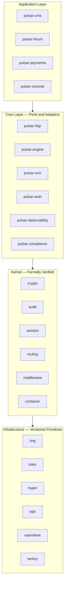

# Pulsar Framework

A 100% Rust web framework engineered for regulated, mission-critical domains: banking, healthcare, legal, and government systems.

> **Status:** pre-alpha, active development. The public API is unstable until 1.0.0. Consult the [release roadmap](docs/plan.md) for phase milestones.

## Principles

- **Formally verified microkernel** for cryptography, audit, session, routing, middleware composition, and dependency injection.
- **Memory-safe end-to-end** via Rust ownership, with audited primitives (`ring`, `rustls`, `sqlx`, `hyper`, `tokio`, `wasmtime`, `tantivy`).
- **Modular monolith with hexagonal architecture** and WASM-sandboxed third-party extensions.
- **100% line + branch + condition coverage**, mutation score ≥ 95%, 10 M fuzz iterations per parser.
- **16 compliance frameworks mapped** (GDPR, HIPAA, PCI-DSS v4, SOC 2, ISO 27001:2022, ISO 42001:2023, DORA, eIDAS, PSD2, NIS2, HL7/FHIR, ISO 13485, MDR, NIST CSF, DSA, Data Act).
- **Minimal CPU, RAM, and I/O footprint**: release binary under 50 MB, per-request memory under 1 MB, idle footprint under 50 MB.

## Quickstart

Prerequisites: Rust 1.95.0+, PostgreSQL 16+ (or SQLite for single-node), a recent Linux or macOS host.

```bash
# (sample once the `pulsar-cli` crate is released)
cargo install pulsar-cli
pulsar new my-app
cd my-app
pulsar serve
```

See the [getting started guide](docs/book/getting-started.md) for the full walkthrough.

## Architecture



Full architectural overview: [docs/architecture/layered.md](docs/architecture/layered.md).

## Workspace layout

```
crates/
  pulsar-framework/      Meta-crate re-exporting the stable public surface
  pulsar-kernel/         Formally verified kernel primitives
  pulsar-http/           HTTP framework on hyper
  pulsar-engine/         Template engine (custom, Rust-native)
  pulsar-orm/            ORM with Identity Map, Unit of Work, 15 attributes
  pulsar-audit/          Tamper-evident audit log
  pulsar-auth/           Password, OAuth2, WebAuthn, 2FA, Social SSO
  pulsar-compliance/     Policy engine and 16 regulatory mappings
  pulsar-observability/  Structured logging, metrics, tracing, OpenTelemetry
  pulsar-cms/            Content management system
  pulsar-forum/          Community forum
  pulsar-payments/       Commerce, subscriptions, invoicing
  pulsar-console/        Admin UI (Leptos WASM)
  pulsar-cli/            `pulsar` command-line tool
  pulsar-test/           Testing utilities
spec/                    TLA+ protocol specifications
docs/                    Architecture, ADRs, book, ops, security, perf
```

## License

Pulsar Framework is distributed under the [Apache License, Version 2.0](LICENSE).

"Pulsar Framework" is a registered trademark of Lenny Obez. Forks, modifications, and redistributions are welcome under the Apache 2.0 terms, but the "Pulsar Framework" name and logo remain protected: derivative projects must adopt a distinct name. See [trademark policy](docs/trademark-policy.md) for details.

## Security

Please report security vulnerabilities through [GitHub Security Advisories](https://github.com/LennyObez/pulsar-framework/security/advisories) (private reporting) or, if needed, by email to `security@pulsar-framework.com`. Public disclosure policy and scope are documented in [SECURITY.md](SECURITY.md).

## Contributing

Contributions are welcomed under the workflow described in [CONTRIBUTING.md](CONTRIBUTING.md). Every contribution must pass the full quality gate suite: format, lints, tests with 100% coverage, mutation ≥ 95%, fuzz zero-crash, security audit, and dependency audit.

## Community

- Issues and discussions: [GitHub Issues](https://github.com/LennyObez/pulsar-framework/issues)
- Documentation: [docs.rs/pulsar-framework](https://docs.rs/pulsar-framework) (published per release)
- Release notes: [CHANGELOG.md](CHANGELOG.md)
