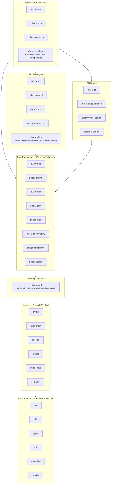

# Pulsar Framework

A 100% Rust web framework engineered for regulated, mission-critical domains: banking, healthcare, legal, and government systems.

> **Status:** pre-alpha, active development. The public API is unstable until 1.0.0. Consult the [release roadmap](docs/plan.md) for phase milestones.

## Principles

- **Formally verified microkernel** for cryptography, audit, session, routing, middleware composition, and dependency injection — nine TLA+ specifications under `spec/` covering crypto, router, session, audit, middleware, OAuth 2.1 + PKCE, SAML SSO, websocket dispatch, and orchestration (workflow + saga).
- **Memory-safe end-to-end** via Rust ownership, with audited primitives (`ring`, `rustls`, `sqlx`, `hyper`, `tokio`, `wasmtime`, `tantivy`).
- **Modular monolith with hexagonal architecture** and WASM-sandboxed third-party extensions with capability-based security.
- **100% line + branch + condition coverage** on kernel, security, compliance, and data protection crates; mutation score ≥ 95%; 10 M fuzz iterations per parser zero crash.
- **23 compliance frameworks mapped** (22 mandatory plus MiCA opt-in for crypto-asset deployments): GDPR, HIPAA, PCI-DSS v4, SOC 2, ISO 27001:2022, ISO 42001:2023, DORA, eIDAS 2 (incl. EUDI Wallet), PSD2 (Strong Customer Authentication), NIS2, HL7/FHIR, ISO 13485, MDR, NIST CSF, NIST AI RMF, DSA, EU Data Act, SWIFT CSP, CCPA, FINRA, FFIEC, BSI IT-Grundschutz, CNIL référentiels, plus opt-in MiCA. Plus FAPI 2.0 Open Banking conformance, OWASP LLM Top 10, OpenSSF Scorecard ≥ 9.0 + Best Practices Badge gold tier, CIS Benchmarks, STIG (DISA).
- **Minimal CPU, RAM, and I/O footprint**: release binary under 50 MB, per-request memory under 1 MB, idle footprint under 50 MB.
- **Polyglot best-tool-per-job**: 53 first-party Rust crates plus a native HTML5 + ES2025 + Web Components admin SPA (zero framework dependency) and a Go + kubebuilder Kubernetes Operator.

## Quickstart

Prerequisites: Rust 1.95.0+, PostgreSQL 16+ (or SQLite for single-node), a recent Linux or macOS host.

```bash
# (sample once the `pulsar-cli` crate is released)
cargo install pulsar-cli
pulsar new my-app
cd my-app
pulsar serve
```

See the [getting started guide](docs/book/src/getting-started/) for the full walkthrough (lands at Sprint 4.5 documentation consolidation).

## Architecture



Full architectural overview: [docs/architecture/overview.md](docs/architecture/overview.md) (lands at Sprint 0.6).

## Workspace layout

53 first-party Rust crates organised in twelve layers (post-consolidation per [plan Section 16.14](docs/plan.md), post-removal per [plan Section 16.13](docs/plan.md)):

```
crates/
  # Meta + Kernel
  pulsar-framework/         Meta-crate re-exporting the stable public surface
  pulsar-kernel/            Formally verified kernel primitives (six subsystems)

  # Core Foundation
  pulsar-http/              HTTP/1+2+3 framework on hyper
  pulsar-engine/            Template engine (custom, compile-time-checked)
  pulsar-orm/               ORM on sqlx, 19 derive attributes incl. EventSourced + RLS
  pulsar-audit/             HMAC-chained tamper-evident audit log + Merkle transparency
  pulsar-auth/              Password + OAuth 2.1 + OIDC + WebAuthn + SAML + LDAP + Kerberos
  pulsar-compliance/        Policy engine + 23-framework mapping + reporting automation
  pulsar-observability/     OpenTelemetry semantic conventions + Prometheus + profiling
  pulsar-search/            Tantivy-backed search abstraction

  # Security Controls (consolidated per Section 16.14)
  pulsar-guard/             CSRF + SRI + incident + ratelimit + resilience + SSRF

  # Application Infrastructure
  pulsar-mail/              SMTP + MJML + webhook verifiers
  pulsar-queue/             Redis + msgpack + AEAD job queue
  pulsar-scheduler/         Distributed cron with audit linkage
  pulsar-cache/             Multi-tier (Moka + Redis + CDN)
  pulsar-config/            Layered typed readonly config + secret adapters
  pulsar-storage/           S3 + Azure Blob + GCS + MinIO + local filesystem
  pulsar-form/              Form builder + validation + MIME sniffer
  pulsar-webhook/           Generic webhook subscription primitives
  pulsar-idempotency/       Idempotency-Key middleware
  pulsar-notification/      Consent-aware Web Push + APNs + FCM + SMS + email + in-app
  pulsar-pagination/        Cursor + offset pagination
  pulsar-feature-flag/      OpenFeature-compatible
  pulsar-i18n/              Dot-notation + ICU plurals + RTL + fallback chains
  pulsar-tenancy/           Row + schema + database tenant isolation

  # Data Protection + Authorization + Identity
  pulsar-dataprotection/    DSAR + RtbF + portability + residency + retention TTL
  pulsar-consent/           Granular consent ledger
  pulsar-authz/             RBAC + ABAC + ReBAC (Zanzibar)
  pulsar-identity-standards/ W3C VC + DIDs + JWS + COSE + eIDAS 2 EUDI

  # Application Extensions
  pulsar-cms/               Content management system
  pulsar-forum/             Threaded discussion forum
  pulsar-payments/          Commerce + subscriptions (Stripe/Braintree/Mollie/PayPal/Adyen)
  pulsar-console-api/       Admin server API (paired with services/admin Web Components)

  # API Paradigms
  pulsar-api/               REST + OpenAPI 3.1 + AsyncAPI 3 + opt-in OData
  pulsar-graphql/           async-graphql with Dataloader + subscriptions
  pulsar-grpc/              tonic with interceptors + reflection + health
  pulsar-mcp-server/        Model Context Protocol server
  pulsar-realtime/          WebSocket + SSE + WebTransport + broadcasting (consolidated)

  # AI Surface
  pulsar-ai/                Multi-provider abstraction (Anthropic/OpenAI/Vertex/Mistral/Bedrock/Ollama/llama.cpp)
  pulsar-ai-governance/     ISO 42001:2023 + EU AI Act + NIST AI RMF + OWASP LLM Top 10
  pulsar-vector-search/     pgvector + Qdrant + Weaviate for RAG
  pulsar-ai-agents/         Agentic framework (tool-use loop + Computer Use)

  # Reactive + Developer Experience
  pulsar-live/              Livewire-style reactive server-driven framework
  pulsar-studio/            Dev Studio IDE extension
  pulsar-analytics/         CSP-compliant tracker, consent-gated
  pulsar-accessibility/     Contrast checker + axe-core + cognitive a11y

  # Orchestration (consolidated per Section 16.14)
  pulsar-orchestration/     Workflow engine + saga compensation

  # Infrastructure Adapters
  pulsar-cloud/             AWS + Azure + GCP unified adapter layer
  pulsar-edge/              Cloudflare Workers + Fastly Compute@Edge + ACME
  pulsar-cluster/           Health supervisor + service discovery (consolidated)
  pulsar-deploy/            Rolling + blue-green + canary deploy strategies

  # CLI + Test
  pulsar-cli/               Command-line tool
  pulsar-test/              Testing utilities

services/                   Polyglot sub-projects outside the Cargo workspace
  admin/                    Native HTML5 + ES2025 + Web Components admin SPA
  operator/                 Go + kubebuilder Kubernetes Operator

spec/                       Nine TLA+ protocol specifications
docs/                       Architecture, ADRs, book, ops, security, perf, compliance
```

Full master plan: [docs/plan.md](docs/plan.md). Architecture decision records: [docs/adr/INDEX.md](docs/adr/INDEX.md) (lands at Sprint 0.5).

## License

Pulsar Framework is distributed under the [Apache License, Version 2.0](LICENSE).

"Pulsar Framework" is a registered trademark of Lenny Obez. Forks, modifications, and redistributions are welcome under the Apache 2.0 terms, but the "Pulsar Framework" name and logo remain protected: derivative projects must adopt a distinct name. See [trademark policy](docs/trademark-policy.md) for details.

## Security

Please report security vulnerabilities through [GitHub Security Advisories](https://github.com/LennyObez/pulsar-framework/security/advisories) (private reporting) or, if needed, by email to `security@pulsar-framework.com`. Public disclosure policy and scope are documented in [SECURITY.md](SECURITY.md).

## Contributing

Contributions are welcomed under the workflow described in [CONTRIBUTING.md](CONTRIBUTING.md). Every contribution must pass the full quality gate suite: format, lints, tests with 100% coverage, mutation ≥ 95%, fuzz zero-crash, security audit, and dependency audit.

## Community

- Issues and discussions: [GitHub Issues](https://github.com/LennyObez/pulsar-framework/issues)
- Documentation: [docs.rs/pulsar-framework](https://docs.rs/pulsar-framework) (published per release)
- Release notes: [CHANGELOG.md](CHANGELOG.md)
