# Pulsar Framework

A 100% Rust web framework engineered for regulated, mission-critical domains: banking, healthcare, legal, and government systems.

> **Status:** pre-alpha, active development. The public API is unstable until 1.0.0. Consult the [release roadmap](docs/plan.md) for phase milestones.

## Principles

- **Formally verified microkernel** for cryptography, audit, session, routing, middleware composition, and dependency injection — **fifteen TLA+ specifications** under `spec/` (per Decision 2.59 v2.3 lock-in) covering crypto, router, session, audit, middleware, OAuth 2.1 + PKCE, SAML SSO, websocket dispatch, orchestration (workflow + saga), RtbF two-phase commit, capability token lifecycle, multi-region saga compensation, event-bus delivery semantics, ratelimit token-bucket invariants, and OAuth refresh-token rotation. Plus **two formally-proven SPARK 2014 invariants** (capability token unforgeability + audit chain append-only) per ADR-0010 + Decision 2.54.
- **Memory-safe end-to-end** via Rust ownership, with **HACL\*-formally-verified cryptographic primitives** (per ADR-0009 + Decision 2.53) and audited primitives (`rustls`, `sqlx`, `hyper`, `tokio`, `wasmtime`, `tantivy`).
- **Modular monolith with hexagonal architecture** and WASM-sandboxed third-party extensions with capability-based security.
- **100% line + branch + MC/DC coverage + 99% mutation kill rate** on kernel, security, compliance, and data protection crates (per ADR-0014 + Decision 2.56); ≥ 95% line + branch on the rest; 10 M fuzz iterations per parser zero crash.
- **31 compliance frameworks mapped** (30 mandatory plus MiCA opt-in for crypto-asset deployments per Decision 2.52 v2.3 lock-in): GDPR, UK GDPR, HIPAA, PCI-DSS 4.0, PSD2, DORA, SOC 2, ISO 27001/27017/27018/27701, NIS2, eIDAS 2 (incl. EUDI Wallet), COPPA, FERPA, CCPA, LGPD, APPI, PIPL, POPIA, NDB, Mexican LFP, India DPDP — plus the **8 v2.3 additions**: NYDFS Part 500, MAS TRM, APRA CPS 234, OSFI B-13, RBI Cybersecurity Framework, Quebec Law 25, Switzerland nFADP, and Common Criteria EAL 6+/7. Opt-in MiCA. Plus FAPI 2.0 Open Banking conformance, OWASP LLM Top 10, OpenSSF Scorecard ≥ 9.0 + Best Practices Badge gold tier, CIS Benchmarks, STIG (DISA). Full mapping in [docs/compliance/matrix.md](docs/compliance/matrix.md).
- **Hybrid post-quantum cryptography from Sprint 1.1** (per ADR-0012 + Decision 2.58) — X25519 + ML-KEM-768 KEM + Ed25519 + ML-DSA-65 signatures from the first cryptographic primitive. No harvest-now-decrypt-later window.
- **SLSA Source Level 3 + Build Level 4 + in-toto layout** supply-chain attestation (per ADR-0011 + Decision 2.57). Cosign keyless signing via Sigstore Fulcio + Rekor transparency log + CycloneDX SBOM + Trusted Publisher OIDC for crates.io publish.
- **Minimal CPU, RAM, and I/O footprint**: release binary under 50 MB, per-request memory under 1 MB, idle footprint under 50 MB.
- **Polyglot best-tool-per-job**: **76 first-party Rust crates** (per Decision 2.51 v2.3 lock-in) plus three non-Rust sub-projects in `services/` — a native HTML5 + ES2025 + Web Components admin SPA (zero framework dependency, per Decision 2.8), a Go + kubebuilder Kubernetes Operator (per Decision 2.46), and an Ada/SPARK 2014 invariants module (per Decision 2.54).

## Quickstart

Prerequisites: Rust 1.95.0+, PostgreSQL 16+ (or SQLite for single-node), a recent Linux or macOS host.

```bash
# (sample once the `pulsar-cli` crate is released)
cargo install pulsar-cli
pulsar new my-app
cd my-app
pulsar serve
```

See the [getting started guide](docs/book/src/getting-started/) for the full walkthrough (lands at Sprint 4.5 documentation consolidation).

## Architecture

```mermaid
graph TD
    subgraph APP[Application Extensions]
        CMS[pulsar-cms]
        FOR[pulsar-forum]
        PAY[pulsar-payments]
        CON[pulsar-console-api<br/>+ services/admin Web Components]
    end

    subgraph API[API Paradigms]
        APIR[pulsar-api]
        GQL[pulsar-graphql]
        GRP[pulsar-grpc]
        MCP[pulsar-mcp-server]
        WS[pulsar-websocket]
        SSE[pulsar-sse]
        WT[pulsar-webtransport]
        BR[pulsar-broadcasting]
    end

    subgraph AI[AI Surface]
        AI1[pulsar-ai]
        AIG[pulsar-ai-governance]
        VEC[pulsar-vector-search]
        AGN[pulsar-ai-agents]
    end

    subgraph CORE[Core Foundation — Ports and Adapters]
        HTTP[pulsar-http]
        ENG[pulsar-engine]
        ORM[pulsar-orm]
        AUTH[pulsar-auth]
        AUD[pulsar-audit]
        OBS[pulsar-observability]
        COMP[pulsar-compliance]
        SRC[pulsar-search]
    end

    subgraph SEC[Security Controls — un-fused per ADR-0011]
        CSRF[pulsar-csrf]
        SRI[pulsar-sri]
        INC[pulsar-incident]
        RL[pulsar-ratelimit]
        RES[pulsar-resilience]
        SSG[pulsar-ssrf-guard]
    end

    subgraph KER[Kernel — Formally Verified]
        CRY[crypto<br/>HACL* via FFI]
        AUDK[audit chain<br/>Ed25519 + Merkle + RFC 6962]
        SES[session]
        ROU[routing]
        MID[middleware]
        DI[container]
        SPK[services/spark-invariants<br/>capability + append-only proofs]
    end

    subgraph INF[Infrastructure — Vendored Primitives]
        RING[ring]
        TOK[tokio]
        HYP[hyper]
        SQ[sqlx]
        WASM[wasmtime]
        TAN[tantivy]
    end

    APP --> API
    APP --> AI
    APP --> CORE
    API --> CORE
    AI --> CORE
    CORE --> SEC
    SEC --> KER
    KER --> INF
```



Full architectural overview: [docs/architecture/overview.md](docs/architecture/overview.md) (lands at Sprint 0.6).

## Workspace layout

**76 first-party Rust crates** organised in twelve layers (per Decision 2.51 v2.3 lock-in: dé-fusion of the four v2.2 meta-crates back into 14 sub-module crates per ADR-0011 + sqlx-pattern driver split applied to `pulsar-orm`, `pulsar-cloud`, `pulsar-storage` per ADR-0011 + HACL\* FFI binding crate per ADR-0009):

```
crates/
  # Meta + Kernel
  pulsar-framework/             Meta-crate re-exporting the stable public surface
  pulsar-kernel/                Formally verified kernel primitives (Rust + Creusot + TLA+)
  pulsar-crypto-hacl-bindings/  HACL* FFI binding crate (per ADR-0009 + Decision 2.53)

  # Core Foundation
  pulsar-http/                  HTTP/1+2+3 framework on hyper
  pulsar-engine/                Template engine (custom, compile-time-checked)
  pulsar-orm/                   ORM core (sqlx-pattern per ADR-0011)
  pulsar-orm-postgres/          PostgreSQL driver
  pulsar-orm-mysql/             MySQL driver
  pulsar-orm-sqlite/            SQLite driver
  pulsar-orm-clickhouse/        ClickHouse driver (OLAP)
  pulsar-audit/                 Ed25519 + Merkle + RFC 6962 transparency log (per ADR-0013)
  pulsar-auth/                  Password + OAuth 2.1 + OIDC + WebAuthn + SAML + LDAP + Kerberos
  pulsar-compliance/            Policy engine + 31-framework mapping + reporting automation
  pulsar-observability/         OpenTelemetry semantic conventions + Prometheus + profiling
  pulsar-search/                Tantivy-backed search abstraction

  # Security Controls (un-fused per ADR-0011 — was pulsar-guard in v2.2)
  pulsar-csrf/                  Cross-Site Request Forgery protection middleware
  pulsar-sri/                   Subresource Integrity digest enforcement
  pulsar-incident/              Incident escalation + alert dispatch + on-call paging
  pulsar-ratelimit/             Token-bucket + leaky-bucket rate limiting (spec/ratelimit.tla)
  pulsar-resilience/            Circuit breaker + bulkhead + retry + timeout
  pulsar-ssrf-guard/            Server-Side Request Forgery protection (DNS rebinding + IMDS)

  # Application Infrastructure
  pulsar-mail/                  SMTP + MJML + webhook verifiers
  pulsar-queue/                 Redis + msgpack + AEAD job queue
  pulsar-scheduler/             Distributed cron with audit linkage
  pulsar-cache/                 Multi-tier (Moka + Redis + CDN)
  pulsar-config/                Layered typed readonly config + secret adapters
  pulsar-storage/               Storage core (sqlx-pattern per ADR-0011)
  pulsar-storage-s3/            S3-compatible (AWS, MinIO, B2, R2, Wasabi)
  pulsar-storage-azure/         Azure Blob Storage
  pulsar-storage-gcs/           Google Cloud Storage
  pulsar-storage-fs/            Local filesystem (single-node + air-gapped)
  pulsar-form/                  Form builder + validation + MIME sniffer
  pulsar-webhook/               Generic webhook subscription primitives
  pulsar-idempotency/           Idempotency-Key middleware
  pulsar-notification/          Consent-aware Web Push + APNs + FCM + SMS + email + in-app
  pulsar-pagination/            Cursor + offset pagination
  pulsar-feature-flag/          OpenFeature-compatible
  pulsar-i18n/                  Dot-notation + ICU plurals + RTL + fallback chains
  pulsar-tenancy/               Row + schema + database tenant isolation

  # Data Protection + Authorization + Identity
  pulsar-dataprotection/        DSAR + RtbF (spec/rtbf.tla) + portability + residency + retention TTL
  pulsar-consent/               Granular consent ledger
  pulsar-authz/                 RBAC + ABAC + ReBAC (Zanzibar)
  pulsar-identity-standards/    W3C VC + DIDs + JWS + COSE + eIDAS 2 EUDI

  # Application Extensions
  pulsar-cms/                   Content management system
  pulsar-forum/                 Threaded discussion forum
  pulsar-payments/              Commerce + subscriptions (Stripe/Braintree/Mollie/PayPal/Adyen)
  pulsar-console-api/           Admin server API (paired with services/admin Web Components)

  # API Paradigms (un-fused realtime per ADR-0011 — was pulsar-realtime in v2.2)
  pulsar-api/                   REST + OpenAPI 3.1 + AsyncAPI 3 + opt-in OData
  pulsar-graphql/               async-graphql with Dataloader + subscriptions
  pulsar-grpc/                  tonic with interceptors + reflection + health
  pulsar-mcp-server/            Model Context Protocol server
  pulsar-websocket/             WebSocket inbound dispatch (spec/websocket.tla)
  pulsar-sse/                   Server-Sent Events push channel
  pulsar-webtransport/          WebTransport over HTTP/3 (QUIC)
  pulsar-broadcasting/          Cross-instance fan-out + presence tracking

  # AI Surface
  pulsar-ai/                    Multi-provider abstraction (Anthropic/OpenAI/Vertex/Mistral/Bedrock/Ollama)
  pulsar-ai-governance/         ISO 42001:2023 + EU AI Act + NIST AI RMF + OWASP LLM Top 10
  pulsar-vector-search/         pgvector + Qdrant + Weaviate for RAG
  pulsar-ai-agents/             Agentic framework (tool-use loop + Computer Use)

  # Reactive + Developer Experience
  pulsar-live/                  Livewire-style reactive server-driven framework
  pulsar-studio/                Dev Studio IDE extension
  pulsar-analytics/             CSP-compliant tracker, consent-gated
  pulsar-accessibility/         Contrast checker + axe-core + cognitive a11y (WCAG 2.2 AAA)

  # Orchestration (un-fused per ADR-0011 — was pulsar-orchestration in v2.2)
  pulsar-workflow/              Typed-state workflow orchestration (spec/orchestration.tla)
  pulsar-saga/                  Saga compensation engine (spec/orchestration.tla + spec/multi-region-saga.tla)

  # Infrastructure Adapters (sqlx-pattern + un-fused cluster per ADR-0011)
  pulsar-cloud/                 Cloud core
  pulsar-cloud-aws/             AWS adapter (S3, KMS, Lambda, SecretsManager, IAM)
  pulsar-cloud-azure/           Azure adapter (Blob, Key Vault, Functions, Comm Svcs)
  pulsar-cloud-gcp/             GCP adapter (Cloud Storage, Cloud KMS, Cloud Functions)
  pulsar-cloud-oci/             Oracle Cloud Infrastructure adapter
  pulsar-edge/                  Cloudflare Workers + Fastly Compute@Edge + ACME
  pulsar-supervisor/            Supervisor tree + actor lifecycle (Erlang/OTP-inspired)
  pulsar-service-discovery/     DNS-SD + Consul + etcd + Kubernetes Endpoints
  pulsar-deploy/                Rolling + blue-green + canary deploy strategies

  # CLI + Test
  pulsar-cli/                   Command-line tool
  pulsar-test/                  Testing utilities

services/                       Polyglot sub-projects outside the Cargo workspace
  admin/                        Native HTML5 + ES2025 + Web Components admin SPA (Decision 2.8)
  operator/                     Go + kubebuilder Kubernetes Operator (Decision 2.46)
  spark-invariants/             Ada/SPARK 2014 module — capability + audit chain invariants (Decision 2.54)

spec/                           Fifteen TLA+ protocol specifications (per Decision 2.59)
docs/                           Architecture, ADRs, book, ops, security, perf, compliance
```

Full master plan: [docs/plan.md](docs/plan.md). Architecture decision records: [docs/adr/INDEX.md](docs/adr/INDEX.md) (Sprint 0.5 + Sprint 0.9-bis v2.3 ADRs 0009-0014).

## License

Pulsar Framework is distributed under the [Apache License, Version 2.0](LICENSE).

"Pulsar Framework" is a registered trademark of Lenny Obez. Forks, modifications, and redistributions are welcome under the Apache 2.0 terms, but the "Pulsar Framework" name and logo remain protected: derivative projects must adopt a distinct name. See [trademark policy](docs/trademark-policy.md) for details.

## Security

Please report security vulnerabilities through [GitHub Security Advisories](https://github.com/LennyObez/pulsar-framework/security/advisories) (private reporting) or, if needed, by email to `security@pulsar-framework.com`. Public disclosure policy and scope are documented in [SECURITY.md](SECURITY.md).

## Contributing

Contributions are welcomed under the workflow described in [CONTRIBUTING.md](CONTRIBUTING.md). Every contribution must pass the full quality gate suite: format, lints, tests with 100% line + branch + MC/DC coverage on critical-tier crates (per ADR-0014), mutation kill rate ≥ 99% on critical-tier crates, ≥ 95% line + branch on the rest, fuzz zero-crash, security audit, dependency audit, and SLSA Source L3 + Build L4 + in-toto provenance attestation on releases (per ADR-0007 + Decision 2.57).

## Community

- Issues and discussions: [GitHub Issues](https://github.com/LennyObez/pulsar-framework/issues)
- Documentation: [docs.rs/pulsar-framework](https://docs.rs/pulsar-framework) (published per release)
- Release notes: [CHANGELOG.md](CHANGELOG.md)
