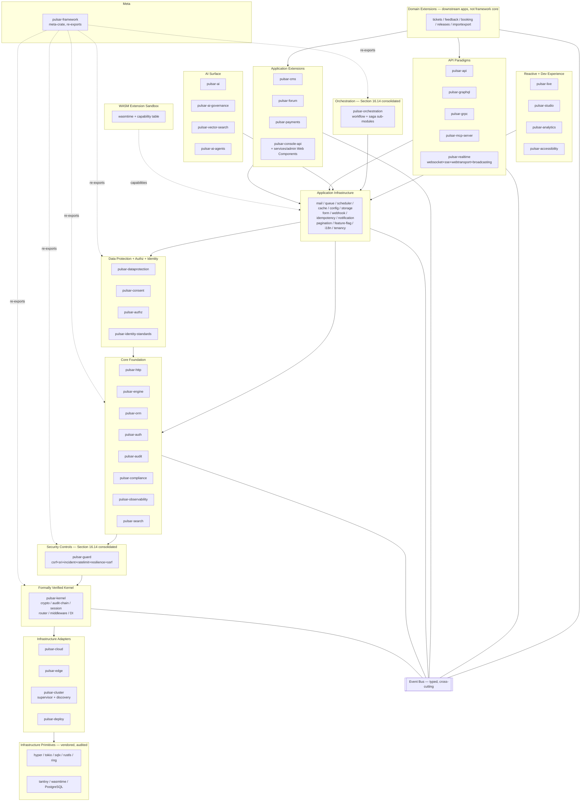

# Diagram 01 — Layered architecture

The Pulsar Framework Rust edition is structured as twelve layers around a formally verified microkernel, with WebAssembly extension sandboxing at the periphery and an event bus cross-cutting every layer. The dependency rule is strict: dependencies flow inward, never reverse. Adapters at every boundary invert dependencies through ports defined in the inner layer.

## Narrative

The Pulsar Framework Rust edition is a polyglot monorepo. The Rust workspace contains 53 first-party crates (post-consolidation per Section 16.14, post-removal per Section 16.13) organised in twelve layers. Two non-Rust sub-projects live in `services/`: the admin SPA in native HTML5 + ES2025 + Web Components per Decision 2.8, and the Kubernetes Operator in Go per Decision 2.46.

**Dependency rule.** Dependencies flow strictly inward. Domain Extensions (downstream apps; explicitly out of framework core per Section 16.13) depend on Application Extensions and API Paradigms. Application Extensions depend on Application Infrastructure. API Paradigms, AI Surface, Reactive + Dev Experience, and Orchestration all depend on Application Infrastructure. Application Infrastructure depends on Core Foundation and on the Data Protection + Authz + Identity layer. Core Foundation depends on Security Controls (`pulsar-guard`). Security Controls depend on the formally verified Kernel. Kernel depends on Infrastructure Adapters (which wrap external systems) and on vendored Infrastructure Primitives (`hyper`, `tokio`, `sqlx`, `rustls`, `ring`, `tantivy`, `wasmtime`, PostgreSQL).

**Reverse edges are forbidden** and enforced via `cargo deny` rulesets at the workspace level plus mandatory manual review on any PR that modifies a `Cargo.toml`. A violation would allow Application-layer changes to leak semantics into the Kernel and invalidate the formal proofs.

**Hexagonal ports and adapters.** Every crate boundary is a hexagonal boundary. The inner crate defines port traits; the outer crate (or a sibling crate) provides adapter implementations. Adapter swapping (e.g. in-memory for tests, PostgreSQL for production, CockroachDB for multi-region) is a compile-time selection — preserving Rust's zero-cost abstraction guarantee. The port/adapter discipline is the architectural mechanism that makes the twenty-three-framework compliance matrix tractable: jurisdictions demanding specific adapters (HSM-backed key storage, region-restricted S3 buckets, EUDI Wallet integration) plug in without modifying the core.

**Microkernel composition.** The Kernel layer contains exactly six subsystems: crypto primitives (key derivation, AEAD encryption, digital signatures on top of `ring`), audit HMAC chain (tamper-evident append-only log with cryptographic linking), session state machine (typed states with verified transitions), router trie (radix-tree path matcher with constant-time worst-case lookup), middleware pipeline (typed before/after ordering with total-order verification), and DI container (constructor injection with compile-time topological-sort verification). Every subsystem carries a TLA+ specification and Creusot function contracts where tractable (per ADR-0003).

**Meta-crate pattern.** `pulsar-framework` re-exports the sixteen "Re-exported in meta. Yes." crates (Section IV). Inner crates do **not** depend on `pulsar-framework`; they depend directly on the smaller set of inner crates whose types they need (most commonly `pulsar-kernel`). Application code consumes `pulsar_framework::prelude::*`. This avoids cyclic dependencies through the meta-crate's re-exports.

**Event-driven inter-module communication.** A typed internal event bus carries events between modules. Events are Rust types with `Debug`, `Clone`, and `Serialize` bounds; subscribers register typed handlers at startup. The bus is single-writer within a request and supports broadcast to multiple subscribers. Events are the sanctioned mechanism for cross-module communication that would otherwise require a direct call (which would violate the dependency rule). Example: `pulsar-auth` emits `UserAuthenticated`; `pulsar-audit` subscribes and records the event in the audit chain — neither crate depends on the other at the type level.

**WASM extension sandbox.** Third-party extensions execute in `wasmtime` instances with WASI Preview 2 component-model capabilities. Each extension receives exactly the capabilities its `pulsar.toml` manifest declares and the administrator grants. The sandbox is the perimeter trust boundary; capability checks are the audit primitive (per ADR-0004).

## Cross-references

* ADR-0002 (modular monolith with hexagonal ports-and-adapters)
* ADR-0003 (microkernel with formal verification — six subsystems)
* ADR-0004 (WASM extension sandbox with capability-based security)
* Plan Section III Architecture Overview (full prose treatment)
* Plan Section IV Workspace Layout (53-crate enumeration)
