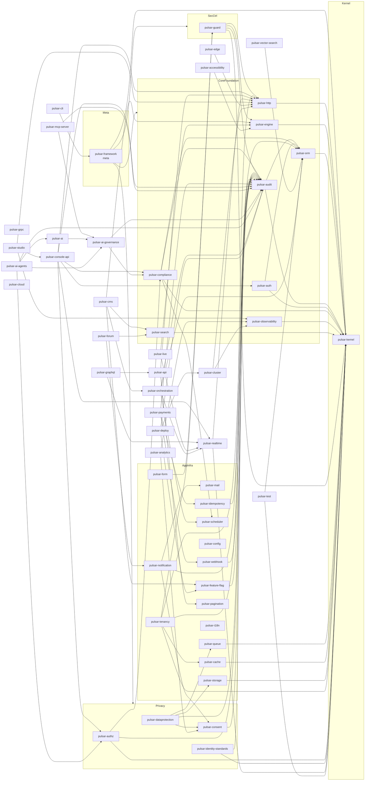

# Diagram 02 — Crate dependency graph

The 53 first-party Pulsar Framework Rust crates form a directed acyclic dependency graph rooted at `pulsar-kernel`. The meta-crate `pulsar-framework` re-exports the 16 stable-surface crates marked `Re-exported in meta. Yes.` in plan Section IV. Inner crates depend on a small set of inner crates whose types they need (most commonly `pulsar-kernel`); they do not depend on the meta-crate to avoid cycles through the re-exports.

## Narrative

The graph is built from the per-crate Cargo.toml files in `crates/*/Cargo.toml`. It is **acyclic by construction**: the meta-crate convention (per plan Section IV intro) enforces that inner crates never depend on `pulsar-framework`, breaking the cycle that would otherwise form through the 16 re-exported crates.

**Hub crates** (high in-degree — many crates depend on them):

* `pulsar-kernel` — depended on by 18+ crates. The verified core surface; every crate that needs crypto, error patterns, or framework primitive types uses it.
* `pulsar-audit` — depended on by 14+ crates. The audit-chain integration point; every crate that emits security-relevant or compliance-relevant events depends on it.
* `pulsar-orm` — depended on by 8+ crates. The persistence surface for typed entities, repositories, and event-sourced aggregates.
* `pulsar-http` — depended on by 7+ crates. The HTTP server primitive that the API paradigms layer composes against.

**Authoritative dependency rule:** the Section III layered architecture must hold at every commit on `develop`. CI invariant: `cargo deny check` plus the `cargo metadata` round-trip parse asserts the workspace dep graph is acyclic and license-clean. A reverse edge (e.g. `pulsar-kernel` importing `pulsar-http`) would violate Section III dependency rule and is rejected at review-time.

**Consolidation impact.** Per Section 16.14, four consolidations reduced cross-crate friction without sacrificing architectural clarity. Their dependency footprint:

* `pulsar-guard` (was csrf + sri + incident + ratelimit + resilience + ssrf-guard) → 6 fewer hub edges, 6 fewer CI pipeline duplications.
* `pulsar-realtime` (was websocket + broadcasting + webtransport) → simpler subscription surface for `pulsar-live` and `pulsar-graphql`.
* `pulsar-orchestration` (was workflow + saga) → single TLA+ spec `spec/orchestration.tla` instead of two.
* `pulsar-cluster` (was supervisor + service-discovery) → single CRD set for the Kubernetes Operator (`services/operator/`).

**Sibling-only paths.** Crates within the same layer can depend on each other only when the dependency reflects a domain relation (e.g. `pulsar-tenancy` depends on `pulsar-cache` because tenant-scoped caches are intrinsic to multi-tenant isolation). The default is "no sibling dep"; sibling deps require a clear domain rationale documented in the spec.

## Cross-references

* ADR-0002 (modular monolith with hexagonal ports-and-adapters — dependency rule)
* ADR-0006 (crates.io `pulsar-*` namespace — meta-crate convention)
* Plan Section IV Workspace Layout (per-crate Dependencies sections)
