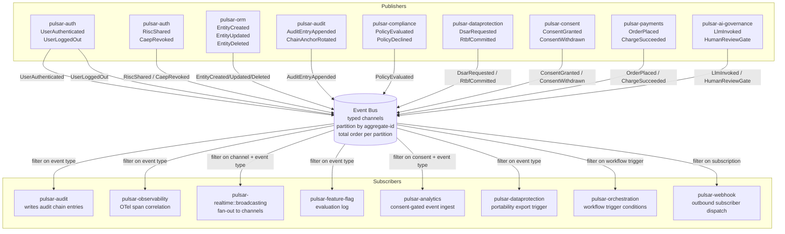

# Diagram 04 — Event bus topology

The event bus is the framework's internal communication primitive. Modules emit typed events; subscribers register typed handlers at startup. The bus is single-writer within a request and supports broadcast to multiple subscribers. Events are the sanctioned mechanism for cross-module communication that would otherwise require a direct call (which would violate the dependency rule).

## Narrative

**Type discipline.** Every event is a Rust type implementing `Debug + Clone + Serialize` (per plan Section III). Subscribers register handlers `Fn(&Event) -> ()` keyed by event type. The compiler refuses to compile a handler whose signature does not match a registered event type. Mistyped events do not exist.

**Examples of canonical event names** (per plan Section 17.14 audit event naming, past-tense DDD):

* `UserAuthenticated`, `UserLoggedOut`, `UserDeleted` — auth lifecycle
* `EntityCreated`, `EntityUpdated`, `EntityDeleted` — ORM hook
* `AuditEntryAppended`, `ChainAnchorRotated` — audit chain
* `PolicyEvaluated`, `PolicyDeclined`, `RateLimitExceeded` — security/compliance
* `OrderPlaced`, `OrderShipped`, `OrderCancelled`, `ChargeSucceeded`, `ChargeFailed` — payments
* `ConsentGranted`, `ConsentWithdrawn`, `CookieBannerDismissed` — consent
* `DsarRequested`, `RtbfRequested`, `RtbfCommitted`, `DataExportEmitted` — data protection
* `LlmInvoked`, `LlmRedacted`, `HumanReviewGate`, `BiasDetectionTriggered` — AI governance
* `ScheduleExecuted`, `ScheduleSkipped` — scheduler

**Partitioning.** Events are partitioned by aggregate-id hash. Within a partition, ordering is total. Across partitions, ordering is unspecified — subscribers cannot rely on cross-aggregate event order. This matches the LMAX Disruptor single-writer principle (per plan Section XIII references).

**Delivery semantics** (per plan Section 14.12):

* **At-least-once by default.** Subscribers must be idempotent.
* **Exactly-once via transactional outbox** for event-sourced aggregates. The outbox table is in the same PostgreSQL transaction as the aggregate write; a separate dispatcher reads the outbox and emits to the bus.
* **At-most-once opt-in** for non-critical observability events (e.g. analytics page-views) where occasional drop is acceptable.

The transactional outbox pattern lands in Sprint 2.4 alongside `pulsar-audit` — same persistence path, same chain-integrity guarantee.

**Cross-cuts** the bus enables:

* **Audit cross-cut.** `pulsar-audit` subscribes to security-relevant events from every layer and appends audit-chain entries without those layers depending on `pulsar-audit` directly. Example: `pulsar-auth` emits `UserAuthenticated`; `pulsar-audit` records it. Neither crate depends on the other at the type level — both depend on the event-bus crate.
* **Observability cross-cut.** `pulsar-observability` correlates OTel spans across event-driven flows. The event-bus dispatch carries a correlation ID that observability subscribers use to thread span context.
* **Realtime cross-cut.** `pulsar-realtime::broadcasting` fans out events to WebSocket channels for live admin UI updates. Subscribers can filter by channel and event type.
* **Compliance cross-cut.** `pulsar-compliance` subscribes to events that trigger regulatory reporting workflows (DORA incident notification, NIS2 escalation, EU AI Act human review).
* **Workflow cross-cut.** `pulsar-orchestration` registers workflow triggers on events; the workflow engine fires when a matching event occurs.

**Schema evolution.** Event types are part of the public surface of the emitting crate. Adding a field to an existing event is a minor version bump on the emitting crate (additive); removing a field is a major version bump (breaking). The meta-crate `pulsar-framework` re-exports event types from re-exported crates; downstream subscribers depend on those types via the prelude.

## Cross-references

* Plan Section III Architecture Overview (event-driven inter-module communication)
* Plan Section 14.12 event-bus delivery semantics
* Plan Section 17.14 audit event naming (past-tense DDD)
* ADR-0002 (modular monolith with hexagonal ports — event bus as cross-cut mechanism)
* ADR-0003 (formally verified microkernel — DI container + middleware pipeline)
