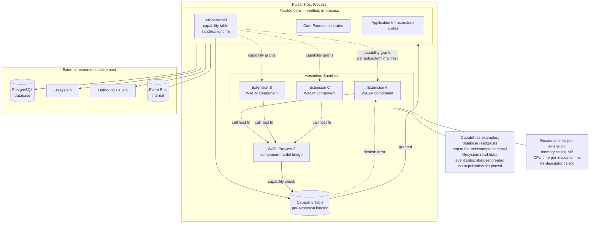

# Diagram 05 — WASM extension sandbox isolation

Third-party extensions execute inside `wasmtime` instances with WASI Preview 2 component-model capabilities. Each extension receives exactly the capabilities its `pulsar.toml` manifest declares and the administrator grants. The sandbox is the perimeter trust boundary between the framework's verified core and untrusted extension code.



## Narrative

**Trust boundary.** Two trust zones inside the host process:

1. **Trusted core.** `pulsar-kernel` and the 53 first-party Pulsar crates, plus the audited primitive crates (`hyper`, `tokio`, `sqlx`, `rustls`, `ring`, etc.). Code in this zone has full process privileges and is gated by code review, formal verification (kernel + security controls), and the Section VI quality-gate suite.
2. **Untrusted sandbox.** Third-party WASM components loaded via `wasmtime`. Code in this zone has zero implicit privileges. Every host-fn invocation traverses the WASI Preview 2 component-model bridge and is checked against the per-extension capability table.

**Capability model** (per ADR-0004). Each extension's `pulsar.toml` manifest declares:

```toml
[extension]
name = "blog-importer"
version = "1.0.0"
api = "1"

[capabilities]
database = ["read:table:posts", "write:table:posts", "read:table:taxonomies"]
http = ["outbound:medium.com:443", "outbound:wordpress.com:443"]
event = ["publish:post.imported"]

[resources]
memory_mb = 64
cpu_ms_per_invocation = 1000
fd_max = 8
```

At install time, the administrator reviews the manifest in the admin console (`services/admin/`) and explicitly grants each capability. Capability grant decisions are recorded in the audit chain (per ADR-0008 audit invariant).

**Capability granularity.** Capabilities are fine-grained enough to make audit decisions tractable:

* `database:read:table:<name>` — single-table read.
* `database:write:table:<name>` — single-table write.
* `database:read:column:<table>:<column>` — column-level read (Sprint 4.1+ extension; finer than table-level for sensitive columns).
* `http:outbound:<host>:<port>` — single-host outbound HTTPS (host:port pair, no wildcards).
* `filesystem:read:<path>` / `filesystem:write:<path>` — directory-level filesystem access.
* `event:subscribe:<event-name>` — typed event subscription.
* `event:publish:<event-name>` — typed event publication.
* `extension:invoke:<other-extension-name>:<api>` — extension-to-extension invocation through the host.

**Crash isolation.** A panic, OOM, or infinite loop in an extension does **not** affect the host. wasmtime enforces:

* **Memory ceiling.** WASM linear memory is bounded by the manifest declaration. Allocations beyond the ceiling fail with `OOM`.
* **CPU time per invocation.** Each host-fn invocation has a wall-clock budget; exceeding it traps the WASM execution (the trap surfaces as a typed error to the host).
* **Stack limit.** WASM stack overflow is caught by the runtime, not the OS.
* **File-descriptor ceiling.** Number of open WASI file descriptors is bounded.

The host catches the trap, logs the failure to the audit chain, and continues servicing other requests. Extensions cannot observably destabilise the host.

**Performance budget** (per Sprint 4.1 exit criteria):

* Extension invocation overhead: < 100 µs.
* Capability check overhead: < 50 ns.
* Memory baseline per idle extension: < 1 MB.

The capability check is on the hot path of every host-fn invocation, hence the < 50 ns target. Implementation: a `pulsar-kernel::sandbox::CapabilityTable` is a hash map keyed on `(extension_id, capability_kind, capability_target)`; lookup is constant-time on a hash collision-resistant path.

**Component-model interop.** Extensions can be authored in any language that targets WASI Preview 2 components: Rust (via `cargo component`), AssemblyScript, Go (via TinyGo), C/C++, Python (via componentize-py), JavaScript (via componentize-js). The host-side bindings are generated from a single `world` declaration in `pulsar-kernel::sandbox` so cross-language extensions speak the same API.

**Audit chain integration.** Every capability grant, every capability denial, every extension load, every extension unload, and every extension trap is appended to the audit chain. The audit chain entry contains the extension ID, the manifest hash (for tamper-evident binding to the install-time decision), and the capability target.

## Cross-references

* ADR-0004 (WebAssembly extension sandbox with capability-based security)
* Plan Section II Decision 2.19 (extension sandbox: wasmtime with capability-based security)
* Plan Section III Architecture Overview (WASM extension sandbox at the periphery)
* Plan Sprint 4.1 (WASM sandbox implementation)
* Compliance mapping: ISO 27001:2022 control A.8.31 (separation of development, test and production environments — extension sandbox is the technical control); GDPR Art. 32 (security of processing — capability-bound access mitigates extension data-access risk)
