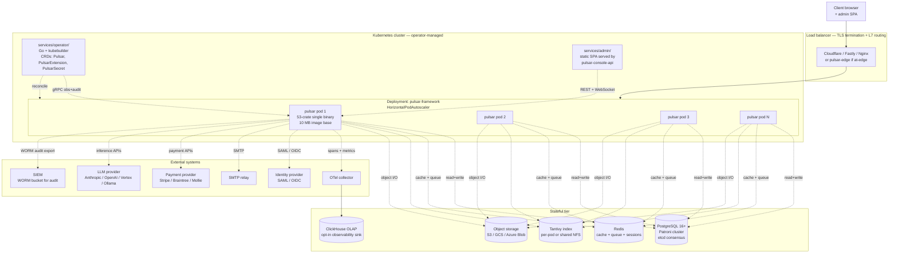

# Diagram 06 — Process model for multi-instance deployments

Pulsar Framework deploys as a single binary (modular monolith per ADR-0002). Horizontal scaling replicates instances; the framework expects nothing beyond the single Cargo workspace artefact. This diagram shows a representative multi-instance production deployment, with the external systems each instance shares state through.

## Narrative

**Single deployable artefact.** Every Pulsar pod is the same 53-crate single binary built from the workspace root. There is no per-instance configuration drift across the framework code itself — only the runtime configuration (TOML files + environment variables + secret-provider references per `pulsar-config`) varies. Per plan Decision 2.27, the stripped release binary is < 50 MB, and the idle-process memory baseline is < 50 MB. A typical Kubernetes pod fits in a 128 MB resource request.

**Horizontal scaling.** Pods scale via the standard Kubernetes `HorizontalPodAutoscaler` keyed on CPU + memory + custom metrics (e.g. `pulsar_http_requests_total` rate). Per plan Section XII, sustained load-test throughput is 1 000 req/s × 1 hour with no degradation per pod; the operator (per Decision 2.46, Go + kubebuilder) reconciles `Pulsar` CRDs that declare the desired pod count and the HPA min/max bounds.

**Stateful tier — shared across pods.**

* **PostgreSQL 16+ with Patroni + etcd.** The default OLTP store per Decision 2.15. Patroni delivers Raft-backed high availability with automated failover; etcd provides the consensus layer. Pods connect via `sqlx` connection pools; the `pulsar-orm` repository pattern abstracts the read-replica routing per plan Section 16.4 multi-backend support.
* **Redis.** Cache (`pulsar-cache`), queue (`pulsar-queue`), distributed locks (`pulsar-scheduler`), and idempotency-key store (`pulsar-idempotency`). Pods share a single Redis cluster; the queue uses Redis streams for at-least-once delivery semantics per plan Section 14.12.
* **Tantivy index.** The full-text search index (`pulsar-search`). Per-pod local index (rebuild on startup) or shared NFS-backed index (deployment choice). Tantivy is Lucene-class but pure-Rust; index format compatibility tracked via plan risk R-010.
* **Object storage.** S3 / GCS / Azure Blob for `pulsar-storage`. Pods read and write equally; the storage tier handles durability + availability. Regional routing per `pulsar-dataprotection::Residency` for jurisdictions that require data residency (GDPR Art. 28, EU Data Act).
* **ClickHouse OLAP** (opt-in per Decision 2.17). High-cardinality observability sink for `pulsar-observability` traces + metrics + ClickHouse-native protocol via the `clickhouse` crate.

**External systems.**

* **Identity provider.** SAML 2.0, OIDC, RISC + CAEP signals via `pulsar-auth`. Enterprise SSO surface per Section 16.1.1. Multiple IdPs are supported simultaneously (e.g. employee SAML + customer OAuth2).
* **SMTP relay.** `pulsar-mail` connects via STARTTLS or implicit TLS. Webhook verifiers for SES / Sendgrid / Mailgun / Postmark validate inbound bounce events.
* **OTel collector.** OTLP-export from `pulsar-observability` per OpenTelemetry semantic conventions (Section 16.5.1). Downstream backends (Honeycomb, Datadog, Grafana Tempo, etc.) connect to the OTel collector — Pulsar pods do not connect directly to the observability vendor.
* **SIEM.** Audit-chain WORM export per Section 16.2.3. S3 Object Lock in governance or compliance mode, Azure Blob immutability policy, GCS bucket lock — all rejected-mutation-attempt-deterministic per plan exit criteria.
* **Payment providers.** `pulsar-payments` connects via HTTPS to Stripe / Braintree / Mollie / PayPal / Adyen. Webhook signature verification on inbound delivery; idempotency keys (`Idempotency-Key` header) propagated through the request lifecycle.
* **LLM providers.** `pulsar-ai` connects to Anthropic, OpenAI, Google Vertex AI, Mistral, Azure OpenAI, AWS Bedrock, Ollama (local), or in-process llama.cpp adapter for air-gapped deployments. Outbound traffic to LLM providers is gated by `pulsar-ai-governance` (audit-chain linkage on every invocation, PII redaction, prompt injection defence, NIST AI RMF + OWASP LLM Top 10 controls per Section 16.8.6 + 16.8.7).

**Observability flow.**

* Every request flows through `pulsar-observability` with structured logging + metrics + distributed tracing.
* `tracing-opentelemetry` exports OTLP spans to the OTel collector.
* Prometheus + OpenMetrics endpoint on `/metrics` for pod-level scraping.
* Continuous profiling (Section 16.5.3) exports pprof samples to Pyroscope / Parca / Grafana Phlare on demand.
* Twenty pre-built Grafana dashboards in `docs/observability/dashboards/` cover HTTP, ORM, audit, queue, scheduler, cache, search, AI, data protection, compliance, kernel, security, realtime, broadcasting, payments, CMS, forum, console, cluster, deploy.

**Deployment topologies.** Reference deployments documented in `docs/ops/deployment/`:

* **Single-tenant production.** Three Pulsar pods, single PostgreSQL Patroni cluster (3 nodes), single Redis cluster, single Tantivy NFS share, S3 bucket per region.
* **Multi-tenant production.** Same baseline; tenancy (`pulsar-tenancy`) selects row-level + schema-level + database-level isolation per tenant per Decision 2.38.
* **Multi-region.** Two regions with PostgreSQL multi-region (CockroachDB community adapter `pulsar-orm-cockroach` per Decision 2.16). Pulsar pods deploy regionally; tenants are pinned to regions per data residency.
* **Edge.** `pulsar-edge` deploys to Cloudflare Workers or Fastly Compute@Edge for fragment caching + L7 routing in front of the regional Pulsar deployment.
* **Air-gapped.** Local LLM via Ollama or in-process llama.cpp; Patroni cluster local; no outbound HTTPS except audited regulator endpoints.

## Cross-references

* ADR-0001 (full rewrite in Rust — single binary, deterministic latency)
* ADR-0002 (modular monolith — single deployable artefact)
* ADR-0004 (WASM extension sandbox — extensions run in-process, not as separate processes)
* Plan Section II Decision 2.27 (resource budgets), 2.46 (Kubernetes operator in Go)
* Plan Section III Architecture Overview (modular monolith pattern)
* Plan Section XII success metrics (per-instance load test, idle memory, binary size)
* Plan Section 14.10 disaster recovery (RPO/RTO targets per topology)
