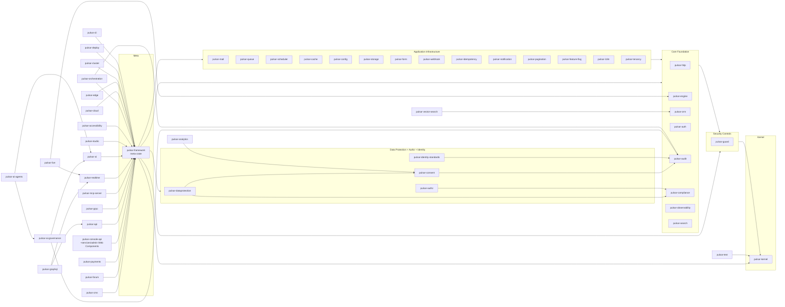
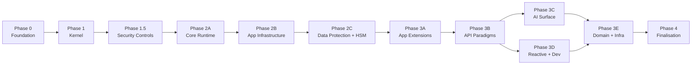
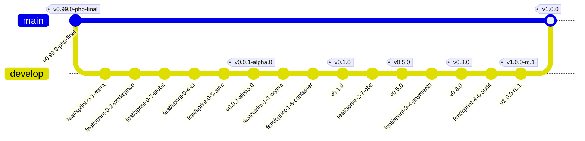

# Pulsar Framework — Master Plan

**Version:** 2.1.0 (Master Plan, Rust Rewrite, Strict Parity Edition, De-timed)
**Status:** Authoritative Planning Artefact
**Owner:** Lenny Obez
**Scope:** Full rewrite of Pulsar Framework from PHP 8.5 to Rust 1.95+, strict functional parity with PHP 1.0.0-rc.11 plus state-of-art extensions
**Cadence:** driven by exit criteria and quality gates, not by calendar; ships when correct, not when scheduled
**Baseline Specification:** Pulsar Framework 1.0.0-rc.11 (PHP): 60 `src/` modules, 31 extensions, 30 ADR, ~500 000 LOC
**Parity Commitment:** every PHP subsystem listed in Section XV Parity Matrix either maps to an equivalent Rust crate or is explicitly superseded, with zero silent regression

---

## I. Executive Summary

Pulsar Framework has matured through eleven release candidates as a PHP 8.5 modular monolith targeted at regulated, high-assurance workloads. The reference release candidate, `1.0.0-rc.11`, crystallises a mature feature surface of sixty `src/` modules and thirty-one first-party extensions totalling approximately five hundred thousand lines of code: a formally considered kernel; an extension-first architecture; an HMAC-chained audit log; attribute-bound public API surface; a modern observability stack; typed configuration DTOs; an application cache layer with multi-driver support (filesystem, Redis, APCu); internationalisation with dot-notation keys and ICU placeholders; OpenTelemetry export; OAuth2, OpenID Connect, and WebAuthn adapters; a queue system with Redis plus msgpack plus AEAD payload encryption; mail with SMTP and webhook verifier for Sendgrid, SES, and Mailgun; notifications with consent awareness; form builders with MimeSniffer; a full CMS with eighty-plus admin controllers, experimentation framework, and business profile management; a payments extension with Stripe, cart, subscription, invoice, and dispute management; a WebSocket subsystem with frame codec, handshake, channel manager, and inbound message handler completed in April 2026; a saga and workflow orchestration module; a resilience policy engine; a scheduler with distributed locks; a feature flag subsystem; a tenancy layer; storage abstractions; cloud adapters for AWS, Azure, and GCP; edge compute integration; service discovery with health checks; supply chain provenance with SLSA attestations; eighteen compliance framework mappings; a Pulse template engine with sandboxed compiler; AI providers for Anthropic, OpenAI, and Ollama with embedding and vector store integration; an AI governance extension aligned to ISO 42001:2023; GraphQL and gRPC adapters; an MCP (Model Context Protocol) server extension; a Dev Studio IDE extension; analytics with CSP-compliant tracker and consent banner; accessibility contrast checking; plus ticketing, feedback, booking, and device management extensions. The PHP implementation has reached the expressive limit of its host language. The present document specifies the full rewrite of Pulsar Framework in Rust 1.95+, preserving every strategic intent and every subsystem of the PHP lineage while elevating the engineering rigour to levels observed in the seL4 microkernel, the CompCert verified C compiler, the SQLite test protocol, the LMAX Disruptor architecture, and the Erlang OTP supervision trees.

The target market for Pulsar 1.0 (Rust) is the set of regulated, mission-critical domains where existing general-purpose web frameworks impose unacceptable compromise: retail and corporate banking, private and public healthcare, legal technology (case management, e-discovery, e-signature backends), and government digital services. These domains require provable, not merely observed, properties: constant-time cryptographic code paths, tamper-evident audit trails, fine-grained capability-scoped extension sandboxes, memory-safety guarantees, explicit side-effect boundaries, and a compliance-mapping matrix aligned to current regulation. Generic frameworks in Node, Go, or Python do not present these properties as first-class concerns. Enterprise frameworks in Java historically do so, yet their operational footprint (cold-start latency, memory baseline, garbage-collection tail latency) is incompatible with the latency budgets demanded by real-time payment rails, electronic health record APIs, and courtroom-scale concurrent sessions. A Rust implementation closes both gaps simultaneously: memory safety without a garbage collector, deterministic latency, predictable footprint, and a host language expressive enough to encode cryptographic invariants directly in the type system.

The rewrite is cadenced by exit criteria and quality gates rather than by calendar. No sprint carries a duration estimate; no phase carries a date; no GA target is set on a clock. The discipline is ship-when-correct. The rewrite is structured in eleven phases, sequenced by dependency:

- **Phase 0 — Foundation** — workspace skeleton, CI topology, ADR process, placeholder crates on crates.io for namespace reservation.
- **Phase 1 — Kernel** — formally verified microkernel: crypto primitives, audit HMAC chain, session state machine, router trie, middleware pipeline, dependency-injection container; every subsystem covered by TLA+ protocol specifications and Creusot function contracts.
- **Phase 1.5 — Security Controls** — CSRF, subresource integrity, incident response primitives, rate limiting, circuit breakers and bulkheads.
- **Phase 2A — Core Runtime** — HTTP layer on `hyper`, template engine, ORM on `sqlx` with fifteen derive attributes including opt-in event sourcing, audit extension, authentication suite (password plus OAuth2 plus WebAuthn plus two-factor plus social SSO with forty-plus providers plus enterprise SSO via SAML, LDAP, Kerberos), compliance policy engine mapped to eighteen frameworks, observability stack, search.
- **Phase 2B — Application Infrastructure** — mail, queue, scheduler, cache, config, storage, form, webhook, idempotency, notification, pagination, feature flag, i18n, tenancy — the horizontal infrastructure layer that parity with PHP requires.
- **Phase 2C — Data Protection + HSM** — DSAR and right-to-be-forgotten automation, consent manager, data purge orchestrator, data residency enforcement, HSM/PKCS#11 integration, key rotation.
- **Phase 3A — Application Extensions** — `pulsar-console-api` + `services/admin/` native Web Components admin SPA, CMS, forum, payments.
- **Phase 3B — API Paradigms** — GraphQL, gRPC, MCP server, REST API framework with OpenAPI generation, WebSocket, WebTransport, broadcasting, server-sent events.
- **Phase 3C — AI Surface** — AI providers (Anthropic, OpenAI, Ollama, local models), vector search, AI governance aligned to ISO 42001:2023 and the EU AI Act.
- **Phase 3D — Reactive + Dev Experience** — `pulsar-live` (reactive server-driven primitive), `pulsar-studio` (Dev Studio IDE extension), analytics, accessibility.
- **Phase 3E — Domain Extensions** — tickets, feedback, booking, devices, releases, import/export, workflow, saga, cloud adapters, edge compute integration, supervisor, service discovery, deploy orchestration.
- **Phase 4 — Finalisation** — WebAssembly extension sandbox, CLI tool, extension marketplace, exhaustive test suites, documentation consolidation, external security audit, FIPS 140-3 validation, confidential computing, governance and RFC process, privacy-enhancing technologies, `1.0.0` GA release.

The merge strategy is big-bang: the full rewrite develops on the `develop` branch across every sprint of every phase; the PHP codebase receives the terminal tag `v0.99.0-php-final` and is frozen; on completion of Phase 4 the single `develop → main` pull request undergoes `/ultrareview` and becomes the new `main` head. No partial integration and no hybrid operation is planned: the PHP tree is preserved for historical auditability but receives no further maintenance, no bug fixes, and no security patches beyond the freeze tag. The same GitHub repository URL, `LennyObez/pulsar-framework`, hosts both histories.

The quantitative success metrics for 1.0.0 GA are: one hundred percent line, branch, and condition coverage on kernel, security, and compliance crates; at least ninety-five percent line/branch coverage across every other crate; mutation-testing score of at least ninety-five percent per `cargo-mutants`; ten million fuzzing iterations with zero crashes per parser with `cargo-fuzz`; a minimum of sixty property-based tests on value objects; at least twenty named chaos-engineering scenarios; nine TLA+ specifications covering crypto, router, session, audit, middleware, OAuth2, saga, workflow, and WebSocket inbound dispatcher; at least eighty percent Creusot contract coverage across kernel functions; zero `cargo-audit` findings at any severity; median hello-world latency under 100 microseconds; 99th-percentile HTTP latency under one millisecond; 99.99th-percentile tail latency under five milliseconds; per-request peak memory below one megabyte; idle process memory below fifty megabytes; sustained load-test throughput of one thousand requests per second over one hour; stripped release binary below fifty megabytes; at least sixty Architecture Decision Records; complete mdBook coverage across Getting Started, Concepts, Guide, Cookbook, and API Reference chapters; at least twenty Grafana dashboards and alerting rules committed to `docs/observability/`; compliance mappings for sixteen nominal frameworks (eighteen enumerated, as detailed in Section V); **all fifty-plus first-party crates covering strict PHP parity per Section XV plus state-of-art extensions per Section XIV**; and at least three of the seven downstream Obez-network projects migrated to the Rust edition before GA.

---

## II. Strategic Decisions

The thirty decisions below are locked for the duration of the rewrite. Each fixes a design-space axis and removes it from subsequent debate. Section V sequences the work that implements each decision; Section X tracks the residual risks that remain attached to each decision.

### 2.1 Full rewrite from PHP 8.5 to Rust 1.95+

The decision is a full rewrite, not a hybrid deployment, not a foreign-function-interface bridge, and not a compatibility layer. Rationale: every module of Pulsar PHP carries idioms (PSR-compliant interfaces, array-shaped configuration, attribute-driven introspection) that do not map one-to-one onto idiomatic Rust. A hybrid would freeze these idioms into the Rust tree and prevent the re-encoding of invariants into the type system, which is the single largest gain the rewrite seeks. Alternatives considered were: gradual port with PHP calling Rust via FFI (rejected: leaks PHP lifecycle into Rust, doubles the operational footprint, and complicates the audit surface); transpilation (rejected: the PHP tree is not sufficiently uniform to transpile safely, and the resulting Rust would not compile on the same semantic footing as hand-written code); and a Rust-side shim exposing the PHP interfaces (rejected: the same leakage problem at a lower abstraction level). The tradeoff accepted: zero code reuse, complete reimplementation cost, extended calendar.

### 2.2 Target domains: regulated banking, healthcare, legal, government

The framework targets domains where framework quality directly drives liability exposure. Rationale: these four sectors share a common property — the cost of a production defect is denominated not in user churn but in regulatory fines, licensure loss, or criminal exposure. A framework that carries formal proofs, tamper-evident audit, capability-scoped sandboxing, and a pre-filled compliance matrix removes the largest portion of the framework-related compliance cost from every downstream application. Alternatives considered: general-purpose positioning (rejected: reduces differentiation against `axum`, `actix-web`, `rocket`); single-vertical positioning, for instance fintech-only (rejected: narrows market, and the four chosen verticals share sixty percent of the compliance surface — GDPR, ISO 27001, SOC 2 — so serving all four costs marginally more than serving one).

### 2.3 Rigour level: 100% state-of-the-art absolute

The engineering rigour target is the strict upper envelope achievable in 2026: NASA JPL Power of Ten rules for kernel-critical loops, seL4-style formal verification for kernel invariants (using Creusot rather than Isabelle/HOL), SQLite-style exhaustive test-to-production ratio, LMAX-style single-writer event paths where relevant, Erlang OTP-style supervision for any persistent concurrency. Rationale: the target market is intolerant of the cost-optimised rigour standard that prevails in the broader web-framework ecosystem; a framework that matches general-purpose rigour will lose every evaluation against Java-enterprise incumbents in regulated procurement. Tradeoff accepted: velocity is roughly halved relative to a non-rigorous rewrite; the calendar absorbs the difference.

### 2.4 Repository: LennyObez/pulsar-framework, PHP history preserved at v0.99.0-php-final

The same GitHub URL hosts both histories. The terminal PHP commit receives the annotated tag `v0.99.0-php-final`; no branch is created for PHP, and no further commits land on it. Rationale: preserves external links, stargazer history, issue history, and CI configuration continuity. Alternatives considered: new repository (rejected: breaks every external link, including the published ADR links, crates.io documentation URLs, and GitHub security advisory references); separate PHP-legacy repository (rejected: doubles the operational surface and fragments the issue tracker).

### 2.5 Branch model: main stable, develop active integration, feat/sprint-N-M-topic

The branch topology is three-tier. `main` holds shipped tags only. `develop` is the active integration branch for the duration of the rewrite. Sprint work lands on `feat/sprint-N-M-topic` branches that merge into `develop`. Rationale: `develop` is long-lived because the rewrite spans the full phased sequence and no intermediate releases ship from `main` until GA; the sprint-namespaced feature branches give each sprint a single canonical branch for review. Alternatives: trunk-based (rejected: forces partial-merge discipline incompatible with the kernel-formal-verification phase); release-branch-per-phase (rejected: fragments review overhead).

### 2.6 Review protocol: /review intra-feature, /ultrareview final

Intra-feature pull requests from `feat/*` to `develop` use the standard `/review` skill. The single terminal pull request from `develop` to `main` at big-bang merge time uses `/ultrareview`. Rationale: `/review` is calibrated for incremental feature-scale changes; `/ultrareview` is calibrated for cross-cutting, architecture-scale review and is reserved for the one PR whose scope is the entire rewrite. Tradeoff accepted: the terminal `/ultrareview` is expected to surface issues requiring multi-day remediation before GA; the calendar reserves four weeks for this (Sprint 4.6).

### 2.7 Language: Rust 1.95.0 stable, edition 2024, pinned via rust-toolchain.toml

The toolchain is pinned to `1.95.0` stable in `rust-toolchain.toml` with edition 2024. Rationale: pinning eliminates the class of failures where a clippy lint introduced in a new minor version breaks CI for downstream contributors; edition 2024 delivers `gen blocks`, unsafe-block preciseness, and the revised `static mut` treatment, all of which reduce the surface area of `unsafe` elsewhere in the tree. Alternatives: nightly (rejected: incompatible with the formal-verification toolchain requirements and with downstream distributors); prior edition (rejected: forgoes material ergonomic gains).

### 2.8 Frontend admin: Web Components v1 + ES2025 + JSDoc, full native, no framework, no compiler

The administration console is a Single-Page Application built entirely on native web standards: HTML5, modern CSS3 (cascade layers, container queries, `:has()`, native nesting, `color-mix`, OKLCH colour space, View Transitions API), JavaScript ES2025 with native modules, Web Components v1 with Shadow DOM for component encapsulation, JSDoc for static type annotations checked by `tsc --checkJs --noEmit` in CI, hand-rolled signals primitive (~100 lines) for fine-grained reactivity, hand-rolled router (~100 lines) on the History API. Zero external framework, zero compiler, zero bundler. The `.js` and `.css` files are served as written, without transformation. Optional production minification through esbuild as a single sub-second pass; not required.

Rationale: removes every external framework dependency (Svelte, React, Vue, Leptos), survives any ecosystem evolution, native browser debuggability (the executed code is the written code), bundle equals source code, alignment with Pulsar's "rigorous engineering, minimal dependencies" philosophy. Alternatives considered: Leptos WASM (rejected: bundles 5-10× larger than native, component ecosystem nascent, Leptos 1.0 timeline uncertain); Svelte 5 (rejected: external runtime dependency, philosophy "native-first" prioritised over framework convenience); Lit (rejected: minimal Web Components wrapper but still an avoidable dependency); React + TypeScript (rejected: industry hegemony without technical advantage for this scope); Yew/Dioxus (rejected: same WASM weight problems as Leptos). Tradeoff accepted: +2 to 3 months of solo effort versus a mature framework, allocated to building the primitives library (signals, router, api-client, form library, data grid, modal system, focus management) once. The primitive library lives in `services/admin/src/lib/` and is reusable across the admin surface.

### 2.9 Frontend public: pulsar-engine SSR + HTMX + modern CSS native

Public-facing pages (CMS, forum, landing, marketing) are rendered server-side by `pulsar-engine` (Rust template engine, Section 4.4). Templates use a component architecture via includes, partials, macros, and shared layouts. HTMX (14 kB gzipped) provides progressive interactivity through HTML attributes (`hx-get`, `hx-post`, `hx-target`, `hx-swap`). Native Web Components defined per-page can act as "islands" for specific interactive widgets where HTMX falls short. Modern CSS (cascade layers, container queries, `:has()`, native nesting, `color-mix`, OKLCH) with a shared design-token layer reused by both public and admin surfaces.

Rationale: SEO baseline perfect (HTML rendered on server, crawlers see content immediately); accessibility natural (semantic HTML before any JavaScript); first-contentful-paint below 100 ms; progressive enhancement (page works fully without JavaScript); minimal bundle (HTMX 14 kB total); identical design tokens across public and admin maintain visual consistency; separation of concerns honoured at the architecture level (server renders structure, HTMX adds interactivity, CSS handles presentation). Alternatives considered: Leptos SSR (rejected: external dependency, hydration complexity); SPA full-JS public (rejected: SEO regresses, accessibility regresses, mobile performance regresses); fully static SSG (rejected: inadequate for authenticated content, real-time updates, dynamic CMS).

### 2.10 CSS pipeline: Lightning CSS

The CSS toolchain is Lightning CSS (written in Rust) for bundling, transformation, minification, and source maps. Rationale: same-language toolchain as the rest of the stack; delivers browser-target transformations (nesting, custom properties, colour-function) without a JavaScript build step; order-of-magnitude faster than `postcss` plus `autoprefixer` plus `cssnano`. Alternatives: Tailwind CSS (rejected as default: imposes utility-class idiom on downstream applications; remains available as an extension); PostCSS (rejected: Node.js toolchain reintroduction).

### 2.11 Template engine: pulsar-engine (custom)

A custom Rust template engine, `pulsar-engine`, ships as the default. Rationale: none of `minijinja`, `tera`, or `askama` combines the four properties Pulsar requires: compile-time template checking with auto-escaping by context (HTML, JS, URL, CSS), ergonomic control-flow, i18n integration with ICU plural forms, and security-hardened partial/include resolution with path sandboxing. Alternatives: adopt `minijinja` and wrap (rejected: escaping semantics are single-context and cannot be raised without forking); adopt `askama` (rejected: macro-expansion model is hostile to dynamic fragment composition required by the CMS extension). Tradeoff accepted: six-week sprint cost (Sprint 2.2).

### 2.12 ORM: pulsar-orm (custom layer on sqlx primitives, 15 derive attributes)

The ORM is a custom layer on `sqlx` primitives, exposing fifteen derive attributes: `Entity`, `Repository`, `ValueObject`, `Aggregate`, `EventSourced`, `Projection`, `ReadModel`, `Query`, `Command`, `Migration`, `Seed`, `Factory`, `Policy`, `Validator`, `Serialized`. Rationale: PHP Pulsar already exposed attribute-driven ORM ergonomics, and Rust proc-macros encode the same model at zero runtime cost; event sourcing is opt-in per aggregate to retain mixed-paradigm support. Alternatives: use `diesel` (rejected: synchronous core incompatible with Tokio runtime); use `sea-orm` (rejected: imposes its own entity model, conflicts with attribute-driven shape).

### 2.13 HTTP framework: pulsar-http (custom layer on hyper primitives)

The HTTP layer is custom, built on `hyper` and `tokio`. Rationale: `axum` or `actix-web` would impose routing, extraction, and middleware idioms incompatible with the formally verified router trie and middleware pipeline. Building on `hyper` keeps the pulsar layer below the verified kernel without importing conflicting upstream idioms. Alternatives: `axum` (rejected: its extractor model conflicts with the attribute-bound request/response contracts); `actix-web` (rejected: actor model imposes supervision overhead absent elsewhere).

### 2.14 Crypto primitives: ring + subtle + zeroize + secrecy

The cryptographic foundation is `ring` (primitives), `subtle` (constant-time operations), `zeroize` (post-use memory clearing), `secrecy` (secret lifecycle typing). No primitive is reimplemented; no F\* extraction is performed at Pulsar-layer; no custom cryptography is introduced. Rationale: reimplementing primitives is categorically forbidden in regulated software; `ring` is FIPS-derived and audited; the surrounding crates cover the typing and hygiene surface. Alternatives: `rustls/*` primitive crates (rejected: less surface coverage); HACL\* bindings (rejected: build complexity disproportionate to gain).

### 2.15 Default OLTP DB: PostgreSQL 16+ with Patroni + etcd

Default online transaction processing is PostgreSQL 16+ operated as a Patroni cluster with etcd as the distributed consensus store. Rationale: PostgreSQL is the regulated-domain default; Patroni plus etcd delivers Raft-backed high availability with automated failover and no single point of failure. Alternatives: MySQL/MariaDB (rejected: MVCC and transactional semantics weaker for regulated domains); Oracle (rejected: licence cost and vendor lock-in); MS SQL Server (rejected: ecosystem narrower for Rust client libraries).

### 2.16 Multi-region OLTP: external community adapter

Multi-region strong-consistency deployments use a community-maintained backend crate (`pulsar-orm-cockroach` or equivalent) rather than a framework-bundled CockroachDB path. Rationale: CockroachDB's Business Source Licence terms evolve unpredictably (R-012), regulated-domain procurement prefers PostgreSQL+Patroni by a wide margin, and bundling a BSL default complicates enterprise evaluations. The `pulsar-orm` crate exposes a backend feature-flag mechanism that the community adapter plugs into. Alternatives considered: bundle CockroachDB as opt-in default in the framework workspace (rejected: licence drift risk, procurement friction); bundle YugabyteDB (rejected: smaller operator ecosystem); bundle Citus (rejected: sharding model weaker for geo-distribution).

### 2.17 Optional OLAP DB: ClickHouse

For observability at scale — high-cardinality metrics, distributed traces, query-side analytics — ClickHouse is the opt-in OLAP target. Rationale: columnar store handles the write-heavy, long-tail-read pattern of observability data orders of magnitude more efficiently than PostgreSQL; remains opt-in so single-node deployments need not provision it. Alternatives: TimescaleDB (rejected: PostgreSQL-extension model inadequate for very high cardinality); Druid (rejected: operational surface disproportionate).

### 2.18 Search: Tantivy + pulsar-search

Full-text search builds on Tantivy as the primitive and ships `pulsar-search` as the Pulsar-layer abstraction. Rationale: Tantivy is a pure-Rust, Lucene-class search library with strong performance and maintenance; wrapping it in `pulsar-search` provides analyser pipelines, i18n tokenisation, and policy-bound field access appropriate to regulated data. Alternatives: Elasticsearch client (rejected: external operational dependency); Meilisearch (rejected: smaller analyser surface).

### 2.19 Extension sandbox: wasmtime with capability-based security

Third-party extensions run inside `wasmtime` with capability-based security. Each extension receives exactly the capabilities explicitly granted through its manifest and no others; the host enforces these via WASI Preview 2 component-model capabilities and the Pulsar capability table. Rationale: extensions written by third parties cannot be trusted to preserve framework invariants; WASM sandboxing provides a hardware-backed trust boundary; capability-based security makes the trust surface auditable and minimal. Alternatives: process isolation (rejected: IPC overhead unacceptable); ambient authority on in-process extensions (rejected: security model collapse).

### 2.20 Formal verification: Creusot + TLA+

Function-level contracts are encoded in Creusot (Rust-specific); protocol-level specifications use TLA+ with the TLC model checker. Rationale: Creusot expresses pre/post conditions and loop invariants in Rust syntax with SMT solver backends (Z3, CVC5); TLA+ expresses distributed and concurrent protocol properties at the abstraction level where liveness and safety claims are testable. The two tools cover disjoint verification surfaces. Alternatives: Prusti (rejected: tooling maturity lower than Creusot in 2026); Kani (rejected: bounded model checking only, weaker for inductive proofs); Alloy (rejected: weaker temporal logic than TLA+).

### 2.21 Licence: Apache-2.0 with Pulsar Framework trademark registered at EUIPO

The licence is Apache-2.0; the name "Pulsar Framework" is registered as an EU trademark at EUIPO. Rationale: Apache-2.0 is the dominant permissive licence acceptable to enterprise procurement and carries an explicit patent grant; EUIPO registration protects the brand across the EU single market. Alternatives: MIT (rejected: lacks patent grant); MPL-2.0 (rejected: file-level copyleft introduces friction in regulated forks); GPL family (rejected: incompatible with closed-source downstream applications).

### 2.22 Architecture pattern

The composite architectural pattern is: modular monolith (single deployable artefact, internal module boundaries) plus formally verified microkernel (crypto, audit, session, routing, middleware, DI) plus hexagonal (ports-and-adapters across every crate boundary) plus WASM-sandboxed extensions (third-party code in capability-scoped wasmtime instances) plus event-driven inter-module communication (typed events on an internal bus, first-class at the kernel level). Rationale: each of these axes is independently justified; the composition is coherent because the modular-monolith layer defines module boundaries, hexagonal defines adapter shapes, the microkernel defines the verified subset, WASM defines the extension sandbox, and events define the inter-module contract. Alternatives: pure microservice (rejected: operational cost for the target deployment size); pure monolith without modular discipline (rejected: loses the extension story).

### 2.23 Crates.io namespace: pulsar-* prefix on every published crate

Every published crate uses the `pulsar-` prefix. The unprefixed `pulsar` name is occupied by an Apache Pulsar client. Rationale: avoids namespace collision; groups every Pulsar crate visually on crates.io; allows downstream authors to recognise framework-provided crates immediately. No alternative considered (the decision is forced by namespace occupancy).

### 2.24 Meta-crate: pulsar-framework

A meta-crate named `pulsar-framework` re-exports the stable public surface of the constituent crates. Rationale: downstream applications depend on `pulsar-framework` rather than on fifteen individual crates; version compatibility is guaranteed within a single meta-crate minor version; the meta-crate is the stability commitment boundary. Alternatives: no meta-crate (rejected: downstream dependency graphs become fragile).

### 2.25 Security disclosure: GitHub Security Advisories + security@pulsar-framework.com

The primary security-disclosure channel is GitHub Security Advisories on the `LennyObez/pulsar-framework` repository; the fallback is `security@pulsar-framework.com`. Rationale: GitHub Security Advisories integrates with CVE issuance and `cargo-audit` feed propagation; the email fallback preserves disclosure capability for reporters outside the GitHub ecosystem. Alternatives: email-only (rejected: lacks integration); Bugcrowd/HackerOne (rejected: operational cost disproportionate to expected volume in year one).

### 2.26 PHP legacy: complete freeze

The PHP tree is frozen at `v0.99.0-php-final`. No bug fixes, no security patches, no maintenance. Consumers on PHP are directed to the Rust edition or to alternative frameworks. Rationale: dual maintenance is the single largest force multiplier on rewrite calendar; freezing eliminates it. Tradeoff accepted: PHP consumers face a forced migration; R-005 tracks this risk.

### 2.27 Resource budgets non-negotiable: CPU + RAM + I/O equal to security and performance

Resource budgets are first-class acceptance criteria, equal in priority to security and functional correctness. Stripped release binary below fifty megabytes; per-request peak memory below one megabyte; idle process memory below fifty megabytes; CPU utilisation under sustained one-thousand-requests-per-second load below four cores on commodity hardware; I/O write amplification in the audit chain below a factor of two over the raw payload. Rationale: regulated deployments increasingly constrain per-instance resource envelopes; a framework exceeding these on a hello-world configuration disqualifies itself at procurement. No alternative considered.

### 2.28 Testing baseline

The testing baseline per sprint exit is: one hundred percent line coverage, one hundred percent branch coverage, one hundred percent condition coverage via `cargo-llvm-cov`; at least ninety-five percent mutation score via `cargo-mutants`; for each parser (HTTP, template, ORM query, configuration, i18n), ten million fuzzing iterations with zero crashes via `cargo-fuzz`; per value object, at least one `proptest` property; at least ten named chaos scenarios at the integration-test layer; sustained load-test of one thousand requests per second for one hour with no degradation. Rationale: this is the floor below which regulated procurement rejects the framework; meeting it is the cost of admission.

### 2.29 Event sourcing: opt-in via #[EventSourced] derive attribute

Event sourcing is a first-class opt-in pattern in `pulsar-orm`, enabled per aggregate by the `#[EventSourced]` derive attribute. Rationale: event sourcing is strongly justified for some regulated workflows (ledger-like financial records, clinical-decision logs) but adds cost unjustified in non-ledger aggregates; making it opt-in rather than mandatory avoids forcing the pattern across the whole domain. Alternatives: mandatory event sourcing (rejected: disproportionate for CRUD aggregates); external library (rejected: integration surface too deep).

### 2.30 Commit policy: GPG-signed, Conventional Commits, zero Co-Authored-By, zero references to drafting tooling

Every commit on every branch is GPG-signed (RFC 4880, Ed25519 key preferred). Commit messages follow Conventional Commits v1.0.0. No commit carries `Co-Authored-By:` trailers. Commit messages, code comments, architecture decision records, and documentation pages never reference automated-drafting tooling of any kind. The sole exception is the literal regulatory framework name ISO 42001:2023, which appears verbatim in the compliance mapping table. Rationale: regulated downstream consumers audit commit provenance; a signed, deterministic, human-attributed commit history is a compliance artefact in itself.

### 2.31 Strict parity with PHP 1.0.0-rc.11

Every sixty `src/` module and every thirty-one first-party extension of the PHP baseline maps to a Rust crate or is explicitly superseded in Section XV. Zero silent regression. Parity is a GA acceptance criterion, audited module-by-module in the parity matrix. Rationale: the PHP codebase is the reference specification of Pulsar's feature surface at GA; a rewrite that drops features rewrites product strategy, not engineering. Alternatives considered: minimal-viable rewrite shipping kernel plus CMS plus payments at GA (rejected: would strand seven downstream projects that already depend on subsystems outside the MVP); staged parity across 1.x releases with partial GA (rejected: breaks procurement criterion "feature complete at GA").

### 2.32 Extended crate catalogue — 50+ crates

The workspace hosts approximately fifty first-party crates, grouped in seven layers: kernel (1), core foundation (8), security controls (5), application infrastructure (14), data protection (2), application extensions (4), API paradigms (6), AI surface (3), reactive and developer experience (2), domain extensions (8), infrastructure adapters (5). Rationale: strict PHP parity requires migrating thirty-plus horizontal subsystems (mail, queue, scheduler, cache, config, storage, form, webhook, idempotency, notification, pagination, feature flag, i18n, tenancy, dataprotection, consent, workflow, saga, websocket, broadcasting, api, graphql, grpc, mcp-server, ai, ai-governance, vector-search, live, studio, accessibility, analytics, cloud, edge, supervisor, service-discovery, deploy, tickets, feedback, booking, devices, releases, importexport, resilience, csrf, sri, incident, ratelimit) that the v1 plan omitted. Alternatives considered: three meta-crates aggregating per layer (rejected: coarsens version boundaries and couples unrelated subsystems); monolithic `pulsar` crate (rejected: catastrophic compile-time cost, forced feature-flag explosion).

### 2.33 No calendar; cadence driven by exit criteria and quality gates

No sprint, phase, or release is bound to a date. The rewrite ships 1.0.0 GA when every exit criterion in Section V is met and every success metric in Section XII is achieved. Rationale: the v1 and v2 calendar estimates (twelve-to-eighteen months; twenty-four-to-thirty months; forty-two-to-fifty-four months) were speculative without velocity data. Anchoring to speculative dates creates two failure modes: (a) schedule-driven quality compromise when the clock appears to slip, (b) false stakeholder expectations inconsistent with solo-maintainer reality. Reference benchmarks (seL4, SQLite, CompCert, Rust itself) ship when correct, never on a calendar. Target market (regulated banking, healthcare, legal, government) accepts "ship when correct" as the higher-assurance standard. Alternatives considered: bind calendar to external audit firm engagement window (rejected: audit firms accommodate preparation calendar, not impose it); commit to quarterly public milestone communications (accepted as communication discipline, not as delivery commitment — see Section IX.9.7 governance).

### 2.34 Application infrastructure layer as first-class

Mail, queue, scheduler, cache, config, storage, form, webhook, idempotency, notification, pagination, feature flag, i18n, and tenancy ship as first-class crates of Pulsar 1.0.0, not as post-GA extensions or third-party dependencies. Rationale: every one of these is already stable in PHP Pulsar; they are not optional infrastructure but part of the framework surface that downstream applications consume. Alternatives considered: recommend community crates for each (e.g., `lettre` for mail, `apalis` for queue, `tokio-cron-scheduler` for scheduler) (rejected: fragmented idioms, no unified policy integration, no audit-chain coupling); defer to post-GA (rejected: breaks Decision 2.31 parity).

### 2.35 Async runtime: tokio (inverts PHP ADR-0005 "synchronous core")

The runtime is `tokio` 1.52 multi-threaded scheduler. Every public API that blocks on I/O is `async`. Rationale: the PHP design chose a synchronous core with controlled Fiber usage because PHP fibers were new and stack-unfriendly; Rust async is the idiomatic concurrency primitive, mature, and inter-operable with every major async crate. Alternatives considered: `glommio` (rejected: single-threaded io_uring model incompatible with multi-core scaling); `monoio` (rejected: same); `smol` (rejected: smaller ecosystem); synchronous core with `rayon` for parallelism (rejected: forfeits async composition with `hyper`, `sqlx`, `reqwest`). A dedicated ADR documents the inversion from PHP ADR-0005.

### 2.36 Live reactive framework as first-party — pulsar-live

Ship `pulsar-live` as a first-party Rust-native Livewire-style reactive server-driven framework: typed reactive components, server-side state, diff-based DOM patches over WebSocket or SSE, progressive enhancement. Rationale: PHP Pulsar has a 3 439-LOC `Live` module that is core to the downstream family-site and studio-pair projects; the native Web Components admin SPA covers high-interactivity admin workloads but does not substitute for the server-driven primitive used by public dashboards and embedded widgets where zero JavaScript framework is acceptable. Alternatives considered: SPA-only client-side (rejected: forfeits the server-driven low-bundle pattern); Hotwire-style Turbo (rejected: requires JS runtime reintroduction).

### 2.37 AI governance as first-party — pulsar-ai-governance

Ship `pulsar-ai-governance` as a first-party crate aligned to ISO 42001:2023 and the EU AI Act (Regulation (EU) 2024/1689): model registry with tamper-evident provenance, prompt injection defense via structured I/O schemas, LLM audit trail (hash of prompt, hash of output, token counts, cost per call), AI data lineage, algorithmic bias detection hooks, RAG retrieval audit, output moderation with PII redaction, risk-level classifier per EU AI Act four-tier taxonomy. Rationale: PHP Pulsar ships an `ai-governance` extension and the compliance matrix (Section V Sprint 2.6) lists ISO 42001:2023; the plan v1 omitted the implementation crate. Alternatives considered: treat as application responsibility (rejected: every downstream application would reinvent the same primitives).

### 2.38 Multi-tenancy as first-class — pulsar-tenancy

Ship `pulsar-tenancy` as a first-party crate: tenant-isolation primitives at the ORM level (row-level security, schema-level isolation, database-level isolation selectable per deployment), tenant-scoped caches, tenant-scoped rate limits, tenant-scoped audit chains (one chain per tenant with per-tenant master key derivation), tenant-aware middleware, tenant migration tooling. Rationale: the four target verticals (banking, healthcare, legal, government) are structurally multi-tenant; PHP Pulsar has a 913-LOC `Tenancy` module. Alternatives considered: treat as application responsibility (rejected: audit and compliance break without framework-level enforcement).

### 2.39 Live reactive primitive distinct from admin SPA

Both `pulsar-live` (Decision 2.36) and the admin stack (`pulsar-console-api` + `services/admin/` per Decision 2.8) ship. They address disjoint concerns: the admin stack is a native Web Components SPA with client-side reactivity for the high-interactivity admin surface ; `pulsar-live` is a server-driven reactive primitive that pushes diff fragments over WebSocket or SSE to enrich public pages and downstream-application dashboards where zero client-side framework is acceptable. Rationale: the two cover the full spectrum from thin-client public rendering to rich-client admin ; each is optimal on its axis. Alternatives considered: unify both under `pulsar-live` server-driven (rejected: insufficient for entity-grid-grade interactivity in admin); unify both under Web Components SPA (rejected: forfeits the zero-JS option for public dashboards).

### 2.40 Unified realtime crate — pulsar-realtime

Ship `pulsar-realtime` as a first-party crate unifying WebSocket inbound + outbound, Server-Sent Events, WebTransport, and the broadcasting / channel fan-out surface. Sub-modules: `realtime::websocket` (inbound `MessageHandler`, outbound `FrameSink`, named channel manager, route-table dispatch, middleware pipeline for frames), `realtime::sse` (progressive streaming responses, reconnection, resumable streams), `realtime::webtransport` (HTTP/3-native datagrams and streams), `realtime::broadcasting` (Redis/NATS/Kafka/in-process pub-sub fan-out, presence channels, private channel auth hook). Rationale: the four surfaces share session state, auth, rate-limit middleware, and back-pressure semantics; splitting them into four crates multiplies integration friction for identical plumbing. Closes PHP VOID DRIFT gap #13 (WebSocket inbound `MessageHandlerInterface`). TLA+ specification covers the inbound dispatch lifecycle. Alternatives considered: keep websocket/broadcasting/webtransport separate (rejected: duplicate middleware wiring, inconsistent back-pressure policy, four identical CI pipelines); fold into `pulsar-http` (rejected: frame-lifecycle semantics differ, protocol state machines warrant dedicated verification).

### 2.41 GraphQL, gRPC, MCP server as first-class API adapters

Ship `pulsar-graphql` (on `async-graphql`), `pulsar-grpc` (on `tonic`), and `pulsar-mcp-server` (Model Context Protocol server, JSON-RPC-over-stdio and over-HTTP transports) as first-party crates. Rationale: PHP Pulsar has corresponding extensions; enterprise banking deployments require gRPC for inter-service, client evaluation teams routinely require GraphQL, and MCP is the 2025-2026 standard for LLM tool-calling surfaces which the AI governance story depends on. Alternatives considered: post-GA (rejected: breaks Decision 2.31).

### 2.42 AI providers: multi-vendor abstraction — pulsar-ai

Ship `pulsar-ai` as a first-party crate exposing a typed provider abstraction over Anthropic, OpenAI, Ollama (local), Google Vertex AI, Mistral, and an in-process llama.cpp adapter. Rationale: PHP `AI` module (3 192 LOC) is already multi-provider; mission-critical deployments require vendor flexibility including air-gapped local inference. Alternatives considered: single-provider (rejected: vendor lock-in unacceptable).

### 2.43 Vector search as first-party — pulsar-vector-search

Ship `pulsar-vector-search` built on `pgvector` (PostgreSQL extension) as default backend and `qdrant` adapter as alternative. Rationale: Retrieval-Augmented Generation is the default LLM grounding pattern in 2026; banking and legal deployments must ground LLM outputs in internal corpora. Alternatives considered: recommend community crates (rejected: no unified policy, no audit coupling).

### 2.44 Security controls as dedicated layer — Phase 1.5

Security controls (`pulsar-csrf`, `pulsar-sri`, `pulsar-incident`, `pulsar-ratelimit`, `pulsar-resilience`) ship as a dedicated phase between kernel and core. Rationale: these are horizontal concerns that the HTTP framework, ORM, and auth suite all consume; shipping them after core would force retrofits. Alternatives considered: fold into `pulsar-http` (rejected: coupling, size); community crates (rejected: no unified integration into audit chain and policy engine).

### 2.45 Data protection runtime automation — pulsar-dataprotection + pulsar-consent

Ship `pulsar-dataprotection` (DSAR workflow, right-to-be-forgotten orchestration, data portability export, data residency enforcement, retention-policy TTL) and `pulsar-consent` (granular consent ledger, withdrawal, cookie banner, preference centre) as separate crates. Rationale: GDPR Articles 15, 17, and 20 require runtime-executable workflows, not documentation. PHP has a `DataProtection` module (1 906 LOC) that is reference-only; the Rust rewrite productionises it. Regulatory reporting automation (DORA, NIS2, EU AI Act, EU Data Act, MiCA, FINRA, FFIEC, HIPAA BAA) folds into `pulsar-compliance` (Section 4.8 extended scope) rather than a separate crate, because reporting templates share the framework-clause taxonomy already in `pulsar-compliance`.

### 2.46 Kubernetes Operator: Go + kubebuilder, hosted in `services/operator/`

The Pulsar Kubernetes Operator is implemented in Go using the kubebuilder framework, hosted in `services/operator/` outside the Cargo workspace. Rationale: Kubernetes is itself written in Go; the operator-pattern ecosystem (kubebuilder, operator-sdk, client-go, controller-runtime, kustomize) is Go-native; reference operators from Red Hat, Google, VMware, Stackable, and Confluent are all Go; community contributors familiar with operator patterns expect Go. Best-tool-for-the-job principle prevails over single-language consistency. The Go operator consumes Pulsar's APIs via gRPC (`pulsar-grpc`) for observability and audit integration. Alternatives considered: `kube-rs` Rust operator (rejected: smaller community, fewer reference patterns, limits operator contributor pool); standalone shell scripts (rejected: insufficient for production-grade reconciliation).

### 2.47 End-to-end testing: WebdriverIO for admin, Rust HTTP clients for public

Automated end-to-end testing follows two stacks aligned with the dual frontend approach (Decisions 2.8 and 2.9):
- **Admin SPA** — WebdriverIO 9+ in TypeScript or JSDoc-typed JavaScript, multi-browser via WebDriver (Chromium, Firefox, WebKit, Edge), hosted in `services/admin/tests/`. Capabilities: visual-regression via `wdio-visual-service`, network mocking via `wdio-intercept-service`, mobile emulation, accessibility snapshot via `@wdio/axe-service`, video recording via `wdio-video-reporter`, parallel execution. Used by Microsoft, SAP, Mozilla. Production-grade since 2014.
- **Public pages (CMS, forum, landing)** — Rust HTTP-client tests with `reqwest` + `scraper` + `insta` snapshot assertions, hosted in `tests/e2e/public/`. Pure HTTP exchanges, no browser, no JavaScript execution required (HTMX is parsed and asserted via DOM-tree inspection). Faster than browser tests, sufficient for SSR + HTMX surfaces.

Rationale: "Best tool per job" applied to E2E: a real browser is unnecessary for SSR pages but mandatory for SPA admin. Playwright is reserved for the maintainer's manual verification only, not for the automated test suite. Alternatives considered: thirtyfour Rust WebDriver client for admin (rejected: tooling completeness gap on trace viewer, codegen, parallel runner); single-stack browser-everywhere (rejected: 10× slower for public-page assertions).

### 2.48 Long-term commitment: multi-year solo project framing accepted

The rewrite is explicitly framed as a **multi-year solo engineering commitment**. No calendar (Decision 2.33), but a realistic effort estimate: ~780 000 lines of code across Rust crates, native admin SPA, Go operator, tests, documentation, and ADRs ; sustained solo velocity of 8–15 thousand lines of net production code per month with strict quality gates (formal verification, mutation, fuzz, property, coverage 100% on critical surfaces) implies an engagement on the order of years rather than months.

The maintainer accepts:
- Deliberate pace : "ship when correct" governs every sprint exit. No artificial deadline pressure.
- Long-haul motivation discipline : mental model of incremental progress, rest, periodic re-engagement, not sprint-marathon-burnout cycle.
- Risk of life-event interruption (R-009 + R-017 already track this) : checkpoints at every phase exit allow scope reduction without abandoning the project.
- Pre-authorisation to onboard a second committer at any checkpoint where solo velocity falls below sustainable target (R-013, R-017 reference).
- Long-term tooling drift management (R-016) : every checkpoint includes a "dependency freshness" review, dependencies pinned, breaking changes absorbed in dedicated maintenance sprints between feature sprints.

Rationale : framing the project explicitly as multi-year prevents the corrosive "behind schedule" feeling that wrecks solo software projects. Reference benchmarks (Lerdorf alone for early PHP, Hoare alone for early Rust, Linus alone for early Linux, Salvatore Sanfilippo alone for early Redis) all involved multi-year solo phases before community formed. Accepting this explicitly is part of sound engineering. Alternatives considered: sprint-to-deadline (rejected: incompatible with the quality gates and formal verification scope) ; abandon scope to fit shorter calendar (rejected: contradicts Decision 2.31 strict-parity commitment) ; outsource portions to contractors (rejected: solo maintainer's quality bar harder to enforce on contractors than on self).

---

## III. Architecture Overview

The Pulsar Rust edition is structured as seven layers around a formally verified microkernel, with WebAssembly extension sandboxing at the periphery and an event bus cross-cutting every layer. The dependency rule is strict: Domain Extensions depend on Application Extensions and API Paradigms; Application Extensions depend on Application Infrastructure; API Paradigms depend on Application Infrastructure; AI Surface depends on Application Infrastructure; Application Infrastructure depends on Core Foundation; Core Foundation depends on Security Controls; Security Controls depend on Kernel; Kernel depends on Infrastructure primitives; the reverse is never permitted. Adapters at every boundary invert dependencies through ports defined in the inner layer.

```mermaid
graph TD
    subgraph DomainLayer[Domain Extensions Layer]
        Tickets[pulsar-tickets]
        Feedback[pulsar-feedback]
        Booking[pulsar-booking]
        Devices[pulsar-devices]
        Releases[pulsar-releases]
        ImportExport[pulsar-importexport]
        Workflow[pulsar-workflow]
        Saga[pulsar-saga]
    end

    subgraph ReactiveLayer[Reactive + Dev Experience Layer]
        Live[pulsar-live]
        Studio[pulsar-studio]
        Analytics[pulsar-analytics]
        Accessibility[pulsar-accessibility]
    end

    subgraph AILayer[AI Surface Layer]
        AI[pulsar-ai]
        AIGov[pulsar-ai-governance]
        VectorSearch[pulsar-vector-search]
    end

    subgraph APILayer[API Paradigms Layer]
        API[pulsar-api REST+OpenAPI]
        GraphQL[pulsar-graphql]
        GRPC[pulsar-grpc]
        MCP[pulsar-mcp-server]
        WebSocket[pulsar-websocket]
        Broadcasting[pulsar-broadcasting]
    end

    subgraph AppExtLayer[Application Extensions Layer]
        Console[pulsar-console-api<br/>+ services/admin native Web Components]
        CMS[pulsar-cms]
        Forum[pulsar-forum]
        Payments[pulsar-payments]
    end

    subgraph AppInfraLayer[Application Infrastructure Layer]
        Mail[pulsar-mail]
        Queue[pulsar-queue]
        Scheduler[pulsar-scheduler]
        Cache[pulsar-cache]
        Config[pulsar-config]
        Storage[pulsar-storage]
        Form[pulsar-form]
        Webhook[pulsar-webhook]
        Idempotency[pulsar-idempotency]
        Notification[pulsar-notification]
        Pagination[pulsar-pagination]
        FeatureFlag[pulsar-feature-flag]
        I18n[pulsar-i18n]
        Tenancy[pulsar-tenancy]
    end

    subgraph DataProtectionLayer[Data Protection Layer]
        DataProtection[pulsar-dataprotection]
        Consent[pulsar-consent]
    end

    subgraph CoreFoundationLayer[Core Foundation Layer]
        HTTP[pulsar-http]
        Engine[pulsar-engine]
        ORM[pulsar-orm]
        Auth[pulsar-auth]
        Audit[pulsar-audit]
        Compliance[pulsar-compliance]
        Observability[pulsar-observability]
        Search[pulsar-search]
    end

    subgraph SecurityControlsLayer[Security Controls Layer — Phase 1.5]
        CSRF[pulsar-csrf]
        SRI[pulsar-sri]
        Incident[pulsar-incident]
        RateLimit[pulsar-ratelimit]
        Resilience[pulsar-resilience]
    end

    subgraph KernelLayer[Formally Verified Kernel]
        Crypto[Crypto primitives]
        AuditChain[Audit HMAC chain]
        Session[Session state machine]
        Router[Router trie]
        Middleware[Middleware pipeline]
        DI[DI container]
    end

    subgraph InfraLayer[Infrastructure Adapters Layer]
        Cloud[pulsar-cloud<br/>AWS/Azure/GCP]
        Edge[pulsar-edge]
        Supervisor[pulsar-supervisor]
        ServiceDiscovery[pulsar-service-discovery]
        Deploy[pulsar-deploy]
    end

    subgraph InfraPrimitives[Infrastructure Primitives]
        Hyper[hyper TCP/HTTP]
        Tokio[tokio runtime]
        Sqlx[sqlx pools]
        Ring[ring crypto]
        Tantivy[Tantivy]
        Postgres[(PostgreSQL 16+ / Patroni)]
        CRDB[(CockroachDB optional)]
        ClickHouse[(ClickHouse optional)]
        Wasmtime[wasmtime WASI P2]
    end

    subgraph ExtensionSandbox[WASM Extension Sandbox]
        CapTable[Capability Table]
        ExtA[3rd-party Extension A]
        ExtB[3rd-party Extension B]
    end

    EventBus[[Event Bus — typed, cross-cutting]]

    DomainLayer --> ReactiveLayer
    DomainLayer --> APILayer
    DomainLayer --> AppExtLayer
    ReactiveLayer --> AppInfraLayer
    APILayer --> AppInfraLayer
    AILayer --> AppInfraLayer
    AppExtLayer --> AppInfraLayer
    AppInfraLayer --> DataProtectionLayer
    AppInfraLayer --> CoreFoundationLayer
    DataProtectionLayer --> CoreFoundationLayer
    CoreFoundationLayer --> SecurityControlsLayer
    SecurityControlsLayer --> KernelLayer
    KernelLayer --> InfraLayer
    InfraLayer --> InfraPrimitives
    ExtensionSandbox -. capabilities .-> AppInfraLayer
    DomainLayer --- EventBus
    APILayer --- EventBus
    AppExtLayer --- EventBus
    AppInfraLayer --- EventBus
    CoreFoundationLayer --- EventBus
    KernelLayer --- EventBus
```



### Dependency rule

The rule is enforced at two levels. At the workspace level, each `Cargo.toml` declares its allowed dependencies, and a `cargo deny` ruleset forbids reverse edges. At the review level, every pull request that modifies a `Cargo.toml` triggers a mandatory manual check against the dependency graph rendered in Section IV. Violations are merge-blocking. Rationale: a violated dependency rule in a regulated framework allows an Application-layer change to leak semantics into the Kernel, invalidating formal proofs.

### Hexagonal ports and adapters

Every crate boundary is a hexagonal boundary: the inner crate defines port traits; the outer crate (or a sibling crate) provides adapter implementations. For example, `pulsar-orm` defines a `Repository<E>` port; `pulsar-cms` consumes it; `pulsar-orm` implements a default PostgreSQL-backed adapter. Adapter swapping (e.g., in-memory for tests, PostgreSQL for production, CockroachDB for multi-region) is a compile-time selection, not a runtime dispatch, to preserve zero-cost abstraction. Rationale: the port/adapter discipline is the architectural mechanism that makes the eighteen-framework compliance matrix tractable — jurisdictions demanding specific adapters (e.g., HSM-backed key storage) plug in without modifying the core.

### Microkernel composition

The Kernel layer contains exactly six subsystems: crypto primitives (key derivation, AEAD encryption, digital signatures on top of `ring`), audit HMAC chain (tamper-evident append-only log with cryptographic linking), session state machine (typed states with verified transitions), router trie (radix-tree path matcher with constant-time worst-case lookup), middleware pipeline (typed before/after ordering with total-order verification), and DI container (constructor injection with compile-time topological-sort verification). Every subsystem in the Kernel layer carries a TLA+ specification and at least a baseline set of Creusot function contracts. Rationale: these six are the subsystems whose defects would be most costly and most hidden; pinning them to formal verification pays the disproportionate share of the assurance budget.

### WASM extension sandbox with capability-based security

Extensions compile to WebAssembly components targeting WASI Preview 2. The host loads each extension through `wasmtime` with an initially empty capability table; the extension's `pulsar.toml` manifest declares requested capabilities; the installation flow presents these to the administrator for explicit grant. No capability is granted implicitly. Capabilities are fine-grained: `database:read:table:posts`, `http:outbound:example.com:443`, `filesystem:read:/data/uploads`, `event:subscribe:user.created`, and so on. Rationale: the capability model is the mechanism that makes third-party extensions tractable in regulated environments — the audit question "what can this extension observe or mutate?" has a deterministic, manifest-bound answer.

### Event-driven inter-module communication

An internal event bus carries typed events between modules. Events are Rust types with `Debug`, `Clone`, and `Serialize` bounds; subscribers register typed handlers at startup. The bus is single-writer within a request and supports broadcast to multiple subscribers. Events are the sanctioned mechanism for cross-module communication that would otherwise require a direct call, which would violate the dependency rule or the modular boundary. Example: `pulsar-auth` emits `UserAuthenticated`; `pulsar-audit` subscribes and records the event in the audit chain; neither crate depends on the other at the type level. Rationale: decouples module lifecycles at compile time, keeps audit and observability cross-cuts cheap.

---

## IV. Workspace Layout

The workspace is a single Cargo workspace with fifty-three first-party Rust crates organised by layer (post-consolidation per Section 16.14), plus two non-Rust sub-projects in `services/` (the admin SPA in native HTML5 + ES2025 + Web Components per Decision 2.8, and the Kubernetes Operator in Go per Decision 2.46). A `spec/` tree hosts TLA+ specifications, a `tools/` tree hosts workspace-local build tooling, an `examples/` tree hosts reference applications, and a `docs/` tree hosts documentation artefacts.

```
pulsar-framework/
├── Cargo.toml                    # workspace manifest, [workspace] table only
├── Cargo.lock
├── rust-toolchain.toml           # pinned 1.95.0 stable, edition 2024
├── deny.toml                     # cargo-deny rules
├── .cargo/config.toml            # mold linker, sccache wrapper
├── rustfmt.toml                  # formatting rules
├── clippy.toml                   # lint configuration
├── LICENSE                       # Apache-2.0
├── NOTICE                        # trademark, attribution
├── README.md
├── CHANGELOG.md                  # [Unreleased] section active through rewrite
├── SECURITY.md                   # disclosure process
├── CONTRIBUTING.md
├── CODE_OF_CONDUCT.md
├── crates/
│   ├── pulsar-framework/         # 4.1 meta-crate, re-exports stable surface
│   │
│   ├── pulsar-kernel/            # 4.2 formally verified primitives
│   │
│   ├── pulsar-http/              # 4.3 HTTP/1+2+3 framework on hyper (SSE included)
│   ├── pulsar-engine/            # 4.4 template engine
│   ├── pulsar-orm/               # 4.5 ORM on sqlx, 15 derive attributes, pg/mysql/sqlite
│   ├── pulsar-audit/             # 4.6 audit log + Merkle transparency + WORM export
│   ├── pulsar-auth/              # 4.7 auth suite (OAuth 2.1, SAML, LDAP, Kerberos, SCIM, WebAuthn, 2FA, Social SSO)
│   ├── pulsar-compliance/        # 4.8 policy engine + 18 framework mappings + runtime automation hooks
│   ├── pulsar-observability/     # 4.9 Timer + Logger + metrics + tracing + OTel + ClickHouse
│   ├── pulsar-search/            # 4.10 Tantivy-based search abstraction
│   │
│   ├── pulsar-guard/             # 4.11 CSRF + SRI + incident + rate-limit + resilience + SSRF-guard (consolidated)
│   │
│   ├── pulsar-mail/              # 4.12 SMTP + MJML + webhook verifier (Sendgrid/SES/Mailgun/Postmark)
│   ├── pulsar-queue/             # 4.13 Redis + msgpack + AEAD job queue
│   ├── pulsar-scheduler/         # 4.14 Cron-like distributed scheduler
│   ├── pulsar-cache/             # 4.15 Multi-tier cache (Moka + Redis + CDN)
│   ├── pulsar-config/            # 4.16 Typed readonly config + hot-reload + secret adapters
│   ├── pulsar-storage/           # 4.17 S3/Azure Blob/GCS/MinIO/local storage
│   ├── pulsar-form/              # 4.18 Form builder + validation + mime sniffer
│   ├── pulsar-webhook/           # 4.19 Generic webhook subscription/retry/signature/replay-guard
│   ├── pulsar-idempotency/       # 4.20 Idempotency-Key middleware primitive
│   ├── pulsar-notification/      # 4.21 Consent-aware notifications (push/SMS/web/in-app)
│   ├── pulsar-pagination/        # 4.22 Cursor + offset pagination primitives
│   ├── pulsar-feature-flag/      # 4.23 Feature flags + kill switch + A/B (OpenFeature)
│   ├── pulsar-i18n/              # 4.24 Dedicated i18n (dot-notation, ICU plurals, RTL, fallback chains)
│   ├── pulsar-tenancy/           # 4.25 Multi-tenant row/schema/database isolation
│   │
│   ├── pulsar-dataprotection/    # 4.26 DSAR + RtbF + data portability + data residency + retention TTL
│   ├── pulsar-consent/           # 4.27 Consent ledger + cookie banner + preference centre
│   ├── pulsar-authz/             # 4.28 RBAC + ABAC + ReBAC (Zanzibar) authorization engine
│   ├── pulsar-identity-standards/# 4.29 W3C VC + DIDs + JWS + COSE signature formats
│   │
│   ├── pulsar-cms/               # 4.30 CMS (pages, posts, taxonomies, media, workflows, experimentation, newsletter)
│   ├── pulsar-forum/             # 4.31 Threaded forum
│   ├── pulsar-payments/          # 4.32 Commerce + subscriptions (Stripe/Braintree/Mollie/PayPal/Adyen)
│   ├── pulsar-console-api/       # 4.33 admin server API + static-asset serving (companion to services/admin/ Web Components SPA)
│   │
│   ├── pulsar-api/               # 4.34 REST + OpenAPI 3.1 + AsyncAPI 3 + OData (feature)
│   ├── pulsar-graphql/           # 4.35 GraphQL on async-graphql (Dataloader, subscriptions, query cost)
│   ├── pulsar-grpc/              # 4.36 gRPC on tonic (+ gRPC-Web + gRPC-JSON transcoding optional)
│   ├── pulsar-mcp-server/        # 4.37 Model Context Protocol server
│   ├── pulsar-realtime/          # 4.38 WebSocket + SSE + WebTransport + broadcasting fan-out (consolidated)
│   │
│   ├── pulsar-ai/                # 4.39 Multi-provider AI abstraction (Anthropic/OpenAI/Vertex/Mistral/Bedrock/Ollama/llama.cpp)
│   ├── pulsar-ai-governance/     # 4.40 ISO 42001:2023 + EU AI Act runtime (model registry, PII redaction, risk classifier)
│   ├── pulsar-vector-search/     # 4.41 pgvector + Qdrant + Weaviate backends for RAG
│   ├── pulsar-ai-agents/         # 4.42 Agentic framework (tool-use loop, Computer Use adapter, cost ceiling)
│   │
│   ├── pulsar-live/              # 4.43 Livewire-style reactive server-driven framework
│   ├── pulsar-studio/            # 4.44 Dev Studio IDE extension
│   ├── pulsar-analytics/         # 4.45 CSP-compliant tracker + consent-gated
│   ├── pulsar-accessibility/     # 4.46 Contrast checker + axe-core audit + cognitive a11y
│   │
│   ├── pulsar-orchestration/     # 4.47 Workflow engine + saga compensation (consolidated)
│   │
│   ├── pulsar-cloud/             # 4.48 AWS/Azure/GCP unified adapter layer
│   ├── pulsar-edge/              # 4.49 Edge compute + CDN + ACME TLS provisioning
│   ├── pulsar-cluster/           # 4.50 Health supervisor + service discovery (consolidated)
│   ├── pulsar-deploy/            # 4.51 Rolling + blue-green + canary deploy orchestration
│   │                             # Note: Kubernetes Operator (formerly 4.52) lives in `services/operator/` in Go (Decision 2.46), not as a Rust crate.
│   │
│   ├── pulsar-cli/               # 4.52 CLI tool
│   └── pulsar-test/              # 4.53 testing utilities
├── spec/
│   ├── crypto.tla                # TLA+ spec for key lifecycle
│   ├── router.tla                # TLA+ spec for route resolution
│   ├── session.tla               # TLA+ spec for session transitions
│   ├── audit.tla                 # TLA+ spec for chain append/verify
│   ├── middleware.tla            # TLA+ spec for pipeline ordering
│   ├── oauth2.tla                # TLA+ spec for OAuth2 flows
│   ├── websocket.tla             # TLA+ spec for inbound dispatch lifecycle
│   ├── workflow.tla              # TLA+ spec for workflow state-machine correctness
│   └── saga.tla                  # TLA+ spec for saga compensation ordering
├── tools/
│   ├── xtask/                    # workspace-local build tasks
│   └── scripts/                  # shell helpers (read-only helpers only)
├── examples/
│   ├── hello-world/
│   ├── banking-ledger/
│   ├── healthcare-fhir/
│   ├── legal-case-mgmt/
│   ├── gov-identity/
│   ├── cms-blog/
│   ├── forum-community/
│   ├── payments-subscription/
│   ├── live-dashboard/
│   └── ai-chatbot-rag/
├── services/                     # non-Rust sub-projects, polyglot-by-best-tool
│   ├── admin/                    # native HTML5 + ES2025 + Web Components SPA, served by pulsar-console-api
│   │   ├── index.html
│   │   ├── tsconfig.json         # checkJs: true, noEmit, target ES2025
│   │   ├── src/
│   │   │   ├── main.js
│   │   │   ├── lib/              # signals, router, api-client, store, form, design-system primitives
│   │   │   ├── design-system/    # tokens.css, utilities.css, base.css
│   │   │   ├── components/       # Web Components (.js with JSDoc + Shadow DOM)
│   │   │   └── pages/            # admin views composing components
│   │   └── tests/                # WebdriverIO E2E (admin browser tests)
│   └── operator/                 # Kubernetes operator in Go (Section 2.46), idiomatic kubebuilder
│       ├── go.mod
│       ├── PROJECT
│       ├── api/v1alpha1/         # CRD definitions: Pulsar, PulsarExtension, PulsarSecret
│       ├── controllers/          # reconciliation logic
│       ├── config/               # Kustomize bases + RBAC
│       └── tests/                # Go test suite + envtest integration
├── benches/                      # workspace-level criterion benchmarks
├── fuzz/                         # cargo-fuzz targets
└── docs/
    ├── plan.md                   # this document
    ├── trademark-policy.md
    ├── api-surface.md            # public API snapshot
    ├── adr/
    │   ├── INDEX.md
    │   ├── 0000-template.md
    │   └── <numbered ADRs>       # target: ≥ 60 ADRs at GA
    ├── architecture/
    │   ├── overview.md
    │   ├── kernel.md
    │   ├── extensions.md
    │   └── diagrams/
    ├── book/                     # mdBook source
    │   ├── book.toml
    │   ├── src/
    │   │   ├── getting-started/
    │   │   ├── concepts/
    │   │   ├── guide/
    │   │   ├── cookbook/
    │   │   └── reference/
    ├── migration/
    │   └── php-to-rust-parity.md # Section XV parity matrix tracking
    ├── ops/
    │   ├── runbooks/
    │   └── deployment/
    ├── security/
    │   ├── threat-model.md
    │   ├── controls-catalogue.md # OWASP Top 10 / ASVS L3 / CWE / NIST 800-53
    │   ├── disclosure.md
    │   └── audits/
    ├── perf/
    │   ├── budgets.md
    │   └── baselines/
    ├── observability/
    │   ├── dashboards/           # ≥ 20 Grafana dashboards at GA
    │   └── alerts/
    ├── governance/
    │   ├── governance.md
    │   ├── stability-tiers.md
    │   ├── deprecation-policy.md
    │   └── rfcs/
    └── compliance/
        ├── matrix.md
        └── frameworks/
```

Six PHP extensions (`tickets`, `feedback`, `booking`, `devices`, `releases`, `importexport`) are deliberately excluded from framework core (Section 16.13); `devices` folds into `pulsar-auth` as a submodule; `importexport` folds into `pulsar-cli` subcommands plus `pulsar-orm` helpers; the four remaining become downstream applications. The crate dependency graph is as follows:



The Kubernetes Operator lives outside the Cargo workspace under `services/operator/` (Go + kubebuilder per Decision 2.46) and consumes Pulsar APIs via `pulsar-grpc` for observability and audit integration. The admin SPA lives outside the Cargo workspace under `services/admin/` (native HTML5 + ES2025 + Web Components per Decision 2.8) and is served as static assets by `pulsar-console-api`.

### 4.1 pulsar-framework (meta-crate, re-exports)

**Purpose.** Single dependency entry point for downstream applications. Re-exports the stable public surface of the kernel, HTTP, engine, ORM, auth, audit, compliance, and observability crates. Version-locks each re-export to a compatible range. Defines the public `pulsar::prelude` module.

**Key types.** `pulsar::prelude::*` (glob re-exports); `pulsar::VERSION` (const string).

**Dependencies.** `pulsar-kernel = "=X.Y.Z"`, `pulsar-http`, `pulsar-engine`, `pulsar-orm`, `pulsar-auth`, `pulsar-audit`, `pulsar-compliance`, `pulsar-observability` (all pinned to exact workspace version).

**Re-exported in meta.** N/A (is the meta).

**Status.** Planned.

### 4.2 pulsar-kernel (formally verified primitives)

**Purpose.** Hosts the six kernel subsystems under formal verification: crypto primitives, audit HMAC chain, session state machine, router trie, middleware pipeline, DI container. Every public function carries Creusot contracts where tractable; every protocol carries a TLA+ specification in `spec/`.

**Key types.** `Crypto`, `KeyId`, `Ciphertext`, `Nonce`, `AuditChain`, `AuditEntry`, `Session<S: State>`, `Router`, `Route`, `Middleware`, `Pipeline`, `Container`, `ServiceId`.

**Dependencies.** `ring = "0.17"`, `subtle = "2.5"`, `zeroize = "1.8"`, `secrecy = "0.10"`, `thiserror = "2"`, `tracing = "0.1"`.

**Re-exported in meta.** Yes.

**Status.** Planned (Phase 1 scope).

### 4.3 pulsar-http (HTTP framework on hyper)

**Purpose.** HTTP server and client built on `hyper` and `tokio`. Request/response types, typed extractors, TLS, HTTP/1.1, HTTP/2, HTTP/3 over QUIC, body-size limits, back-pressure, graceful shutdown, health and readiness probes, Prometheus-compatible metrics endpoint.

**Key types.** `Request`, `Response`, `Handler`, `Extractor<T>`, `Server`, `Client`, `Route` (re-exported from kernel), `Middleware` (re-exported).

**Dependencies.** `pulsar-kernel`, `hyper = "1.9"`, `hyper-util`, `tokio = "1.52"`, `tower`, `tower-http`, `rustls = "0.23"`, `rustls-pemfile`, `bytes`, `http`, `http-body`, `http-body-util`, `percent-encoding`.

**Re-exported in meta.** Yes.

**Status.** Planned (Phase 2 scope).

### 4.4 pulsar-engine (template engine)

**Purpose.** Compile-time-checked template engine with context-aware auto-escaping (HTML, JS, URL, CSS), i18n integration with ICU plural forms, path-sandboxed partials, custom filters and functions, streaming output.

**Key types.** `Template`, `Engine`, `Context`, `Filter`, `Function`, `Loader`, `CompiledTemplate`.

**Dependencies.** `pulsar-kernel`, `pest = "2"`, `pest_derive`, `icu = "2.0"`, `serde`, `thiserror`.

**Re-exported in meta.** Yes.

**Status.** Planned (Phase 2 scope).

### 4.5 pulsar-orm (ORM on sqlx, 15 derive attributes)

**Purpose.** Typed, attribute-driven ORM layer on `sqlx`. Exposes fifteen derive macros (`Entity`, `Repository`, `ValueObject`, `Aggregate`, `EventSourced`, `Projection`, `ReadModel`, `Query`, `Command`, `Migration`, `Seed`, `Factory`, `Policy`, `Validator`, `Serialized`) plus a query builder and migration runner. Opt-in event sourcing via `#[EventSourced]`.

**Key types.** `Repository<E>`, `EventStore`, `Migration`, `Aggregate<E>`, `Projection<P>`, `Query`, `Command`, `Policy`, `Validator`, `ConnectionPool`.

**Dependencies.** `pulsar-kernel`, `sqlx = "0.8"` (with `postgres`, `runtime-tokio-rustls`, `macros`), `serde`, `serde_json`, `uuid`, `chrono`, `thiserror`, `darling` (proc-macro helper), `proc-macro2`, `syn`, `quote`.

**Re-exported in meta.** Yes.

**Status.** Planned (Phase 2 scope).

### 4.6 pulsar-audit (audit log extension)

**Purpose.** Append-only, HMAC-chained, tamper-evident audit log. Every entry carries a sequence number, a timestamp, an actor, an action, a target, a before/after diff, and an HMAC chained to the previous entry. Verifier detects any tampering in constant time per entry. Integrates via event bus.

**Key types.** `AuditLog`, `AuditEntry`, `Verifier`, `ChainAnchor`, `AuditEvent`.

**Dependencies.** `pulsar-kernel`, `pulsar-orm`, `ring`, `subtle`, `serde`, `serde_json`, `thiserror`.

**Re-exported in meta.** Yes.

**Status.** Planned (Phase 2 scope).

### 4.7 pulsar-auth (password + OAuth2 + WebAuthn + 2FA + Social SSO)

**Purpose.** Complete authentication suite: Argon2id password hashing, session management, remember-me tokens, OAuth2 (authorisation code, client credentials, device code flows), OpenID Connect, WebAuthn registration and authentication, two-factor authentication (TOTP + recovery codes), and social SSO with over forty providers (Google, Microsoft, GitHub, GitLab, Apple, Facebook, Twitter/X, LinkedIn, Discord, Slack, Okta, Auth0, Keycloak, Azure AD, etc.).

**Key types.** `PasswordHasher`, `OAuth2Client`, `OpenIdConnectClient`, `WebAuthnVerifier`, `TotpGenerator`, `SocialSSO`, `Provider`, `Credential`.

**Dependencies.** `pulsar-kernel`, `pulsar-orm`, `argon2`, `oauth2 = "5"`, `openidconnect`, `webauthn-rs`, `totp-rs`, `reqwest` (TLS only), `url`.

**Re-exported in meta.** Yes.

**Status.** Planned (Phase 2 scope).

### 4.8 pulsar-compliance (policy engine + 18 framework mappings + regulatory reporting automation)

**Purpose.** Three responsibilities in one crate because they share the same policy primitives, the same audit integration, and the same regulatory-framework taxonomy:

- **Policy engine** — runtime-evaluable `Policy` traits composed via conjunction / disjunction / negation, evaluated at middleware-pipeline time and repository-access time, with deterministic decision and audit linkage.
- **Compliance mapping matrix** — pre-filled structured mapping (plus machine-readable metadata in `docs/compliance/matrix.toml`) between framework clauses (GDPR, HIPAA, PCI-DSS v4, SOC 2, ISO 27001:2022, ISO 42001:2023, DORA, eIDAS, PSD2, NIS2, HL7/FHIR, ISO 13485, MDR, NIST CSF, DSA, Data Act, SWIFT CSP, CCPA) and Pulsar features, extensions, and controls.
- **Regulatory reporting automation** — templated submission artefacts for: DORA ICT incident reporting (4h / 24h / 72h / one-month deadlines tracked through `pulsar-scheduler`), NIS2 incident notification (early warning 24h / notification 72h / final report one month), EU AI Act Article 14 human-oversight runtime gates, EU Data Act B2B portability export, MiCA crypto-asset disclosure (opt-in feature `mica`), DSA Article 25 dark-pattern prevention primitives, HIPAA Business Associate Agreement template, PCI-DSS tokenisation boundary primitives, FINRA audit-trail emission, FFIEC cybersecurity posture report.

**Key types.** `Policy`, `PolicyEngine`, `Decision`, `ComplianceFramework`, `ComplianceMapping`, `DataClassification`, `RegulatoryReport`, `ReportTemplate`, `ReportSubmission`, `DoraIncident`, `Nis2Notification`, `AiActRiskGate`, `DataActExport`, `MicaDisclosure`.

**Dependencies.** `pulsar-kernel`, `pulsar-audit`, `pulsar-orm`, `pulsar-scheduler`, `serde`, `serde_json`, `thiserror`.

**Re-exported in meta.** Yes.

**PHP parity.** `src/Compliance/` (7 680 LOC) in PHP. Rust extends PHP's static-matrix-only coverage with runtime reporting automation (PHP had the matrix but emitted no artefacts).

**Status.** Planned (Phase 2A scope; reporting-automation sub-module can land incrementally post policy-engine core).

### 4.9 pulsar-observability (Timer + Logger + metrics + tracing + OTel + ClickHouse)

**Purpose.** Observability stack. Structured logging via `tracing`; metrics via `metrics` plus Prometheus exporter; distributed tracing via `tracing-opentelemetry` with OTLP export; optional ClickHouse sink for high-cardinality observability at scale; Timer and Logger façade types for ergonomic in-request instrumentation.

**Key types.** `Timer`, `Logger`, `MetricsRegistry`, `Tracer`, `Span`, `OtlpExporter`, `ClickHouseSink`.

**Dependencies.** `pulsar-kernel`, `tracing`, `tracing-subscriber`, `tracing-opentelemetry = "0.32"`, `opentelemetry = "0.31"`, `opentelemetry-otlp = "0.31"`, `metrics = "0.24"`, `metrics-exporter-prometheus`, `clickhouse = "0.13"`.

**Re-exported in meta.** Yes.

**Status.** Planned (Phase 2 scope).

### 4.10 pulsar-search (Tantivy-backed search abstraction)

**Purpose.** Full-text search abstraction over Tantivy with analyser pipelines, i18n tokenisation (including CJK and Arabic), policy-bound field access appropriate to regulated data, and pluggable backends (in-process Tantivy default, remote Elasticsearch adapter optional via feature flag).

**Key types.** `SearchIndex`, `Query`, `Analyser`, `FieldPolicy`, `IndexWriter`, `IndexReader`.

**Dependencies.** `pulsar-kernel`, `tantivy = "0.25"`, `serde`, `icu = "2.2"`, `thiserror`.

**Re-exported in meta.** Yes.

**PHP parity.** Partial equivalent in PHP (`extensions/cms/SearchAnalytics`); Rust makes search a first-party primitive.

**Status.** Planned (Phase 2A scope).

### 4.11 pulsar-guard (Security controls — consolidated)

**Purpose.** Horizontal security-controls layer unifying six security concerns that share middleware plumbing, request lifecycle, and back-pressure semantics. Shipping as one crate avoids five parallel CI pipelines, five duplicate middleware-composition modules, and the cross-crate versioning friction of fragmenting the security surface. Sub-modules publish under `pulsar_guard::<module>`:

- `guard::csrf` — double-submit cookie CSRF tokens with HMAC authentication bound to session identifier; SameSite cookie defaults; Origin and Referer verification; stateless SPA flow via custom header.
- `guard::sri` — Subresource Integrity digest generation (SHA-384 default, SHA-512 available), integrity attribute injection into rendered templates, asset-pipeline hook, CSP header emission with hashed inline scripts.
- `guard::incident` — Incident classification per FIRST CVSS 4.0, containment catalogue, automatic circuit-trip on threshold breach, audit-chain linkage, runbook reference, on-call notification dispatch (PagerDuty, OpsGenie, Slack, email).
- `guard::ratelimit` — token-bucket and sliding-window algorithms, per-IP/user/tenant/endpoint scopes, Redis backend with local fallback, graceful degradation, configurable rejection policies (429 with Retry-After, queue-and-delay, silent-drop).
- `guard::resilience` — circuit breaker (closed/open/half-open), bulkhead via semaphore, retry with exponential backoff plus full jitter, timeout, hedging, composable builder.
- `guard::ssrf` — outbound URL validation with private-IP blocking, DNS-rebinding defence, allowlist policy, `reqwest` middleware integration.

**Key types.** `CsrfToken`, `SriDigest`, `Incident`, `IncidentSeverity`, `RateLimiter`, `ResiliencePolicy`, `CircuitBreaker`, `Bulkhead`, `SsrfGuard`. One top-level `GuardMiddleware` composes the subset configured for a given pipeline.

**Dependencies.** `pulsar-kernel`, `pulsar-http`, `pulsar-engine` (for SRI template injection), `pulsar-audit`, `pulsar-notification`, `ring`, `subtle`, `redis = "0.27"`, `tower = "0.5"`, `tokio`, `thiserror`.

**Re-exported in meta.** Yes.

**PHP parity.** `src/Security/Csrf/`, `src/Security/Sri/`, `src/Security/Incident/`, `src/Http/Middleware/RateLimitMiddleware`, `src/Resilience/`. Closes VOID DRIFT gap #7 (sliding-window rate limiter validation). Rust formalises the CSRF token invariant with Creusot contracts and replaces PHP `@file_get_contents` suppressions with typed readers.

**Status.** Planned (Phase 1.5 scope, single consolidated sprint).

### 4.16 pulsar-mail (SMTP + template + webhook verifier)

**Purpose.** SMTP client with TLS (both STARTTLS and implicit), message-level encryption via S/MIME, MJML-to-HTML compilation, plain-text fallback auto-generation, attachment handling with size and type limits, webhook verifiers for Sendgrid, SES, Mailgun, Postmark (HMAC-signature verification), bounce-report parsing, DMARC alignment.

**Key types.** `Mailer`, `Message`, `Attachment`, `WebhookVerifier`, `BounceReport`, `Provider`.

**Dependencies.** `pulsar-framework`, `lettre = "0.11"` (SMTP transport primitive), `rustls`, `mrml = "4"` (MJML compiler), `serde`, `thiserror`.

**Re-exported in meta.** No (first-party extension, imported explicitly).

**PHP parity.** `src/Mail/` (3 760 LOC) in PHP.

**Status.** Planned (Phase 2B scope).

### 4.17 pulsar-queue (Job queue with AEAD payload encryption)

**Purpose.** Redis-backed job queue with msgpack serialisation and AEAD payload encryption (subkey 10 per key-derivation hierarchy), Lua-script-based atomic claim-and-update, per-job retry policy, dead-letter queue, delayed jobs, priority classes, worker supervision, graceful shutdown, back-pressure, per-job observability.

**Key types.** `Queue`, `Job`, `JobId`, `Worker`, `DeadLetter`, `JobResult`, `RetryPolicy`.

**Dependencies.** `pulsar-framework`, `redis = "0.27"`, `rmp-serde = "1"` (msgpack), `tokio`, `thiserror`.

**Re-exported in meta.** No.

**PHP parity.** `src/Queue/` (6 564 LOC) in PHP.

**Status.** Planned (Phase 2B scope).

### 4.18 pulsar-scheduler (Cron-like distributed scheduler)

**Purpose.** Cron-expression parser, distributed locking via Redis or PostgreSQL advisory locks to ensure at-most-one-run-per-schedule across instances, ergonomic `every_minutes(int)` / `every_hours(int)` builders, drift detection and correction, history retention, audit-chain linkage per scheduled execution.

**Key types.** `Schedule`, `CronExpr`, `Scheduler`, `Lock`, `Execution`, `History`.

**Dependencies.** `pulsar-framework`, `cron = "0.12"`, `redis` (optional), `tokio`, `thiserror`.

**Re-exported in meta.** No.

**PHP parity.** `src/Scheduler/` (1 603 LOC) in PHP, includes H-1 fix `everyMinutes(int)` already applied.

**Status.** Planned (Phase 2B scope).

### 4.19 pulsar-cache (Multi-tier cache)

**Purpose.** Multi-tier cache with in-process first tier (Moka), Redis second tier, optional CDN-edge third tier, typed keys and values, stampede protection via single-flight, per-key TTL, cache-aside and read-through patterns, integrity protection via AEAD when the cache stores sensitive material, integrity markers fixed vs PHP `@unserialize` suppressions.

**Key types.** `Cache`, `CacheKey`, `Tier`, `EvictionPolicy`, `SingleFlight`.

**Dependencies.** `pulsar-framework`, `moka = "0.12"`, `redis = "0.27"`, `serde`, `thiserror`.

**Re-exported in meta.** No.

**PHP parity.** `src/Cache/` (6 567 LOC) in PHP, ADR-0018.

**Status.** Planned (Phase 2B scope).

### 4.20 pulsar-config (Typed readonly configuration)

**Purpose.** Layered configuration (builtin defaults → TOML files → environment variables → runtime overrides), typed readonly DTOs per configuration domain, secret references resolved via HashiCorp Vault / AWS Secrets Manager / Azure Key Vault / GCP Secret Manager adapters, hot-reload on supported layers, schema validation, configuration diff utility for drift detection.

**Key types.** `Config`, `Layer`, `SecretRef`, `ConfigBuilder`, `ConfigDiff`.

**Dependencies.** `pulsar-framework`, `figment = "0.10"`, `toml`, `serde`, `thiserror`.

**Re-exported in meta.** No.

**PHP parity.** `src/Config/` (6 033 LOC) in PHP, `SharedMemoryConfigStore` and readonly DTOs per ADR-0011.

**Status.** Planned (Phase 2B scope).

### 4.21 pulsar-storage (Object storage abstraction)

**Purpose.** Object storage abstraction with pluggable backends (AWS S3, Azure Blob, GCS, MinIO, local filesystem), presigned URLs, multipart uploads for large files, AEAD encryption at rest option, integrity verification on read, per-bucket policies, regional routing for data residency enforcement (coupled with `pulsar-dataprotection`).

**Key types.** `ObjectStore`, `Bucket`, `Object`, `PresignedUrl`, `MultipartUpload`, `BackendAdapter`.

**Dependencies.** `pulsar-framework`, `object_store = "0.11"`, `tokio`, `thiserror`.

**Re-exported in meta.** No.

**PHP parity.** `src/Storage/` (1 141 LOC) in PHP.

**Status.** Planned (Phase 2B scope).

### 4.22 pulsar-form (Form builder + validation + mime sniffer)

**Purpose.** Typed form definitions with derive macros, declarative validation rules, multi-step flow support, file upload with magic-byte MIME sniffing (defence in depth against extension spoofing), CSRF integration (depends on `pulsar-csrf`), auto-generated client-side validation via JSON-Schema emission, i18n integration for error messages.

**Key types.** `Form`, `Field`, `Validator`, `MimeSniffer`, `UploadLimit`, `FormError`.

**Dependencies.** `pulsar-framework`, `pulsar-csrf`, `serde`, `validator = "0.19"`, `infer = "0.16"` (MIME sniffing), `thiserror`.

**Re-exported in meta.** No.

**PHP parity.** `extensions/form/` in PHP (stable).

**Status.** Planned (Phase 2B scope).

### 4.23 pulsar-webhook (Generic webhook subscriptions)

**Purpose.** Generic webhook subscription framework, per-endpoint signature scheme (HMAC-SHA256 default, Ed25519 optional), retry with exponential backoff, delivery attempts audit (audit-chain linkage), replay-attack defence via nonce + timestamp window, subscription CRUD API, deliverability dashboards.

**Key types.** `Webhook`, `Subscription`, `Delivery`, `SignatureScheme`, `ReplayGuard`.

**Dependencies.** `pulsar-framework`, `pulsar-audit`, `reqwest = "0.12"` (TLS only), `ring`, `thiserror`.

**Re-exported in meta.** No.

**PHP parity.** `src/Webhook/` (555 LOC) in PHP (primitive, distinct from per-extension webhooks like Stripe).

**Status.** Planned (Phase 2B scope).

### 4.24 pulsar-idempotency (Idempotency-Key middleware)

**Purpose.** Idempotency-Key middleware primitive, pluggable store (Redis default, PostgreSQL optional), TTL-bounded result cache, idempotency fingerprint on request body hash, safe interaction with retries from upstream clients, conflict detection on same key with different body.

**Key types.** `IdempotencyKey`, `IdempotencyStore`, `Fingerprint`, `IdempotencyMiddleware`.

**Dependencies.** `pulsar-framework`, `pulsar-http`, `redis = "0.27"`, `ring`, `thiserror`.

**Re-exported in meta.** No.

**PHP parity.** `src/Idempotency/` (355 LOC) in PHP.

**Status.** Planned (Phase 2B scope).

### 4.25 pulsar-notification (Consent-aware notifications)

**Purpose.** Consent-aware notification dispatcher across Web Push (VAPID), Apple Push Notification Service, Firebase Cloud Messaging, SMS (Twilio, Vonage, AWS SNS), email (via `pulsar-mail`), in-app inbox, with delivery policy respecting user preferences declared in `pulsar-consent`.

**Key types.** `Notification`, `Channel`, `Dispatcher`, `ConsentCheck`, `DeliveryReceipt`.

**Dependencies.** `pulsar-framework`, `pulsar-mail`, `pulsar-consent`, `pulsar-audit`, `reqwest`, `thiserror`.

**Re-exported in meta.** No.

**PHP parity.** `src/Notification/` (2 191 LOC) in PHP.

**Status.** Planned (Phase 2B scope).

### 4.26 pulsar-pagination (Pagination primitives)

**Purpose.** Cursor and offset pagination, typed page envelopes, total-count hint with approximation strategy for large tables, consistent ordering guarantees, integration with `pulsar-orm` repositories, link-header generation per RFC 5988.

**Key types.** `Page<T>`, `Cursor`, `Offset`, `PageSize`, `PaginationMiddleware`.

**Dependencies.** `pulsar-framework`, `serde`, `thiserror`.

**Re-exported in meta.** No.

**PHP parity.** `src/Pagination/` (527 LOC) in PHP.

**Status.** Planned (Phase 2B scope).

### 4.27 pulsar-feature-flag (Feature flags + kill switch + A/B)

**Purpose.** Feature flag evaluation with local cache plus remote provider adapters (OpenFeature-compatible, LaunchDarkly, Unleash, GrowthBook, in-process static), user targeting rules, kill switch semantics, A/B variant allocation, evaluation log for audit, percentage rollout, segment-based gating.

**Key types.** `FeatureFlag`, `Variant`, `Segment`, `Evaluator`, `Provider`, `EvaluationLog`.

**Dependencies.** `pulsar-framework`, `pulsar-audit`, `open-feature = "0.1"`, `serde`, `thiserror`.

**Re-exported in meta.** No.

**PHP parity.** `src/FeatureFlag/` (821 LOC) in PHP.

**Status.** Planned (Phase 2B scope).

### 4.28 pulsar-i18n (Dedicated internationalisation)

**Purpose.** Dedicated i18n crate (not folded into the template engine): dot-notation key resolution (`domain.subdomain.key`), ICU placeholder substitution including plural forms, locale negotiation chains (Accept-Language → user profile → per-request override → fallback chain), RTL support with `dir="auto"` propagation, message catalogue compilation at build time, hot-reload in development.

**Key types.** `Locale`, `Catalog`, `Message`, `Plural`, `Negotiator`, `Translator`.

**Dependencies.** `pulsar-framework`, `icu = "2.2"`, `unic-langid = "0.9"`, `serde`, `thiserror`.

**Re-exported in meta.** No.

**PHP parity.** `src/I18n/` (3 715 LOC) in PHP, ADR-0021.

**Status.** Planned (Phase 2B scope).

### 4.29 pulsar-tenancy (Multi-tenant isolation)

**Purpose.** Row-level, schema-level, and database-level tenant isolation (selectable per deployment), tenant-scoped caches, tenant-scoped rate limits, tenant-scoped audit chains with per-tenant master-key derivation, tenant-aware middleware, tenant migration tooling for splits and merges, compliance-aware tenant classification.

**Key types.** `TenantId`, `IsolationStrategy`, `TenantContext`, `TenantMigration`, `Scope`.

**Dependencies.** `pulsar-framework`, `pulsar-kernel`, `pulsar-orm`, `pulsar-cache`, `pulsar-ratelimit`, `pulsar-audit`, `thiserror`.

**Re-exported in meta.** No.

**PHP parity.** `src/Tenancy/` (913 LOC) in PHP.

**Status.** Planned (Phase 2B scope).

### 4.30 pulsar-dataprotection (DSAR + RtbF + data residency)

**Purpose.** Data Subject Access Request (GDPR Art. 15) workflow orchestration, Right to be Forgotten (GDPR Art. 17) orchestrator with dry-run and two-phase commit across tables, data portability export (GDPR Art. 20) in machine-readable formats, data residency enforcement coupled with `pulsar-storage` regional routing, retention-policy TTL enforcement at row level, data purge audit.

**Key types.** `Dsar`, `DsarWorkflow`, `RtbfOrchestrator`, `DataExport`, `Residency`, `Retention`.

**Dependencies.** `pulsar-framework`, `pulsar-audit`, `pulsar-consent`, `pulsar-storage`, `pulsar-queue`, `thiserror`.

**Re-exported in meta.** Yes.

**PHP parity.** `src/DataProtection/` (1 906 LOC) in PHP (reference impl only; Rust productionises).

**Status.** Planned (Phase 2C scope).

### 4.31 pulsar-consent (Granular consent ledger)

**Purpose.** Granular consent ledger with append-only storage, per-purpose opt-in and withdrawal tracking, legal-basis categorisation (consent, contract, legal obligation, vital interests, public task, legitimate interests), cookie banner with server-side preference centre, cookie classification, integration with `pulsar-analytics` and `pulsar-notification` for consent-gated dispatch.

**Key types.** `Consent`, `Purpose`, `LegalBasis`, `ConsentLedger`, `CookieClassification`.

**Dependencies.** `pulsar-framework`, `pulsar-audit`, `serde`, `thiserror`.

**Re-exported in meta.** Yes.

**PHP parity.** `src/DataProtection/Consent*` in PHP.

**Status.** Planned (Phase 2C scope).

### 4.32 pulsar-cms (Content Management System)

**Purpose.** First-party content management system. Pages, posts, taxonomies, media library, menus, user roles, workflow states (Draft → Review → Published → Archived), scheduled publishing, multi-language content, revisions with diff, SEO metadata, sitemap generation, RSS feed, HTMX-enhanced public pages rendered by `pulsar-engine` SSR (Decision 2.9); admin integration through `pulsar-console-api` + `services/admin/` Web Components (Decision 2.8). Covers the PHP CMS surface including experimentation (A/B), newsletter, business profile, bulk operations, import/export, link health, custom fields, form submissions, invoices, customers, digital assets.

**Key types.** `Page`, `Post`, `Taxonomy`, `Term`, `Media`, `Menu`, `Workflow`, `Revision`, `Sitemap`, `RssFeed`, `Experiment`.

**Dependencies.** `pulsar-framework`, `pulsar-engine`, `pulsar-workflow`, `pulsar-feature-flag`, `pulsar-search`, `chrono`.

**Re-exported in meta.** No.

**PHP parity.** `extensions/cms/` in PHP (80+ admin controllers).

**Status.** Planned (Phase 3A scope).

### 4.33 pulsar-forum (Discussion forum)

**Purpose.** Threaded discussion forum. Categories, threads, posts, moderation actions, reactions, reputation, subscriptions, email notifications, spam detection via opt-in Akismet-compatible adapter, full-text search via `pulsar-search`.

**Key types.** `Category`, `Thread`, `Post`, `Reaction`, `Subscription`, `ModerationAction`.

**Dependencies.** `pulsar-framework`, `pulsar-search`, `pulsar-notification`, `chrono`.

**Re-exported in meta.** No.

**PHP parity.** `extensions/forum/` in PHP.

**Status.** Planned (Phase 3A scope).

### 4.34 pulsar-payments (Commerce + subscriptions)

**Purpose.** Commerce extension with pluggable payment-provider adapters for Stripe, Braintree, Mollie, PayPal, Adyen; cart with line items and quote; credit notes, invoices, subscriptions with proration, trials, dunning; PDF rendering via a `pulsar-engine` template + Rust PDF writer (typst or printpdf); tax computation hooks (pluggable adapter); idempotency-first design with idempotency keys propagated across the entire request lifecycle; dispute workflow.

**Key types.** `PaymentProvider`, `Cart`, `CartItem`, `Quote`, `Charge`, `Subscription`, `Invoice`, `CreditNote`, `Dispute`, `TaxRate`, `IdempotencyKey`.

**Dependencies.** `pulsar-framework`, `pulsar-audit`, `pulsar-idempotency`, `pulsar-webhook`, `reqwest`, `rust_decimal`.

**Re-exported in meta.** No.

**PHP parity.** `extensions/payments/` + `extensions/subscriptions/` in PHP.

**Status.** Planned (Phase 3A scope).

### 4.33 pulsar-console-api (Admin server API + static asset serving)

**Purpose.** Rust crate that hosts the server-side surface of the administration console: typed REST and WebSocket endpoints consumed by the SPA in `services/admin/`, OpenAPI specification for client-side TypeScript-or-JSDoc clients, authentication via `pulsar-auth`, authorisation via `pulsar-authz` and `pulsar-compliance`, audit-chain integration via `pulsar-audit`, and static-asset serving for the built admin SPA. The admin SPA itself lives outside the Rust workspace under `services/admin/` (HTML5 + ES2025 + Web Components, Section 2.8) and is built independently into a static artefact that this crate serves.

**Key types.** `ConsoleApi`, `EntityRoute`, `AdminAuthContext`, `AssetServer`, `AdminWebSocketHandler`.

**Dependencies.** `pulsar-framework`, `pulsar-http`, `pulsar-auth`, `pulsar-authz`, `pulsar-compliance`, `pulsar-audit`, `pulsar-realtime`, `serde`, `thiserror`. **No frontend framework dependency.** No `leptos`, no `wasm-bindgen`, no `web-sys`.

**Re-exported in meta.** No.

**PHP parity.** `extensions/admin/` in PHP. Rust splits the responsibility: server-side API in this crate, client-side SPA in `services/admin/` native Web Components.

**Status.** Planned (Phase 3A scope, paired with `services/admin/` build pipeline).

### 4.36 pulsar-api (REST API + OpenAPI generation)

**Purpose.** Typed REST API framework on top of `pulsar-http`: content negotiation, pagination (via `pulsar-pagination`), filtering, sorting, field selection, API versioning (URI path and header-based), OpenAPI 3.1 generation from typed handlers, Swagger UI and Rapidoc embed options, JSON:API and HAL adapters.

**Key types.** `ApiRoute`, `Version`, `OpenApiSpec`, `JsonApi`, `Hal`, `FieldSelection`, `FilterExpr`.

**Dependencies.** `pulsar-framework`, `pulsar-http`, `pulsar-pagination`, `utoipa = "5"`, `serde`, `thiserror`.

**Re-exported in meta.** No.

**PHP parity.** `src/Api/` (6 977 LOC) in PHP.

**Status.** Planned (Phase 3B scope).

### 4.37 pulsar-graphql (GraphQL via async-graphql)

**Purpose.** GraphQL server on `async-graphql`, schema-first and code-first both supported, Dataloader for N+1 avoidance, subscriptions over WebSocket (through `pulsar-websocket`), persisted queries, query cost analysis, introspection access control.

**Key types.** `Schema`, `Resolver`, `Dataloader`, `Subscription`, `QueryCost`.

**Dependencies.** `pulsar-framework`, `pulsar-api`, `pulsar-websocket`, `async-graphql = "7"`, `thiserror`.

**Re-exported in meta.** No.

**PHP parity.** `extensions/graphql/` in PHP.

**Status.** Planned (Phase 3B scope).

### 4.38 pulsar-grpc (gRPC via tonic)

**Purpose.** gRPC server and client on `tonic`, proto compilation through `tonic-build`, interceptor integration with middleware pipeline, reflection service, health service (gRPC health protocol), optional gRPC-Web and gRPC-JSON transcoding.

**Key types.** `GrpcServer`, `GrpcClient`, `Interceptor`, `ProtoService`.

**Dependencies.** `pulsar-framework`, `tonic = "0.13"`, `tonic-build`, `prost = "0.13"`, `thiserror`.

**Re-exported in meta.** No.

**PHP parity.** `extensions/grpc/` in PHP.

**Status.** Planned (Phase 3B scope).

### 4.39 pulsar-mcp-server (Model Context Protocol server)

**Purpose.** Model Context Protocol server implementation (MCP specification 2025-03-26 baseline), JSON-RPC-over-stdio and over-HTTP transports, resource, tool, and prompt capabilities, per-tool authorisation hooks, audit-chain integration, schema validation on inbound calls, structured output constraints.

**Key types.** `McpServer`, `Resource`, `Tool`, `Prompt`, `AuthorizationHook`.

**Dependencies.** `pulsar-framework`, `pulsar-audit`, `pulsar-ai-governance`, `serde_json`, `thiserror`.

**Re-exported in meta.** No.

**PHP parity.** `extensions/mcp-server/` in PHP.

**Status.** Planned (Phase 3B scope).

### 4.40 pulsar-websocket (WebSocket inbound + outbound)

**Purpose.** WebSocket server with inbound `MessageHandler`, outbound `FrameSink`, typed per-route handlers, named channel manager, broadcast fan-out (delegates to `pulsar-broadcasting`), route-table-driven dispatch, middleware pipeline for frame-level concerns (auth, rate-limit, compression), ping/pong liveness, graceful close.

**Key types.** `WebSocketServer`, `MessageHandler`, `FrameSink`, `Channel`, `InboundDispatcher`, `WsRoute`.

**Dependencies.** `pulsar-framework`, `pulsar-http`, `pulsar-kernel`, `tokio-tungstenite = "0.24"`, `thiserror`.

**Re-exported in meta.** No.

**PHP parity.** `src/WebSocket/` (1 675 LOC) in PHP; inbound MessageHandler completed April 2026 (gap #13 closed).

**Status.** Planned (Phase 3B scope). **TLA+ specification required** (`spec/websocket.tla`).

### 4.41 pulsar-broadcasting (Pub/sub + channel fan-out)

**Purpose.** Pub/sub abstraction for real-time features, backend adapters for Redis Pub/Sub, NATS, Kafka, and in-process; channel fan-out for `pulsar-websocket` and server-sent events over `pulsar-http`; presence channels with typed member metadata; private channel authentication hook.

**Key types.** `Broadcaster`, `Channel`, `PresenceChannel`, `PrivateChannel`, `AuthHook`.

**Dependencies.** `pulsar-framework`, `pulsar-websocket`, `redis`, `async-nats = "0.38"`, `rdkafka = "0.37"` (optional), `thiserror`.

**Re-exported in meta.** No.

**PHP parity.** `src/Broadcasting/` (367 LOC) in PHP.

**Status.** Planned (Phase 3B scope).

### 4.42 pulsar-ai (Multi-provider AI abstraction)

**Purpose.** Typed provider abstraction over Anthropic, OpenAI, Google Vertex AI, Mistral, Azure OpenAI, AWS Bedrock, Ollama (local), and an in-process `llama.cpp` adapter for air-gapped deployments. Covers text completion, chat completion with tool calling, embeddings, image generation. Provider-agnostic streaming API. Cost tracking. Token counting.

**Key types.** `AiClient`, `Provider`, `Completion`, `ChatMessage`, `Tool`, `Embedding`, `CostAccumulator`.

**Dependencies.** `pulsar-framework`, `pulsar-ai-governance` (mandatory audit), `reqwest`, `serde`, `thiserror`.

**Re-exported in meta.** No.

**PHP parity.** `src/AI/` (3 192 LOC) in PHP.

**Status.** Planned (Phase 3C scope).

### 4.43 pulsar-ai-governance (ISO 42001:2023 + EU AI Act)

**Purpose.** Runtime implementation of ISO 42001:2023 and EU AI Act (Regulation (EU) 2024/1689) requirements: model registry with tamper-evident provenance, prompt injection defence via structured I/O schemas, LLM audit trail (hash of prompt, hash of output, token counts, cost per call, latency), RAG retrieval audit, output moderation with PII redaction hooks, risk-level classifier per EU AI Act four-tier taxonomy (minimal, limited, high, unacceptable), bias-detection hooks, human-in-the-loop gating for high-risk decisions.

**Key types.** `ModelRegistry`, `ModelProvenance`, `PromptSchema`, `LlmAuditEntry`, `PiiRedactor`, `RiskLevel`, `HumanReviewGate`, `BiasDetector`.

**Dependencies.** `pulsar-framework`, `pulsar-audit`, `pulsar-compliance`, `serde`, `thiserror`.

**Re-exported in meta.** Yes.

**PHP parity.** `extensions/ai-governance/` in PHP.

**Status.** Planned (Phase 3C scope).

### 4.44 pulsar-vector-search (Vector search for RAG)

**Purpose.** Vector search abstraction with pluggable backends: `pgvector` (PostgreSQL extension, default), Qdrant adapter, Weaviate adapter, in-memory HNSW for testing. Covers dense embedding indexes, hybrid search (BM25 + vector), re-ranking hooks, metadata filtering.

**Key types.** `VectorIndex`, `Embedding`, `HybridSearch`, `ReRanker`, `Backend`.

**Dependencies.** `pulsar-framework`, `pulsar-orm` (pgvector path), `qdrant-client = "1.11"` (optional), `thiserror`.

**Re-exported in meta.** No.

**PHP parity.** `src/AI/VectorStore` in PHP.

**Status.** Planned (Phase 3C scope).

### 4.45 pulsar-live (Reactive server-driven framework)

**Purpose.** Livewire-style reactive server-driven framework: typed reactive components with server-side state, diff-based DOM patches delivered over WebSocket (through `pulsar-websocket`) or server-sent events, progressive enhancement (full functionality without JavaScript for non-reactive fallback paths), wire protocol defined by this crate, component authoring via proc-macro `#[live_component]`.

**Key types.** `LiveComponent`, `LiveState`, `Diff`, `LiveEvent`, `WireProtocol`.

**Dependencies.** `pulsar-framework`, `pulsar-websocket`, `pulsar-engine`, `serde`, `thiserror`.

**Re-exported in meta.** No.

**PHP parity.** `src/Live/` (3 439 LOC) in PHP.

**Status.** Planned (Phase 3D scope).

### 4.46 pulsar-studio (Dev Studio IDE extension)

**Purpose.** Dev Studio IDE extension: route browser, DI container inspector, migration editor, template sandbox, audit-chain inspector, observability panel, extension capability editor, local benchmark runner, fuzz target trigger, cargo-expand integration for proc-macro debugging, config-diff viewer.

**Key types.** `StudioServer`, `RouteBrowser`, `ContainerInspector`, `TemplateSandbox`, `BenchmarkRunner`.

**Dependencies.** `pulsar-framework`, `pulsar-console-api`, `pulsar-http`, `pulsar-observability`, `thiserror`. Studio admin views integrated as Web Components into `services/admin/`.

**Re-exported in meta.** No.

**PHP parity.** `extensions/studio/` in PHP.

**Status.** Planned (Phase 3D scope).

### 4.47 pulsar-analytics (CSP-compliant tracker)

**Purpose.** Privacy-respecting analytics: CSP-compliant JavaScript tracker (no third-party network calls, no fingerprinting, cookie-less mode default), consent-banner integration (through `pulsar-consent`), event-stream storage (ClickHouse default, PostgreSQL optional), funnel and cohort analysis, export to third-party analytics platforms when consent is explicitly granted.

**Key types.** `Tracker`, `Event`, `Funnel`, `Cohort`, `ConsentGate`.

**Dependencies.** `pulsar-framework`, `pulsar-consent`, `pulsar-observability`, `serde`, `thiserror`.

**Re-exported in meta.** No.

**PHP parity.** `extensions/analytics/` in PHP.

**Status.** Planned (Phase 3D scope).

### 4.48 pulsar-accessibility (Accessibility tooling)

**Purpose.** Accessibility-first tooling: contrast-ratio checker (WCAG 2.2 AA and AAA thresholds), axe-core integration for server-side render audit, keyboard-trap detection, screen-reader-announcement helpers, `prefers-reduced-motion` and `prefers-color-scheme` propagation, high-contrast mode theme, dyslexia-friendly font policy integration.

**Key types.** `ContrastCheck`, `AxeAudit`, `KeyboardTrapDetector`, `A11yPreference`.

**Dependencies.** `pulsar-framework`, `pulsar-engine`, `serde`, `thiserror`.

**Re-exported in meta.** No.

**PHP parity.** `extensions/accessibility/` in PHP.

**Status.** Planned (Phase 3D scope).

### 4.49 pulsar-workflow (Workflow engine)

**Purpose.** Typed workflow engine with state-machine-based steps, declarative transitions with guards and actions, compensating actions, persistence through `pulsar-orm`, audit-chain linkage on every transition, cron and event triggers, parallel and sequential step composition, human-approval gates.

**Key types.** `Workflow`, `State`, `Transition`, `Guard`, `Action`, `HumanGate`.

**Dependencies.** `pulsar-framework`, `pulsar-orm`, `pulsar-audit`, `pulsar-scheduler`, `thiserror`.

**Re-exported in meta.** Yes.

**PHP parity.** `src/Workflow/` (3 759 LOC) in PHP.

**Status.** Planned (Phase 3E scope). **TLA+ specification required** (`spec/workflow.tla`).

### 4.50 pulsar-saga (Saga orchestration)

**Purpose.** Saga pattern for distributed transactions: step definitions with forward action and compensating action, saga coordinator with at-least-once execution and idempotent compensation, failure recovery, audit-chain linkage, orchestration via `pulsar-workflow` or choreography via `pulsar-broadcasting`.

**Key types.** `Saga`, `Step`, `Compensation`, `SagaCoordinator`, `RecoveryPolicy`.

**Dependencies.** `pulsar-framework`, `pulsar-workflow`, `pulsar-broadcasting`, `pulsar-audit`, `thiserror`.

**Re-exported in meta.** Yes.

**PHP parity.** `src/Saga/` (1 858 LOC) in PHP, ADR-0027.

**Status.** Planned (Phase 3E scope). **TLA+ specification required** (`spec/saga.tla`).

### 4.51 pulsar-tickets (Ticketing extension)

**Purpose.** Ticketing: ticket lifecycle (open, in-progress, resolved, closed), categories and priorities, assignment rules, SLA tracking with escalation, internal notes vs customer-visible replies, integration with `pulsar-notification` and `pulsar-audit`.

**Key types.** `Ticket`, `TicketCategory`, `Priority`, `Sla`, `Assignment`.

**Dependencies.** `pulsar-framework`, `pulsar-notification`, `pulsar-audit`, `chrono`.

**Re-exported in meta.** No.

**PHP parity.** `extensions/tickets/` in PHP.

**Status.** Planned (Phase 3E scope).

### 4.52 pulsar-feedback (Feedback + GitHub issue linking)

**Purpose.** Feedback capture extension with form builder integration (`pulsar-form`), optional GitHub issue creation on submission via webhook, categorisation, sentiment analysis hook (optional, via `pulsar-ai`), public roadmap page integration.

**Key types.** `Feedback`, `Category`, `GitHubLink`, `SentimentHook`.

**Dependencies.** `pulsar-framework`, `pulsar-form`, `pulsar-webhook`, `reqwest`.

**Re-exported in meta.** No.

**PHP parity.** `extensions/feedback/` in PHP.

**Status.** Planned (Phase 3E scope).

### 4.53 pulsar-booking (Booking + calendar sync)

**Purpose.** Booking extension: resources, availability windows, time slots, reservations, cancellation policy, Google Calendar and Microsoft Graph Calendar sync, iCalendar export, recurring bookings.

**Key types.** `Resource`, `Availability`, `Reservation`, `CalendarSync`.

**Dependencies.** `pulsar-framework`, `pulsar-notification`, `pulsar-auth` (for calendar OAuth2), `chrono`.

**Re-exported in meta.** No.

**PHP parity.** `extensions/booking/` in PHP.

**Status.** Planned (Phase 3E scope).

### 4.54 pulsar-devices (UserDevice registry)

**Purpose.** User device registry: device fingerprint (conservative, non-identifying), first-seen and last-seen timestamps, trust scoring, known-device vs unknown-device enforcement in auth flows, device-specific revocation.

**Key types.** `UserDevice`, `Fingerprint`, `TrustScore`.

**Dependencies.** `pulsar-framework`, `pulsar-auth`, `pulsar-audit`.

**Re-exported in meta.** No.

**PHP parity.** `extensions/devices/` in PHP.

**Status.** Planned (Phase 3E scope).

### 4.55 pulsar-releases (BetaSignup + Release DTOs)

**Purpose.** Release-communication extension: beta signup flow, release-notes publication, changelog rendering, release-train subscription, feature-flag linkage to releases, release dashboard in the admin console.

**Key types.** `Release`, `BetaSignup`, `ReleaseTrain`, `ReleaseNote`.

**Dependencies.** `pulsar-framework`, `pulsar-feature-flag`, `pulsar-notification`.

**Re-exported in meta.** No.

**PHP parity.** `extensions/releases/` in PHP.

**Status.** Planned (Phase 3E scope).

### 4.56 pulsar-importexport (Universal import/export)

**Purpose.** Universal import/export framework: CSV, JSON, XML, Excel, Parquet input; pluggable mapping with validation; dry-run preview; progress reporting; resumable imports on failure; scheduled exports; audit-chain linkage for bulk data changes.

**Key types.** `Importer`, `Exporter`, `Mapping`, `ValidationResult`, `DryRun`, `ResumeToken`.

**Dependencies.** `pulsar-framework`, `pulsar-queue`, `pulsar-audit`, `calamine = "0.26"` (Excel), `polars = "0.45"` (Parquet), `serde`.

**Re-exported in meta.** No.

**PHP parity.** `src/ImportExport/` (768 LOC) in PHP.

**Status.** Planned (Phase 3E scope).

### 4.57 pulsar-cloud (AWS/Azure/GCP adapters)

**Purpose.** Unified cloud-vendor adapter layer: S3/Blob/GCS via `pulsar-storage` adapters, SNS/Service Bus/Pub-Sub via `pulsar-broadcasting` adapters, Secrets Manager / Key Vault / Secret Manager via `pulsar-config` adapters, CloudWatch / Azure Monitor / Cloud Logging via `pulsar-observability` adapters, SQS/Service Bus/Pub-Sub via `pulsar-queue` adapters. Avoids vendor-specific surface leaking into downstream code.

**Key types.** `AwsAdapter`, `AzureAdapter`, `GcpAdapter`, `CloudCredentialProvider`.

**Dependencies.** `pulsar-framework`, `aws-sdk-s3`, `azure_core`, `google-cloud-storage`, `thiserror`.

**Re-exported in meta.** No.

**PHP parity.** `src/Cloud/` (4 207 LOC) in PHP (currently embryonic, Rust productionises).

**Status.** Planned (Phase 3E scope).

### 4.58 pulsar-edge (Edge compute + CDN integration)

**Purpose.** Edge-compute and CDN integration: Cloudflare Workers deploy-target, Fastly Compute@Edge deploy-target, edge-side fragment caching, purge API, signed cookie propagation at edge, TLS certificate provisioning via ACME.

**Key types.** `EdgeDeployment`, `FragmentCache`, `PurgeApi`, `AcmeClient`.

**Dependencies.** `pulsar-framework`, `pulsar-http`, `acme-client = "0.4"`, `reqwest`, `thiserror`.

**Re-exported in meta.** No.

**PHP parity.** `src/Edge/` (398 LOC) in PHP.

**Status.** Planned (Phase 3E scope).

### 4.59 pulsar-supervisor (Health check runner)

**Purpose.** Health-check runner: liveness, readiness, and startup probes per subsystem, periodic background checks, aggregated health status dashboard, Kubernetes probe emission, Nomad check emission, fail-fast behaviour on startup-probe failure.

**Key types.** `HealthCheck`, `Probe`, `Supervisor`, `AggregatedStatus`.

**Dependencies.** `pulsar-framework`, `pulsar-observability`, `tokio`, `thiserror`.

**Re-exported in meta.** No.

**PHP parity.** `src/Supervisor/` (1 013 LOC) in PHP.

**Status.** Planned (Phase 3E scope).

### 4.60 pulsar-service-discovery (Service discovery)

**Purpose.** Service discovery: Consul adapter, etcd adapter, Kubernetes Service adapter, DNS-SD adapter, client-side load balancing with health filtering, watch-and-update for topology changes.

**Key types.** `Discovery`, `Service`, `Instance`, `LoadBalancer`.

**Dependencies.** `pulsar-framework`, `pulsar-http`, `etcd-client = "0.14"`, `k8s-openapi = "0.24"`, `trust-dns-resolver`, `thiserror`.

**Re-exported in meta.** No.

**PHP parity.** `src/ServiceDiscovery/` (962 LOC) in PHP, ADR-0029.

**Status.** Planned (Phase 3E scope).

### 4.61 pulsar-deploy (Deploy orchestration)

**Purpose.** Deploy orchestration: rolling, blue-green, and canary deploy strategies; pre-flight health check; post-deploy verification; rollback on verification failure; feature-flag-driven progressive rollout (through `pulsar-feature-flag`); deployment audit (through `pulsar-audit`).

**Key types.** `DeployStrategy`, `Rollout`, `Verification`, `Rollback`.

**Dependencies.** `pulsar-framework`, `pulsar-feature-flag`, `pulsar-supervisor`, `pulsar-audit`, `thiserror`.

**Re-exported in meta.** No.

**PHP parity.** `src/Deploy/` (2 711 LOC) in PHP.

**Status.** Planned (Phase 3E scope).

### 4.62 pulsar-cli (CLI tool)

**Purpose.** Command-line tool for framework operations: `new` (scaffold application), `migrate`, `seed`, `routes`, `serve`, `extension install/remove/list`, `audit verify`, `diagnostics`, `key generate`, `key rotate`, `dsar export`, `consent report`, `doctor`, `lint` (answers PHP VOID DRIFT gap #8).

**Key types.** `Command`, `Args`, `Context`.

**Dependencies.** `pulsar-framework`, `clap = "4"`, `anyhow`, `indicatif`, `console`.

**Re-exported in meta.** No (binary, not library).

**PHP parity.** `src/Console/` in PHP.

**Status.** Planned (Phase 4 scope).

### 4.63 pulsar-test (Testing utilities)

**Purpose.** Test helpers: in-memory adapters for every port defined in the kernel and core crates, time-travel clock, deterministic random (also usable as cross-language fixture source per VOID DRIFT gap #14), assertion helpers for audit-chain integrity, snapshot fixtures, chaos-scenario runner.

**Key types.** `InMemoryRepository`, `MockClock`, `DeterministicRng`, `AuditChainAssertions`, `ChaosScenario`.

**Dependencies.** `pulsar-kernel`, `pulsar-orm`, `proptest = "1.6"`, `insta = "1.42"`, `mockall = "0.13"`, `wiremock = "0.6"`.

**Re-exported in meta.** No (dev-dependency layer).

**Status.** Planned (cross-phase, matures as ports are defined).

---

## V. Phased Plan

The plan is partitioned into eleven phases sequenced by dependency. Phase 0 bootstraps the workspace and CI. Phase 1 delivers the formally verified kernel. Phase 1.5 delivers the security controls layer. Phase 2A delivers the core runtime. Phase 2B delivers the application infrastructure layer. Phase 2C delivers data protection and HSM. Phase 3A delivers the first-party application extensions. Phase 3B delivers API paradigms. Phase 3C delivers the AI surface. Phase 3D delivers reactive and developer experience. Phase 3E delivers domain extensions and infrastructure adapters. Phase 4 delivers the WASM sandbox, CLI, marketplace, exhaustive tests, documentation, external audit, FIPS 140-3 validation, confidential computing, governance, and privacy-enhancing technologies. No sprint carries a duration; no phase carries a date. Every sprint closes when its exit criteria are met and every workspace quality gate passes. A dependency graph follows the sprint listings.



Within each phase, sprints are listed in the order they must be delivered. Sprints without cross-dependency inside a phase may be parallelised where solo velocity allows, but no sprint starts before its predecessor's exit criteria are met. The phase-exit release tags (`v0.1.0`, `v0.2.0`, `v0.5.0`, `v0.6.0`, `v0.7.0`, `v0.8.0`, `v0.9.0`, `v0.10.0`, `v0.11.0`, `v0.12.0`, `v1.0.0`) are triggered by exit-criteria satisfaction, not by elapsed time.

---

### Phase 0 — Foundation

Phase 0 establishes the complete workspace skeleton, the CI topology, the ADR process, the initial architecture diagrams, this master plan committed, and publishes fifteen placeholder crates at version `0.0.1-alpha.0` to reserve the `pulsar-*` namespace on crates.io. No production code lands in Phase 0; every sprint deliverable is structural.

#### Sprint 0.1 — Meta-files

**Scope.** Commits the canonical repository meta-files: `LICENSE` (Apache-2.0), `NOTICE` (trademark and attribution), `README.md`, `CHANGELOG.md` with active `[Unreleased]` section, `SECURITY.md` describing the disclosure process, `CONTRIBUTING.md`, `CODE_OF_CONDUCT.md`, and `.gitignore`.

**Deliverables:**
- Code: N/A.
- Tests: N/A.
- Documentation: all seven meta-files listed above.
- Formal: N/A.
- Benchmarks: N/A.

**Exit criteria:**
- All files present at repository root.
- Licences validated by `cargo-deny` (after Sprint 0.2 introduces the config).
- README links to docs/plan.md and docs/adr/INDEX.md.

**Quality gate reference:** Section VI applies in full.

#### Sprint 0.2 — Workspace Cargo manifests

**Scope.** Creates the root `Cargo.toml` as a workspace-only manifest, `rust-toolchain.toml` pinned at 1.95.0 stable edition 2024, `deny.toml` with licence allow-list (Apache-2.0, MIT, BSD-2-Clause, BSD-3-Clause, ISC, Zlib) and advisories policy, `rustfmt.toml`, `clippy.toml` with `deny` severity for warnings, and `.cargo/config.toml` selecting the mold linker and the sccache wrapper.

**Deliverables:**
- Code: the configuration files listed above.
- Tests: `cargo check --workspace` passes on an empty workspace.
- Documentation: short note in `docs/ops/deployment/toolchain.md` describing the pinned toolchain.
- Formal: N/A.
- Benchmarks: N/A.

**Exit criteria:**
- `cargo check --workspace` succeeds.
- `cargo deny check` succeeds.
- `cargo fmt --check` succeeds.

**Quality gate reference:** Section VI applies in full.

#### Sprint 0.3 — Fifteen crate stubs

**Scope.** Creates the fifteen crate subdirectories under `crates/` with minimal `Cargo.toml`, `src/lib.rs` containing only a crate-level doc comment and a single `pub const VERSION: &str = env!("CARGO_PKG_VERSION");` line, and `README.md`. All crates set `version = "0.0.1-alpha.0"`, `rust-version = "1.95"`, and `edition = "2024"`. The meta-crate `pulsar-framework` declares path dependencies on each inner crate without re-exporting yet.

**Deliverables:**
- Code: fifteen crate skeletons.
- Tests: `cargo check --workspace` succeeds; `cargo test --workspace` runs zero tests successfully.
- Documentation: per-crate README with purpose line from Section IV.
- Formal: N/A.
- Benchmarks: N/A.

**Exit criteria:**
- Fifteen crates listed in workspace `[members]`.
- `cargo test --workspace` exits 0 with zero tests executed.
- `cargo doc --workspace --no-deps` builds successfully.

**Quality gate reference:** Section VI applies in full.

#### Sprint 0.4 — CI workflows

**Scope.** Commits five GitHub Actions workflows: `ci.yml` (fmt, clippy, check, nextest, llvm-cov, deny, audit, docs), `nightly.yml` (mutants, fuzz short runs), `audit.yml` (daily security advisory check), `benchmark.yml` (criterion regression tracking), `publish.yml` (Trusted Publisher OIDC flow, guarded on tag match).

**Deliverables:**
- Code: `.github/workflows/*.yml` (five files).
- Tests: every workflow passes a successful run on `develop`.
- Documentation: `docs/ops/ci.md` describing each workflow's triggers, runners, and caches.
- Formal: N/A.
- Benchmarks: N/A.

**Exit criteria:**
- All five workflows listed in the Actions tab.
- First `ci.yml` run on `develop` succeeds end to end.
- `publish.yml` dry-runs against `--dry-run` flag of `cargo publish`.

**Quality gate reference:** Section VI applies in full.

#### Sprint 0.5 — Initial ADRs

**Scope.** Commits the first eight ADRs encoding the locked decisions most structural to the rewrite: ADR-0001 Rewrite in Rust, ADR-0002 Modular Monolith with Hexagonal Ports, ADR-0003 Microkernel with Formal Verification, ADR-0004 WASM Extension Sandbox, ADR-0005 Apache-2.0 Licence, ADR-0006 Crates.io `pulsar-*` Namespace, ADR-0007 Branch Model, ADR-0008 GitFlow Sprint Branches. `docs/adr/INDEX.md` lists all eight with status and supersedes chain.

**Deliverables:**
- Code: N/A.
- Tests: N/A.
- Documentation: eight ADR files plus INDEX.md.
- Formal: N/A.
- Benchmarks: N/A.

**Exit criteria:**
- Eight ADRs merged.
- `docs/adr/INDEX.md` regenerated and committed.
- Each ADR references the corresponding Section II decision number.

**Quality gate reference:** Section VI applies in full.

#### Sprint 0.6 — Architecture diagrams

**Scope.** Commits the high-level architecture diagrams to `docs/architecture/diagrams/`: layer diagram (Mermaid), crate dependency graph (Mermaid), request lifecycle (Mermaid sequence), event bus topology (Mermaid), WASM sandbox isolation (Mermaid), and a process-model diagram for multi-instance deployments. Each diagram is accompanied by a one-page narrative.

**Deliverables:**
- Code: N/A.
- Tests: N/A.
- Documentation: six diagrams plus narratives; `docs/architecture/overview.md` linking them.
- Formal: N/A.
- Benchmarks: N/A.

**Exit criteria:**
- Six diagrams render in GitHub Mermaid preview.
- `docs/architecture/overview.md` linked from README and plan.md.

**Quality gate reference:** Section VI applies in full.

#### Sprint 0.7 — Plan committed

**Scope.** Commits this master plan (`docs/plan.md`) and `docs/trademark-policy.md`.

**Deliverables:**
- Code: N/A.
- Tests: N/A.
- Documentation: `docs/plan.md` (this document), `docs/trademark-policy.md`.
- Formal: N/A.
- Benchmarks: N/A.

**Exit criteria:**
- `docs/plan.md` merged on `develop`.
- `docs/trademark-policy.md` merged on `develop`.
- README references both.

**Quality gate reference:** Section VI applies in full.

#### Sprint 0.8 — Foundation tag + namespace-reservation alpha publish

**Scope.** Tags `v0.0.1-alpha.0` on `develop`. Publishes fifteen placeholder crates to crates.io via the `publish.yml` workflow. Each placeholder README states explicitly: "Placeholder release for namespace reservation. The implementation ships in 0.1.0."

**Deliverables:**
- Code: published crates.
- Tests: `cargo install pulsar-cli --version 0.0.1-alpha.0` succeeds on a clean host (binary is a no-op stub).
- Documentation: `CHANGELOG.md` entries under `[Unreleased]` migrated to `[0.0.1-alpha.0]`; `[Unreleased]` re-opened.
- Formal: N/A.
- Benchmarks: N/A.

**Exit criteria:**
- Fifteen crates visible on crates.io at `0.0.1-alpha.0`.
- Tag `v0.0.1-alpha.0` annotated and signed.
- `develop` advanced beyond the tag.

**Quality gate reference:** Section VI applies in full.

---

### Phase 1 — Kernel

Phase 1 delivers the formally verified microkernel in six sprints, each corresponding to one of the six kernel subsystems. Every sprint produces a TLA+ protocol specification in `spec/`, a set of Creusot function contracts, property-based tests, fuzz harnesses, and criterion benchmarks. The phase exits at the `0.1.0` release publishing `pulsar-kernel` as the first kernel-complete version.

#### Sprint 1.1 — Crypto primitives

**Scope.** Implements the kernel crypto module: key derivation (HKDF-SHA256), authenticated encryption (AES-256-GCM, ChaCha20-Poly1305), digital signatures (Ed25519), hashing (SHA-256, SHA-512), HMAC (SHA-256), constant-time byte-string equality, key lifecycle (generation, derivation, rotation, zeroisation). All primitives delegate to `ring`; the kernel layer provides typed wrappers, lifecycle management, and Creusot contracts. Sensitive materials are wrapped in `Secret<T>` (from `secrecy`) and zeroised on drop (via `zeroize`).

**Deliverables:**
- Code: `pulsar_kernel::crypto::{Crypto, KeyId, Ciphertext, Nonce, Signature, Hmac, Hash}`.
- Tests: unit tests per primitive; property tests for round-trip encrypt/decrypt; fuzz harness for ciphertext parsing (cargo-fuzz, 10M iterations).
- Documentation: ADR-0009 Crypto Primitive Selection; book chapter `concepts/crypto.md`.
- Formal: TLA+ spec `spec/crypto.tla` modelling key lifecycle states (Fresh, InUse, Rotating, Zeroised); Creusot contracts on `encrypt`, `decrypt`, `sign`, `verify`.
- Benchmarks: `benches/crypto.rs` covering encrypt/decrypt throughput and signature latency.

**Exit criteria:**
- AES-256-GCM encrypt throughput above one gigabyte per second on a modern x86-64 CPU.
- Ed25519 signature latency below fifty microseconds.
- TLA+ specification passes TLC model check on a bounded state space.
- Creusot verifier succeeds on all annotated functions.
- All workspace quality gates from Section VI pass.

**Quality gate reference:** Section VI applies in full.

#### Sprint 1.2 — Audit HMAC chain

**Scope.** Implements the append-only HMAC-chained audit log. Each entry is `(seq, ts, actor, action, target, payload_hash, prev_hmac, hmac)` where `hmac = HMAC(chain_key, seq || ts || actor || action || target || payload_hash || prev_hmac)`. The verifier walks the chain in either direction in constant time per entry. Persistence is adapter-defined (append-only file for single-node, PostgreSQL for distributed; `pulsar-audit` in Phase 2 wires the PostgreSQL adapter).

**Deliverables:**
- Code: `pulsar_kernel::audit::{AuditChain, AuditEntry, Verifier, ChainAnchor, ChainError}`.
- Tests: property tests on random-length chains (append-then-verify round trip); adversarial tests (tampering with one entry fails verification); fuzz harness on serialised entries.
- Documentation: ADR-0010 Audit HMAC Chain; book chapter `concepts/audit.md`.
- Formal: TLA+ spec `spec/audit.tla` modelling append, verify, and tamper-detection invariants; Creusot contracts on `append`, `verify`.
- Benchmarks: entry append latency; chain verification throughput.

**Exit criteria:**
- Entry append below five microseconds in-memory.
- Chain verification throughput above one hundred thousand entries per second.
- TLA+ specification proves "any single-byte tampering fails verification" as an invariant.
- All workspace quality gates from Section VI pass.

**Quality gate reference:** Section VI applies in full.

#### Sprint 1.3 — Session state machine

**Scope.** Implements a typed session state machine. States: `Anonymous`, `Authenticating`, `Authenticated`, `Elevated` (post-2FA), `Expired`. Transitions are encoded as traits with the `Session<S>` type parameterised by the current state; invalid transitions are compile errors. Cookie-bound session tokens are AEAD-encrypted and HMAC-authenticated with keys derived from the master key per Sprint 1.1.

**Deliverables:**
- Code: `pulsar_kernel::session::{Session, Anonymous, Authenticating, Authenticated, Elevated, Expired, Token}`.
- Tests: compile-fail tests for forbidden transitions; property tests for token round-trip; fuzz harness on token deserialisation.
- Documentation: ADR-0011 Session State Machine; book chapter `concepts/session.md`.
- Formal: TLA+ spec `spec/session.tla` modelling state transitions and liveness; Creusot contracts on transition functions.
- Benchmarks: token encrypt/decrypt latency.

**Exit criteria:**
- Token round-trip below ten microseconds.
- TLA+ specification proves "no path from Anonymous to Elevated bypasses Authenticating" as a safety invariant.
- All workspace quality gates from Section VI pass.

**Quality gate reference:** Section VI applies in full.

#### Sprint 1.4 — Router trie

**Scope.** Implements a radix-tree router with constant-time worst-case path lookup, parameterised segments (`/users/:id`), catch-all segments (`/static/*path`), constraint traits (`:id as u64`), host-based routing, and named-route reverse lookup. Routes are registered at startup; the trie is frozen post-registration for lock-free read access.

**Deliverables:**
- Code: `pulsar_kernel::router::{Router, Route, Segment, Param, Constraint, RouteBuilder}`.
- Tests: property tests on random route sets (registered routes are findable); adversarial tests for overlapping patterns; fuzz harness on path strings (10M iterations).
- Documentation: ADR-0012 Router Trie Design; book chapter `concepts/routing.md`.
- Formal: TLA+ spec `spec/router.tla` modelling route resolution determinism; Creusot contracts on `resolve`, `register`.
- Benchmarks: router resolution latency across route counts (100, 1 000, 10 000 routes).

**Exit criteria:**
- Resolution latency below one microsecond at 10 000 routes.
- TLA+ specification proves "each path resolves to at most one route" as a safety invariant.
- All workspace quality gates from Section VI pass.

**Quality gate reference:** Section VI applies in full.

#### Sprint 1.5 — Middleware pipeline

**Scope.** Implements the middleware pipeline: typed, ordered, before/after hooks around a handler. The pipeline supports `Before`, `After`, and `Around` middleware; ordering is total and declared at registration time. A compile-time sort check ensures no cycles in declared dependencies.

**Deliverables:**
- Code: `pulsar_kernel::middleware::{Middleware, Pipeline, Before, After, Around, Order}`.
- Tests: property tests on pipeline composition (declared order equals execution order); compile-fail tests for cyclic dependency declarations; fuzz harness on pipeline configuration.
- Documentation: ADR-0013 Middleware Pipeline Ordering; book chapter `concepts/middleware.md`.
- Formal: TLA+ spec `spec/middleware.tla` modelling pipeline execution; Creusot contracts on pipeline composition.
- Benchmarks: pipeline composition overhead at 0, 5, 20 middleware depth.

**Exit criteria:**
- Composition overhead below one hundred nanoseconds at five-middleware depth.
- TLA+ specification proves "no middleware runs twice per request" as a safety invariant.
- All workspace quality gates from Section VI pass.

**Quality gate reference:** Section VI applies in full.

#### Sprint 1.6 — DI container

**Scope.** Implements the dependency-injection container: constructor injection, singleton and request-scoped lifetimes, compile-time topological sort of service dependencies via proc-macro, no runtime reflection. Missing dependencies are compile errors.

**Deliverables:**
- Code: `pulsar_kernel::container::{Container, ServiceId, Lifetime, Resolver}`.
- Tests: property tests on service resolution; compile-fail tests for circular dependencies; fuzz harness on container configuration.
- Documentation: ADR-0014 DI Container Design; book chapter `concepts/container.md`.
- Formal: Creusot contracts on `resolve`; the DI container is not given a TLA+ spec (sequential, no protocol).
- Benchmarks: service resolution latency.

**Exit criteria:**
- Service resolution below one hundred nanoseconds at singleton lifetime.
- Cyclic dependency produces a compile error with the cycle named.
- All workspace quality gates from Section VI pass.
- Phase 1 closes; `pulsar-kernel` is tagged `v0.1.0` and published to crates.io (all other crates advance to `0.1.0` with placeholder content).

**Quality gate reference:** Section VI applies in full.

---

### Phase 1.5 — Security Controls

Phase 1.5 delivers the horizontal security-controls layer between kernel and core. Every control depends on the verified kernel and is consumed by the core runtime (HTTP, ORM, auth) in Phase 2A. The phase closes at tag `v0.2.0`.

#### Sprint 1.5.1 — pulsar-csrf

**Scope.** Double-submit cookie CSRF tokens with HMAC authentication bound to session identifier; SameSite cookie defaults; Origin and Referer verification; middleware before-hook integration; stateless single-page-app flow via custom header.

**Deliverables:** Code: `pulsar_csrf::{CsrfToken, CsrfMiddleware, CsrfVerifier, CsrfPolicy}`. Tests: property tests on token round-trip; adversarial forgery tests. Documentation: ADR-0030 CSRF Defense; book chapter `concepts/csrf.md`. Formal: Creusot contracts on `generate` and `verify`.

**Exit criteria:** Forgery rejection rate 100 % across adversarial corpus; all workspace quality gates pass.

#### Sprint 1.5.2 — pulsar-sri

**Scope.** Subresource Integrity digest generation (SHA-384 default, SHA-512 available); integrity attribute injection into rendered templates; asset-pipeline hook; CSP header emission with hashed inline scripts.

**Deliverables:** Code: `pulsar_sri::{AssetDigest, SriPolicy, CspBuilder}`. Tests: snapshot tests on rendered HTML; CSP compliance parser tests. Documentation: ADR-0031 SRI and CSP.

**Exit criteria:** CSP emission passes strict Mozilla Observatory A+ grade on reference templates; all workspace quality gates pass.

#### Sprint 1.5.3 — pulsar-incident

**Scope.** Incident classification per FIRST CVSS 4.0, containment action catalogue, automatic circuit-trip on threshold breach, audit-chain linkage per incident, runbook reference, notification dispatch.

**Deliverables:** Code: `pulsar_incident::{Incident, IncidentSeverity, ContainmentAction, IncidentDispatcher, Runbook}`. Tests: integration tests with mocked audit and notification. Documentation: ADR-0032 Incident Response Primitives.

**Exit criteria:** Classification determinism verified; audit chain records every incident; all workspace quality gates pass.

#### Sprint 1.5.4 — pulsar-ratelimit

**Scope.** Token-bucket and sliding-window algorithms; per-IP, per-user, per-tenant, per-endpoint scopes; Redis backend with local fallback; graceful degradation; 429 with Retry-After.

**Deliverables:** Code: `pulsar_ratelimit::{RateLimiter, Bucket, Window, Scope, Quota, RateLimitMiddleware}`. Tests: load tests at 10 000 req/s across scopes; chaos scenario for Redis failure. Documentation: ADR-0033 Rate Limiting Algorithms; closes PHP VOID DRIFT gap #7.

**Exit criteria:** Throughput 100 000 decisions per second per instance; all workspace quality gates pass.

#### Sprint 1.5.5 — pulsar-resilience

**Scope.** Circuit breaker (closed/open/half-open), bulkhead semaphore, retry with exponential backoff and full jitter, timeout primitive, hedging, policy composition.

**Deliverables:** Code: `pulsar_resilience::{ResiliencePolicy, CircuitBreaker, Bulkhead, RetryPolicy, TimeoutPolicy, Hedge}`. Tests: property tests on retry composition; chaos scenarios for dependency failure. Documentation: ADR-0034 Resilience Policies.

**Exit criteria:** Breaker state-transition determinism verified; all workspace quality gates pass; Phase 1.5 closes, tag `v0.2.0`.

---

### Phase 2A — Core Runtime

Phase 2A delivers the core runtime across eight sprints, each corresponding to one core-layer crate. The phase builds on the verified kernel and the security-controls layer and delivers the HTTP layer, template engine, ORM, audit extension, authentication suite, compliance policy engine plus eighteen-framework mapping, observability stack, and search. The phase exits at the `0.5.0` release.

#### Sprint 2.1 — pulsar-http

**Scope.** Implements the HTTP server and client on `hyper`. Typed extractors (`Path<T>`, `Query<T>`, `Body<T>`, `Header<T>`); TLS via `rustls`; HTTP/1.1, HTTP/2, and HTTP/3 over QUIC all default-enabled; body-size limits; back-pressure; graceful shutdown; health (`/healthz`) and readiness (`/readyz`) probes; Prometheus endpoint (`/metrics`). Router and middleware are re-exported from `pulsar-kernel`.

**Deliverables:**
- Code: `pulsar_http::{Request, Response, Handler, Extractor, Server, Client}`.
- Tests: integration tests for every extractor; fuzz harness on HTTP/1.1 request parsing (10M iterations); load test with a hello-world handler.
- Documentation: ADR-0015 HTTP Framework on hyper; book chapter `guide/http.md`.
- Formal: N/A (protocol semantics follow RFC 7230/7540; no Pulsar-layer specification).
- Benchmarks: hello-world latency and throughput.

**Exit criteria:**
- Hello-world median latency below 100 microseconds.
- 99th-percentile latency below one millisecond at 1 000 req/s sustained.
- Fuzz harness passes 10M iterations zero crash.
- All workspace quality gates from Section VI pass.

**Quality gate reference:** Section VI applies in full.

#### Sprint 2.2 — pulsar-engine

**Scope.** Implements the template engine. Grammar in `pest`; compile-time template checking (invalid syntax is a compile error when templates are declared with the `#[template]` attribute); context-aware auto-escaping (HTML, JS, URL, CSS contexts tracked through the template AST); i18n integration with ICU plural forms via the `icu` crate; path-sandboxed partials (resolution forbidden outside configured template roots); custom filters and functions registered at engine construction.

**Deliverables:**
- Code: `pulsar_engine::{Template, Engine, Context, Filter, Function, Loader, CompiledTemplate}`.
- Tests: snapshot tests via `insta` on a broad template fixture corpus; fuzz harness on template source (10M iterations); property tests on round-trip escape/unescape.
- Documentation: ADR-0016 Custom Template Engine; book chapter `guide/templating.md`; `examples/` templates for each context mode.
- Formal: N/A (context semantics documented, not formally specified).
- Benchmarks: template compile latency; template render throughput.

**Exit criteria:**
- Render throughput above one hundred thousand small templates per second per core.
- Context-escape invariant enforced: no path through the engine produces unescaped output in an HTML context when not explicitly marked `safe`.
- Fuzz harness passes 10M iterations zero crash.
- All workspace quality gates from Section VI pass.

**Quality gate reference:** Section VI applies in full.

#### Sprint 2.3 — pulsar-orm full ORM layer

**Scope.** Implements the ORM layer on `sqlx` covering nineteen proc-macro derive attributes (fifteen original + four state-of-art additions per Section 16.4), three database backends as feature flags, and the data-engineering primitives for CDC, replication, and read replicas.

**Original fifteen derive attributes:**

1. `#[derive(Entity)]` — entity mapping to a database table.
2. `#[derive(Repository)]` — typed CRUD repository.
3. `#[derive(ValueObject)]` — immutable, self-validating wrapper.
4. `#[derive(Aggregate)]` — domain aggregate with identity and invariants.
5. `#[derive(EventSourced)]` — opt-in event sourcing; generates event store and rehydration.
6. `#[derive(Projection)]` — read-model projection over events.
7. `#[derive(ReadModel)]` — denormalised read model entity.
8. `#[derive(Query)]` — CQRS query side.
9. `#[derive(Command)]` — CQRS command side.
10. `#[derive(Migration)]` — versioned schema migration.
11. `#[derive(Seed)]` — seed data loader.
12. `#[derive(Factory)]` — test-data factory.
13. `#[derive(Policy)]` — authorisation policy binding.
14. `#[derive(Validator)]` — declarative validation rules.
15. `#[derive(Serialized)]` — custom (de)serialisation for stored types.

**State-of-art additional attributes (Section 16.4):**

16. `#[derive(SoftDelete)]` — `deleted_at` column management, query scope modifier hides soft-deleted rows by default, restore API, irreversible hard-delete path with audit trail.
17. `#[derive(Versioned)]` — optimistic concurrency via version column, atomic compare-and-set, stale-update error with typed diff, three-way merge helpers.
18. `#[derive(Temporal)]` — SQL:2011 system-versioned tables, automatic history table management, `AS OF` query syntax wrapper, period semantics. PostgreSQL via `temporal_tables` extension, CockroachDB native, MySQL via emulation pattern.
19. `#[derive(RowLevelSecurity)]` — declarative RLS policies attached to entities, enforced at repository and query-builder layer, integrated with `pulsar-authz` ReBAC, audit trail on policy evaluation.

**Database backends (feature-flagged):**
- `postgres` (default) — full feature support including pgvector, `temporal_tables`, advisory locks.
- `mysql` — full feature support except `pgvector` (substitute via vector-search backend); MySQL 8.4 LTS minimum.
- `sqlite` — feature subset for embedded or single-node deployments; `dropColumn()` portable workaround for SQLite < 3.35 (closes PHP VOID DRIFT gap #10).

**Replication and CDC primitives (Section 16.4 extension):**
- Read-replica routing with stale-tolerance hints and routing fallback to primary.
- PostgreSQL logical replication primitives: publication and subscription helpers, decoded-message handlers.
- Change Data Capture (CDC) abstraction with adapters for Debezium-compatible Kafka topics, native PostgreSQL logical replication, and PgBouncer / PgCat pooler integration.
- Pessimistic locking primitives: `SELECT ... FOR UPDATE`, `FOR SHARE`, `SKIP LOCKED`, typed lock guard with deadlock-detection helper.

Migration runner with batch tracking; connection pool on `sqlx`; typed parameters; `Repository<E>` trait and in-memory adapter for tests. Event sourcing backed by the audit chain where the aggregate opts in through `#[derive(EventSourced)]`.

**Deliverables:**
- Code: nineteen proc-macro derive plus `pulsar_orm::{Repository, EventStore, Migration, Aggregate, Projection, Query, Command, Policy, Validator, SoftDelete, Versioned, Temporal, RowLevelSecurity, ReadReplicaRouter, LogicalReplicationStream, CdcAdapter, PessimisticLock}`.
- Tests: per-attribute unit tests; property tests on aggregate invariants; property tests on optimistic-concurrency stale-update detection; chaos scenarios for migration rollback; integration tests against PostgreSQL, MySQL, and SQLite services in CI; CDC round-trip tests against Debezium reference deployment.
- Documentation: ADR-0017 ORM Nineteen Attributes (extended); ADR-0082 Multi-backend Database Support; ADR-0083 CDC and Replication Primitives; book chapter `guide/orm.md`; one cookbook recipe per attribute (≥ 19 recipes).
- Formal: N/A.
- Benchmarks: per-attribute code-generation overhead; repository round-trip latency on each backend; CDC throughput on reference Debezium pipeline.

**Exit criteria:**
- Simple-entity round-trip below 500 microseconds against local PostgreSQL.
- All nineteen attributes documented with worked examples.
- PostgreSQL, MySQL, SQLite tested in CI matrix.
- CDC reference deployment captures all change types within 100 ms.
- Optimistic concurrency rejects 100% of stale updates across property-test corpus.
- Row-Level Security blocks zero cross-tenant data leakage across one-million-request adversarial test.
- Soft-delete query scope hides deleted rows by default in 100% of repository methods.
- All workspace quality gates from Section VI pass.

**Quality gate reference:** Section VI applies in full.

#### Sprint 2.4 — pulsar-audit extension

**Scope.** Wraps the kernel audit chain as a Pulsar extension: PostgreSQL persistence adapter, event-bus subscriber that captures typed events and writes audit entries, administrative read API.

**Deliverables:**
- Code: `pulsar_audit::{AuditLog, AuditEntry, AuditEventSubscriber, PostgresAuditStore}`.
- Tests: integration tests against PostgreSQL; chaos scenarios for crash recovery mid-append.
- Documentation: ADR-0018 Audit Extension Persistence; book chapter `guide/audit.md`.
- Formal: inherits TLA+ spec from Sprint 1.2.
- Benchmarks: sustained append throughput against PostgreSQL.

**Exit criteria:**
- Append throughput above 10 000 entries per second against PostgreSQL (single writer).
- Chain-integrity verification across a 10-million-entry corpus in under one minute.
- All workspace quality gates from Section VI pass.

**Quality gate reference:** Section VI applies in full.

#### Sprint 2.5 — pulsar-auth full authentication suite

**Scope.** Implements the complete authentication suite covering the union of consumer, enterprise, government, and edge identity flows.

**Password and 2FA primitives:**
- Argon2id password hashing with parameters calibrated for current hardware.
- TOTP (RFC 6238) plus recovery codes.
- Step-up authentication challenge (RFC 9470) for sensitive operations.

**OAuth 2.1 and OpenID Connect:**
- OAuth 2.1 (consolidated draft RFC obsoleting OAuth 2.0): authorisation code with PKCE mandatory, client credentials, refresh token rotation.
- Device Authorization Grant (RFC 8628) for CLI, TV, and IoT devices.
- Client-Initiated Backchannel Authentication (CIBA, OpenID Foundation) for voice and out-of-band flows.
- OpenID Connect discovery and id-token validation; OIDC RP-Initiated Logout (specification).
- JWT Best Current Practice (RFC 8725) compliance: algorithm allow-list, `alg=none` rejected, key-confusion checks.
- OAuth 2.0 for Browser-Based Apps (BCP) compliance for the admin SPA.

**WebAuthn and FIDO2:**
- WebAuthn registration and authentication ceremonies.
- Attestation policy configuration with FIDO Metadata Service (MDS) v3 lookup.
- Cross-device passkey synchronisation UX (iCloud Keychain, Google Password Manager, 1Password integration via Conditional Mediation API).
- Autofill priming.

**Social SSO (consumer-facing identity providers):**
- At least forty pre-registered adapters: Google, Microsoft, GitHub, GitLab, Apple, Facebook, X (Twitter), LinkedIn, Discord, Slack, Okta, Auth0, Keycloak, Azure AD, AWS Cognito, Amazon, Yahoo, Dropbox, Box, Spotify, Twitch, Reddit, Bitbucket, Atlassian, Salesforce, HubSpot, Zoom, Adobe, Figma, Notion, Asana, Trello, Monday, ServiceNow, Zendesk, DocuSign, PayPal, Stripe, Mailchimp, Intuit, Xero, QuickBooks, FreshBooks.

**Enterprise SSO (per Section 16.1.1):**
- SAML 2.0 IdP-initiated and SP-initiated flows; assertion signing and encryption; SLO (Single Logout); metadata generation.
- LDAP v3 bind and search for directory integration; group synchronisation; nested group resolution.
- Active Directory tenant integration with NTLM and Kerberos GSSAPI for intranet-first government deployments.
- SCIM 2.0 (RFC 7643/7644) for cross-system identity provisioning and de-provisioning.
- Reference deployments tested against Azure AD, Okta SAML, on-premise OpenLDAP, FreeIPA, and Active Directory.

**Continuous evaluation (per Section 16.1):**
- RISC (Risk and Incident Sharing and Coordination) Shared Signals Framework: event publication and consumption.
- CAEP (Continuous Access Evaluation Profile) signals for session revocation propagation.
- Backend-for-Frontend (BFF) pattern reference implementation for the admin SPA token-handling.

**Verifiable Credentials (per Section 16.1.3):**
- W3C Verifiable Credentials Data Model v2.0; W3C Decentralized Identifiers Core v1.0.
- DID methods: `did:web`, `did:key`, `did:jwk`.
- Credential formats: JWT-VC and JSON-LD-VC.
- Presentation Exchange Protocol (DIF).
- Status List 2021 for revocation.
- Interop tested against W3C VC Test Suite.

**Deliverables:**
- Code: `pulsar_auth::{PasswordHasher, TotpGenerator, OAuth2Client, OpenIdConnectClient, DeviceGrantFlow, CibaFlow, StepUpChallenge, WebAuthnVerifier, FidoMetadataClient, SocialSSO, Provider, Credential, SamlServiceProvider, SamlIdentityProvider, LdapClient, KerberosClient, ScimClient, ScimServer, RiscPublisher, RiscSubscriber, CaepPublisher, CaepSubscriber, BffSession, VcIssuer, VcVerifier, DidResolver, PresentationVerifier}`.
- Tests: per-provider integration tests against recorded fixtures via `wiremock`; property tests on TOTP generation/verification; fuzz harness on OAuth 2.1 and SAML XML parsers (10M iter zero crash each); compile-fail tests for provider-registration misuse; W3C VC Test Suite conformance.
- Documentation: ADR-0019 Authentication Suite (extended scope); ADR-0079 Enterprise SSO (SAML + LDAP + Kerberos); ADR-0080 Continuous Evaluation (RISC + CAEP); ADR-0081 Verifiable Credentials + DIDs; book chapter `guide/authentication.md`; one cookbook recipe per major flow (≥ 25 recipes).
- Formal: TLA+ spec `spec/oauth2.tla` modelling the OAuth 2.1 authorisation code flow with PKCE; TLA+ spec `spec/saml.tla` modelling SAML SSO with assertion replay defence.
- Benchmarks: Argon2id hash latency at calibrated parameters; TOTP verification throughput; SAML assertion verification latency; LDAP bind round-trip latency against reference OpenLDAP.

**Exit criteria:**
- Argon2id hash latency within 200ms±20% at calibrated parameters.
- TLA+ specs `oauth2.tla` and `saml.tla` pass TLC model check.
- At least forty social SSO adapters implemented and tested against recorded fixtures.
- SAML SP and IdP flows tested against Azure AD, Okta, and on-premise OpenLDAP reference deployments.
- LDAP bind + search, AD group sync, and Kerberos GSSAPI flows verified.
- SCIM 2.0 reference suite passes.
- W3C Verifiable Credentials Test Suite passes for `did:web`, `did:key`, `did:jwk` methods.
- RISC and CAEP event flows tested against shared-signal reference receivers.
- BFF reference implementation in `services/admin/` consumes `pulsar-auth` BFF endpoints.
- All workspace quality gates from Section VI pass.

**Quality gate reference:** Section VI applies in full.

#### Sprint 2.6 — pulsar-compliance policy engine + 16 framework mappings

**Scope.** Implements the policy engine and the compliance mapping matrix. The policy engine exposes `Policy` traits evaluable at middleware-pipeline time and at repository-access time; policies compose via conjunction, disjunction, and negation. The compliance matrix is a structured document (`docs/compliance/matrix.md`) plus machine-readable metadata (`docs/compliance/matrix.toml`) mapping framework clauses to Pulsar features, extensions, and controls.

The nominal "sixteen frameworks" label is project shorthand. The full enumerated mapping list is eighteen entries, as listed below:

| Acronym        | Full Name                                                            | Jurisdiction             | Scope                                 | Mapping Status |
|----------------|----------------------------------------------------------------------|--------------------------|---------------------------------------|----------------|
| GDPR           | General Data Protection Regulation                                   | EU                       | Cross-sector                          | Planned        |
| HIPAA          | Health Insurance Portability and Accountability Act                  | United States            | Healthcare                            | Planned        |
| PCI-DSS v4     | Payment Card Industry Data Security Standard, version 4              | Global                   | Banking, Payments                     | Planned        |
| SOC 2          | Service Organization Control 2                                       | Global (AICPA)           | Cross-sector                          | Planned        |
| ISO 27001:2022 | Information Security Management Systems                              | Global                   | Cross-sector                          | Planned        |
| ISO 42001:2023 | AI Management Systems                                                | Global                   | Cross-sector                          | Planned        |
| DORA           | Digital Operational Resilience Act                                   | EU                       | Banking                               | Planned        |
| eIDAS          | Electronic Identification, Authentication and Trust Services         | EU                       | Government, Legal                     | Planned        |
| PSD2           | Revised Payment Services Directive                                   | EU                       | Banking, Payments                     | Planned        |
| NIS2           | Network and Information Systems Directive 2                          | EU                       | Cross-sector                          | Planned        |
| HL7/FHIR       | Health Level Seven / Fast Healthcare Interoperability Resources      | Global                   | Healthcare                            | Planned        |
| ISO 13485      | Medical Devices Quality Management                                   | Global                   | Healthcare                            | Planned        |
| MDR            | Medical Device Regulation                                            | EU                       | Healthcare                            | Planned        |
| NIST CSF       | NIST Cybersecurity Framework                                         | United States            | Cross-sector                          | Planned        |
| DSA            | Digital Services Act                                                 | EU                       | Cross-sector                          | Planned        |
| Data Act       | EU Data Act                                                          | EU                       | Cross-sector                          | Planned        |
| SWIFT CSP      | SWIFT Customer Security Programme                                    | Global                   | Banking                               | Planned        |
| CCPA           | California Consumer Privacy Act                                      | United States (CA)       | Cross-sector                          | Planned        |
| FINRA          | Financial Industry Regulatory Authority                              | United States            | Banking, Broker-Dealer                | Planned        |
| FFIEC          | Federal Financial Institutions Examination Council                   | United States            | Banking                               | Planned        |
| BSI IT-Grundschutz | German Federal Office for Information Security baseline          | Germany                  | Cross-sector                          | Planned        |
| CNIL référentiels | French Data Protection Authority guidance                         | France                   | Cross-sector                          | Planned        |
| MiCA (opt-in)  | Markets in Crypto-Assets Regulation                                  | EU                       | Crypto-asset Service Providers        | Opt-in         |

Note: the headline count is twenty-three frameworks (twenty-two mandatory plus MiCA opt-in for crypto-asset deployments). Sub-section coverage in `docs/compliance/frameworks/` mirrors the table.

**Runtime reporting automation (per Section 16.9, folded into this crate per Section 2.45):**

The crate ships templated submission artefacts for the regulatory regimes that mandate machine-actionable reporting:
- **DORA ICT incident reporting (EU banking)**: classification per DORA Art. 3(8), incident-template generator for competent authorities, deadlines tracked through `pulsar-scheduler` (4-hour preliminary, 24-hour notification, 72-hour intermediate, one-month final), reporting-artefact persistence in `pulsar-audit`.
- **NIS2 incident notification (EU cross-sector)**: early warning within 24 hours, notification within 72 hours, final report within one month, aligned to national-competent-authority APIs where published.
- **DSA Article 25 dark-pattern prevention primitives**: detection primitives for confirmshaming, hidden-toggles, bait-and-switch; opt-in design-review helper for admin and CMS surfaces.
- **EU AI Act Article 14 human-oversight runtime gates**: high-risk decision classifier triggers mandatory human review before effect; review-queue API; audit trail on override.
- **EU Data Act B2B portability**: structured data export in JSON-LD and RFC 4180 strict CSV; access provisions for third-party service providers on user consent.
- **MiCA crypto-asset transparency** (opt-in feature `mica`): disclosure document templates, transaction transparency ledger integration.
- **HIPAA Business Associate Agreement (BAA)** template generator with mandatory clauses checklist.
- **PCI-DSS tokenisation boundary primitives**: explicit `TokenizationService` per PHP parity, token vault adapter, FPE (Format-Preserving Encryption) helpers, scope reduction for cardholder data environment.
- **FINRA audit-trail emission**: broker-dealer transaction audit feed (CAT-compliant ordering and timestamping).
- **FFIEC cybersecurity posture report**: maturity-level self-assessment template with evidence collection helpers.

**Deliverables:**
- Code: `pulsar_compliance::{Policy, PolicyEngine, Decision, ComplianceFramework, ComplianceMapping, DataClassification, RegulatoryReport, ReportTemplate, ReportSubmission, DoraIncident, Nis2Notification, AiActRiskGate, DataActExport, MicaDisclosure, HipaaBaaTemplate, PciTokenizationService, FinraAuditFeed, FfiecPosture, DsaDarkPatternDetector}`.
- Tests: per-policy unit tests; integration tests binding policies to the middleware pipeline and the repository layer; property tests on policy composition (associativity, identity, absorption where applicable); end-to-end tests on each reporting workflow (DORA timelines, NIS2 escalation, AI Act human-gate); fuzz harness on report-template parsing.
- Documentation: ADR-0020 Compliance Mapping Matrix (extended scope); ADR-0084 Regulatory Reporting Automation; book chapter `guide/compliance.md`; one compliance guide per framework in `docs/compliance/frameworks/` (≥ 23 documents).
- Formal: N/A.
- Benchmarks: policy evaluation latency; DORA classification latency; report-generation throughput.

**Exit criteria:**
- Policy evaluation latency below ten microseconds for a typical composition.
- Twenty-three framework mapping documents landed in `docs/compliance/frameworks/`.
- Matrix rendered on the documentation site with filterable jurisdiction and scope columns.
- DORA incident workflow end-to-end test passes against reference EBA-API mock.
- NIS2 escalation workflow end-to-end test passes.
- AI Act human-gate intercepts 100% of high-risk decisions in adversarial test corpus.
- FINRA audit feed emission validated against CAT specification.
- HIPAA BAA template clauses verified by qualified legal review.
- All workspace quality gates from Section VI pass.

**Quality gate reference:** Section VI applies in full.

#### Sprint 2.7 — pulsar-observability full state-of-art stack

**Scope.** Implements the complete observability stack covering structured logging, metrics, traces, profiling, and field-level redaction.

- **Structured logging**: `tracing` with JSON subscriber; correlation-id and tenant-id auto-propagation per request; field-level redaction policies declared via `pulsar-dataprotection` PII classification; tail-based sampling for high-volume events.
- **Metrics**: `metrics` crate with Prometheus exporter on `/metrics`; **OpenMetrics 1.0** exposition format negotiated via `Accept` header (Section 16.5.2); SLO panels per Section 14.9.
- **Distributed tracing**: `tracing-opentelemetry` with OTLP export; full **OpenTelemetry semantic conventions** compliance (Section 16.5.1) — attributes follow `otel-semconv` current version (`http.request.method`, `db.system.name`, `messaging.destination.name`, etc.); compliance tested in CI via `opentelemetry-semantic-conventions` crate.
- **High-cardinality sink**: optional ClickHouse for observability at scale (high-cardinality metrics, distributed traces, query-side analytics).
- **Continuous profiling** (Section 16.5.3): embedded pprof sampler, Pyroscope/Parca/Grafana Phlare ingest adapters, on-demand flame-graph emission, sampling overhead below 1% CPU at default rate.
- **eBPF integration** (Section 16.5.4, Linux feature `ebpf`): optional eBPF probe for syscall-level tracing and network-level tracing; emitted via OTLP; feature-gated for non-Linux targets.
- **Log redaction and sampling** (Section 16.5.5): field-level redaction policies declared in configuration; tail-based sampling; integration with `pulsar-dataprotection` PII classification.
- **Timer and Logger façades**: ergonomic in-request instrumentation matching PHP Pulsar API.

**Deliverables:**
- Code: `pulsar_observability::{Timer, Logger, MetricsRegistry, Tracer, Span, OtlpExporter, OpenMetricsExporter, ClickHouseSink, ProfilingSampler, FlameGraphEmitter, EbpfProbe, RedactionPolicy, SamplingPolicy}`.
- Tests: integration tests verifying metric and trace emission with semantic-conventions validation; chaos scenarios for exporter back-pressure; property tests on span context propagation; redaction-completeness property tests; profiling overhead measurement under load.
- Documentation: ADR-0021 Observability Stack (extended); ADR-0085 OpenTelemetry Semantic Conventions Compliance; ADR-0086 Continuous Profiling; book chapter `guide/observability.md`; **twenty pre-built Grafana dashboards** committed to `docs/observability/dashboards/` covering HTTP, ORM, audit, queue, scheduler, cache, search, AI, data-protection, compliance, kernel, security, realtime, broadcasting, payments, CMS, forum, console, cluster, deploy.
- Formal: N/A.
- Benchmarks: instrumentation overhead per request; profiling overhead at default sample rate; OTLP exporter throughput.

**Exit criteria:**
- Instrumentation overhead below two percent of handler latency at the hello-world baseline.
- Profiling sampler overhead below one percent CPU at default rate.
- Twenty Grafana dashboards and matching alerting rules committed.
- OTLP exporter validated against a reference OpenTelemetry collector with full semantic conventions compliance.
- OpenMetrics emission validated against a reference Prometheus scraper that requests OpenMetrics format.
- Redaction policies block 100% of PII fields configured for redaction across an adversarial corpus.
- eBPF probe runs without overhead regression on Linux targets.
- All workspace quality gates from Section VI pass.

**Quality gate reference:** Section VI applies in full.

#### Sprint 2.8 — pulsar-search

**Scope.** Tantivy-backed search abstraction with analyser pipelines, i18n tokenisation (CJK, Arabic), policy-bound field access, pluggable backends (in-process Tantivy default, Elasticsearch feature-flagged).

**Deliverables:** Code: `pulsar_search::{SearchIndex, Query, Analyser, FieldPolicy, IndexWriter, IndexReader}`. Tests: integration tests per analyser; fuzz harness on query parser; benchmark on one-million-document corpus. Documentation: ADR-0035 Search Abstraction; book chapter `guide/search.md`.

**Exit criteria:** Query latency below 50 ms at P99 on one-million-doc corpus; all workspace quality gates pass; Phase 2A closes, tag `v0.5.0`.

---

### Phase 2B — Application Infrastructure

Phase 2B delivers the horizontal application-infrastructure layer across fourteen sprints, each corresponding to one infrastructure crate. These crates cover the breadth of what PHP Pulsar ships natively and are required for strict parity. Sprints run largely sequentially but sprints without dependency on each other (e.g., 2B.1 config and 2B.2 cache) may be parallelised where solo velocity allows. The phase closes at tag `v0.6.0`.

#### Sprint 2B.1 — pulsar-config

**Scope.** Layered configuration (defaults → TOML → environment → runtime overrides), typed readonly DTOs, secret references via Vault/AWS SM/Azure KV/GCP SM adapters, hot-reload, schema validation, config-diff utility.

**Deliverables:** Code: `pulsar_config::{Config, Layer, SecretRef, ConfigBuilder, ConfigDiff}`. Tests: per-layer tests; hot-reload integration tests; property tests on layering semantics. Documentation: ADR-0036 Configuration Layers; book chapter `guide/config.md`.

**Exit criteria:** Layer precedence determinism verified by property tests; secret-reference resolution against all four backends tested in CI; all workspace quality gates pass.

#### Sprint 2B.2 — pulsar-cache

**Scope.** Multi-tier cache (Moka in-process first tier, Redis second, CDN third), typed keys/values, stampede protection via single-flight, per-key TTL, cache-aside and read-through, AEAD for sensitive material.

**Deliverables:** Code: `pulsar_cache::{Cache, CacheKey, Tier, EvictionPolicy, SingleFlight}`. Tests: chaos scenarios for Redis failure with local-tier fallback; property tests on TTL enforcement. Documentation: ADR-0037 Multi-Tier Cache.

**Exit criteria:** Single-flight de-duplication rate 100 % under concurrency stress; all workspace quality gates pass.

#### Sprint 2B.3 — pulsar-storage

**Scope.** Object-storage abstraction (S3/Azure Blob/GCS/MinIO/local filesystem), presigned URLs, multipart uploads, AEAD at rest, integrity verification on read, per-bucket policies, regional routing.

**Deliverables:** Code: `pulsar_storage::{ObjectStore, Bucket, Object, PresignedUrl, MultipartUpload, BackendAdapter}`. Tests: per-backend integration tests against LocalStack / Azurite / fake-gcs-server; chaos scenarios for partial upload. Documentation: ADR-0038 Object Storage Abstraction.

**Exit criteria:** All five backend adapters tested in CI; all workspace quality gates pass.

#### Sprint 2B.4 — pulsar-queue

**Scope.** Redis-backed job queue with msgpack and AEAD payload encryption (subkey 10), atomic Lua claim-and-update, per-job retry, dead-letter, delayed jobs, priorities, worker supervision, graceful shutdown, back-pressure.

**Deliverables:** Code: `pulsar_queue::{Queue, Job, JobId, Worker, DeadLetter, JobResult, RetryPolicy}`. Tests: chaos scenarios for worker crash mid-execution; property tests on exactly-once claim semantics; load test at 10 000 enqueues per second. Documentation: ADR-0039 Queue Semantics.

**Exit criteria:** At-least-once semantics verified under crash; idempotency preserved across retries; all workspace quality gates pass.

#### Sprint 2B.5 — pulsar-scheduler

**Scope.** Cron-expression parser, distributed locking via Redis or PostgreSQL advisory locks, ergonomic builders, drift detection, history retention, audit-chain linkage per execution.

**Deliverables:** Code: `pulsar_scheduler::{Schedule, CronExpr, Scheduler, Lock, Execution, History}`. Tests: integration tests on distributed locking; chaos scenarios for node death mid-schedule. Documentation: ADR-0040 Distributed Scheduler.

**Exit criteria:** At-most-once execution verified under distributed stress; all workspace quality gates pass.

#### Sprint 2B.6 — pulsar-mail

**Scope.** SMTP with STARTTLS and implicit TLS, S/MIME, MJML compilation, plain-text fallback, attachments with limits, webhook verifiers (Sendgrid, SES, Mailgun, Postmark), bounce parsing, DMARC alignment.

**Deliverables:** Code: `pulsar_mail::{Mailer, Message, Attachment, WebhookVerifier, BounceReport, Provider}`. Tests: integration tests against `mailpit`; fuzz harness on SMTP-response parsing; per-provider webhook-signature tests. Documentation: ADR-0041 Mail Subsystem.

**Exit criteria:** Signature verification rejects tampered webhooks 100 % across fuzz corpus; all workspace quality gates pass.

#### Sprint 2B.7 — pulsar-notification

**Scope.** Consent-aware notification dispatch across Web Push (VAPID), APNs, FCM, SMS (Twilio, Vonage, AWS SNS), email, in-app inbox, with consent respect via `pulsar-consent` (deferred to Phase 2C, notification integrates a stub provider until 2C completes).

**Deliverables:** Code: `pulsar_notification::{Notification, Channel, Dispatcher, ConsentCheck, DeliveryReceipt}`. Tests: per-channel integration tests with recorded fixtures. Documentation: ADR-0042 Notification Subsystem.

**Exit criteria:** Every channel dispatches successfully against recorded fixtures; all workspace quality gates pass.

#### Sprint 2B.8 — pulsar-webhook

**Scope.** Generic webhook subscription framework, per-endpoint signature scheme, retry with exponential backoff, delivery audit, replay defence via nonce + timestamp window.

**Deliverables:** Code: `pulsar_webhook::{Webhook, Subscription, Delivery, SignatureScheme, ReplayGuard}`. Tests: chaos scenarios for subscriber endpoint failure; replay-attack rejection tests. Documentation: ADR-0043 Webhook Subsystem.

**Exit criteria:** Replay window enforcement verified; all workspace quality gates pass.

#### Sprint 2B.9 — pulsar-idempotency

**Scope.** Idempotency-Key middleware primitive; pluggable store (Redis default, PostgreSQL optional); TTL-bounded result cache; fingerprint on body hash; conflict detection.

**Deliverables:** Code: `pulsar_idempotency::{IdempotencyKey, IdempotencyStore, Fingerprint, IdempotencyMiddleware}`. Tests: property tests on duplicate-request invariants. Documentation: ADR-0044 Idempotency Middleware.

**Exit criteria:** Duplicate key with same body returns cached result; duplicate key with different body returns 409; all workspace quality gates pass.

#### Sprint 2B.10 — pulsar-form

**Scope.** Typed form definitions with derive macros, declarative validation, multi-step flows, file upload with magic-byte MIME sniffing, CSRF integration, JSON-Schema emission for client-side validation, i18n for error messages.

**Deliverables:** Code: `pulsar_form::{Form, Field, Validator, MimeSniffer, UploadLimit, FormError}`. Tests: property tests on validation composition; fuzz harness on upload stream. Documentation: ADR-0045 Form Builder.

**Exit criteria:** MIME sniffer identifies the fifteen most-common file types with zero false negatives; all workspace quality gates pass.

#### Sprint 2B.11 — pulsar-pagination

**Scope.** Cursor and offset pagination, typed page envelopes, total-count approximation strategy, ordering guarantees, RFC 5988 link headers.

**Deliverables:** Code: `pulsar_pagination::{Page, Cursor, Offset, PageSize, PaginationMiddleware}`. Tests: property tests on cursor stability under concurrent inserts. Documentation: ADR-0046 Pagination Primitives.

**Exit criteria:** Cursor stability verified under concurrent insert stress; all workspace quality gates pass.

#### Sprint 2B.12 — pulsar-feature-flag

**Scope.** Feature flag evaluation with local cache and OpenFeature-compatible remote providers, user targeting, kill switch, A/B allocation, evaluation log, percentage rollout, segment gating.

**Deliverables:** Code: `pulsar_feature_flag::{FeatureFlag, Variant, Segment, Evaluator, Provider, EvaluationLog}`. Tests: property tests on allocation determinism; chaos scenarios for provider failure. Documentation: ADR-0047 Feature Flags.

**Exit criteria:** Allocation stability verified across deployments; all workspace quality gates pass.

#### Sprint 2B.13 — pulsar-i18n

**Scope.** Dedicated i18n crate: dot-notation keys, ICU placeholders with plural forms, locale negotiation chains, RTL support with `dir="auto"`, message-catalogue compilation, hot-reload in development. Closes PHP VOID DRIFT gap #4 (per-language HTML links).

**Deliverables:** Code: `pulsar_i18n::{Locale, Catalog, Message, Plural, Negotiator, Translator}`. Tests: property tests on locale fallback determinism; RTL bi-directional rendering tests. Documentation: ADR-0048 Internationalisation.

**Exit criteria:** Ten locales shipped (including Arabic, Hebrew, Chinese, Japanese, Korean); fallback chain determinism verified; all workspace quality gates pass.

#### Sprint 2B.14 — pulsar-tenancy

**Scope.** Row-level, schema-level, and database-level tenant isolation (selectable per deployment), tenant-scoped caches and rate limits, tenant-scoped audit chains with per-tenant key derivation, tenant-aware middleware, tenant migration tooling.

**Deliverables:** Code: `pulsar_tenancy::{TenantId, IsolationStrategy, TenantContext, TenantMigration, Scope}`. Tests: adversarial tests for cross-tenant leakage; property tests on isolation invariants; chaos scenarios for tenant migration. Documentation: ADR-0049 Multi-Tenant Isolation.

**Exit criteria:** Zero cross-tenant data leakage across one million adversarial requests; all workspace quality gates pass; Phase 2B closes, tag `v0.6.0`.

---

### Phase 2C — Data Protection + HSM

Phase 2C delivers the data-protection runtime and HSM integration. These crates productionise the PHP `DataProtection` module (currently reference-only) and introduce hardware-backed key custody. The phase closes at tag `v0.7.0`.

#### Sprint 2C.1 — pulsar-consent

**Scope.** Granular consent ledger, per-purpose opt-in and withdrawal, legal-basis categorisation, cookie banner with server-side preference centre, cookie classification.

**Deliverables:** Code: `pulsar_consent::{Consent, Purpose, LegalBasis, ConsentLedger, CookieClassification}`. Tests: property tests on consent ledger append-only invariant. Documentation: ADR-0050 Consent Management.

**Exit criteria:** Consent-withdrawal propagation verified end-to-end; all workspace quality gates pass.

#### Sprint 2C.2 — pulsar-dataprotection

**Scope.** DSAR workflow orchestration (GDPR Art. 15), RtbF orchestrator with dry-run and two-phase commit (GDPR Art. 17), data portability export (GDPR Art. 20), data residency enforcement, retention-policy TTL.

**Deliverables:** Code: `pulsar_dataprotection::{Dsar, DsarWorkflow, RtbfOrchestrator, DataExport, Residency, Retention}`. Tests: end-to-end DSAR and RtbF scenarios across multi-table fixtures; chaos for partial purge failure with rollback verification. Documentation: ADR-0051 Data Protection Runtime.

**Exit criteria:** RtbF two-phase commit verified on adversarial failure injection; data export round-trips every supported entity; all workspace quality gates pass.

#### Sprint 2C.3 — HSM integration + key rotation

**Scope.** PKCS#11 adapter via `cryptoki` for master-key storage, key-derivation delegation, signing delegation; supported HSM vendors Thales Luna, AWS CloudHSM, Azure Dedicated HSM, Google Cloud HSM, Nitrokey HSM 2, YubiHSM 2; SoftHSM reference backend; formalises key rotation cadence (master annual, subkey quarterly, TLS 90-day, SSH annual, API token quarterly); rotation runbook and verifier.

**Deliverables:** Code: `pulsar_kernel::hsm::{HsmAdapter, Pkcs11Adapter, RotationRunbook, RotationVerifier}`. Tests: integration tests against SoftHSM; property tests on rotation idempotency. Documentation: ADR-0052 HSM Integration; book chapter `guide/hsm.md`.

**Exit criteria:** Master key non-extractable from host process with HSM configured; rotation runbook executed end-to-end on reference deployment; all workspace quality gates pass; Phase 2C closes, tag `v0.7.0`.

---

### Phase 3A — Application Extensions

Phase 3A delivers the first-party application extensions: admin console, CMS, forum, and payments. Each extension consumes the core via the `pulsar-framework` meta-crate. The phase exits with the four application crates at `0.8.0`.

#### Sprint 3.1 — pulsar-console-api + services/admin native Web Components SPA

**Scope.** Implements the administration console as a native Web Components SPA per Decision 2.8, paired with the Rust server-side API in `pulsar-console-api` (Section 4.33).

Server side (`crates/pulsar-console-api/`):
- Typed REST endpoints for entity CRUD (users, roles, audit entries, consent ledger, feature flags, tenancy, capability grants, model registry, observability links).
- WebSocket endpoints for live admin streams (audit-log tail, observability dashboards, queue depth, scheduler jobs).
- Static-asset server for the `services/admin/` build output.
- Authentication via `pulsar-auth`, authorisation via `pulsar-authz` (RBAC + ABAC + ReBAC), audit-chain linkage on every admin action.
- OpenAPI 3.1 emission consumed by the JSDoc-typed admin client.

Client side (`services/admin/`, native HTML5 + ES2025 + Web Components, no framework):
- Primitive library in `src/lib/`: signals (~100 lines), router (~100 lines), api-client (~150 lines), store (~100 lines), form helpers (~200 lines), focus management (~100 lines), keyboard-shortcut manager (~100 lines).
- Design system in `src/design-system/`: `tokens.css` (OKLCH colours, spacing scale, typography, radii, z-index), `utilities.css` (layout helpers, accessibility utilities), `base.css` (reset, typography, scroll behaviour).
- Components in `src/components/` (Web Components v1 with Shadow DOM, JSDoc-typed): `AdminShell`, `EntityGrid` (virtualized, sortable, filterable, paginatable, ≥ 10 000 rows fluid), `EntityEditor`, `AuditViewer` (live tail, search), `UserManager`, `RoleEditor`, `ComplianceMatrixView`, `CapabilityGrantDialog`, `ObservabilityDashboardEmbed`, `ExtensionMarketplace`, `ConsentLedgerViewer`, `DsarDashboard`, `ModelRegistryViewer`, `FeatureFlagEditor`, `TenancyAdmin`, `Modal`, `Toast`, `Tooltip`, `Drawer`, `CommandPalette`.
- Pages in `src/pages/` composing components per route.
- Bootstrap entry `src/main.js` + `index.html`.
- `tsconfig.json` with `checkJs: true`, `strict: true`, `noEmit: true`, `target: "ES2025"`.
- Build pipeline: native files served as written; optional minification via `esbuild --bundle --minify` for production.

**Deliverables:**
- Code: `pulsar_console_api::{ConsoleApi, EntityRoute, AdminAuthContext, AssetServer, AdminWebSocketHandler}`; `services/admin/src/**`.
- Tests: server-side integration tests in Rust against `pulsar-console-api`; client-side WebdriverIO end-to-end tests in `services/admin/tests/` covering administrator onboarding, entity creation, audit-trail inspection, capability grant, multi-browser (Chromium, Firefox, WebKit).
- Documentation: ADR-0022 Native Admin Stack; ADR documenting the primitives library design; book chapter `guide/admin-console.md`.
- Formal: N/A.
- Benchmarks: initial bundle size, first-contentful-paint latency, time-to-interactive, entity-grid scroll FPS at 10 000 rows.

**Exit criteria:**
- Initial admin bundle below 150 kB gzipped (admin shell + first route).
- First-contentful-paint below 800 ms on a cold load over a 10 Mbps connection.
- Time-to-interactive below 1.5 seconds.
- Entity grid scrolling stays at 60 FPS minimum on 10 000-row dataset.
- WebdriverIO suite covers administrator onboarding, entity create/edit/delete, audit-trail inspection, capability grant, role editing, compliance matrix navigation; all pass on Chromium, Firefox, and WebKit.
- Accessibility: zero axe-core violations at WCAG 2.2 AAA across admin shell and primary views.
- TypeScript strict checking via `tsc --checkJs --noEmit` passes with zero errors.
- All workspace quality gates from Section VI pass.

**Quality gate reference:** Section VI applies in full plus admin-specific bundle-size and accessibility gates.

#### Sprint 3.2 — pulsar-cms

**Scope.** Implements the CMS extension. Pages, posts, taxonomies, media library, menus, roles, workflow states (Draft → Review → Published → Archived), scheduled publishing, multi-language content via `pulsar-i18n`, revisions with diff, SEO metadata, sitemap generation, RSS feed, HTMX-enhanced public pages rendered by `pulsar-engine` SSR (Decision 2.9). The admin surface for CMS editing lives in `services/admin/` Web Components SPA (Decision 2.8) consuming `pulsar-cms` server APIs through `pulsar-console-api`.

**Deliverables:**
- Code: `pulsar_cms::{Page, Post, Taxonomy, Term, Media, Menu, Workflow, Revision, Sitemap, RssFeed}`; CMS-specific admin components in `services/admin/src/components/cms/*`; CMS-specific public templates in `crates/pulsar-cms/templates/*.pulse`.
- Tests: per-entity integration tests; public-page end-to-end tests in Rust via `reqwest` + `scraper` + `insta` (Decision 2.47) covering page rendering, sitemap generation, RSS feed format, HTMX form submissions; admin end-to-end via WebdriverIO covering editor workflows; accessibility tests on public pages with axe-core CLI subprocess (WCAG 2.2 AA on public, AAA on admin per Section 16.7.1).
- Documentation: ADR-0023 CMS Architecture; book chapter `guide/cms.md`; migration guide from PHP Pulsar CMS to Rust Pulsar CMS.
- Formal: N/A.
- Benchmarks: public page render latency (target P99 < 10 ms); editor save throughput; sitemap generation duration on 10 000-page corpus.

**Exit criteria:**
- Public page render below ten milliseconds median.
- WCAG 2.2 AA compliance verified on the default theme.
- Migration guide validated against a reference downstream CMS deployment.
- All workspace quality gates from Section VI pass.

**Quality gate reference:** Section VI applies in full.

#### Sprint 3.3 — pulsar-forum

**Scope.** Implements the forum extension. Categories, threads, posts, moderation actions, reactions, reputation, subscriptions, email notifications, spam detection via opt-in Akismet-compatible adapter, full-text search via `pulsar-search`.

**Deliverables:**
- Code: `pulsar_forum::{Category, Thread, Post, Reaction, Subscription, ModerationAction}`.
- Tests: integration tests on posting, moderation, and search; chaos scenarios for concurrent replies to the same thread.
- Documentation: ADR-0024 Forum Extension; book chapter `guide/forum.md`.
- Formal: N/A.
- Benchmarks: search latency on a one-million-post corpus.

**Exit criteria:**
- Search latency below 50 milliseconds at the 99th percentile on a one-million-post corpus.
- Moderation actions produce audit entries verifiable by the audit chain.
- All workspace quality gates from Section VI pass.

**Quality gate reference:** Section VI applies in full.

#### Sprint 3.4 — pulsar-payments Stripe/Braintree/Mollie

**Scope.** Implements the payments extension. Payment-provider adapters for Stripe, Braintree, and Mollie; subscriptions with proration, trials, dunning, invoices, PDF rendering via `pulsar-engine` templates + typst-rs or printpdf for PDF output; tax computation hooks (pluggable adapter); idempotency-first design with idempotency keys propagated across the entire request lifecycle.

**Deliverables:**
- Code: `pulsar_payments::{PaymentProvider, Charge, Subscription, Invoice, TaxRate, IdempotencyKey, providers::{Stripe, Braintree, Mollie}}`.
- Tests: per-provider integration tests against recorded fixtures; chaos scenarios for webhook delivery duplication; fuzz harness on webhook signature verification.
- Documentation: ADR-0025 Payments Extension; book chapter `guide/payments.md`; one cookbook recipe per provider.
- Formal: N/A.
- Benchmarks: charge round-trip latency against a mock provider.

**Exit criteria:**
- Webhook signature verification rejects tampered payloads 100% of the time across a fuzzing corpus.
- Idempotency invariant verified: duplicate webhook delivery produces exactly one charge record.
- Phase 3A closes; workspace is tagged `v0.8.0`.
- All workspace quality gates from Section VI pass.

**Quality gate reference:** Section VI applies in full.

---

### Phase 3B — API Paradigms

Phase 3B delivers API paradigms across six sprints: REST with OpenAPI generation, WebSocket inbound and outbound, broadcasting, GraphQL, gRPC, and Model Context Protocol server. The phase closes at tag `v0.9.0`.

#### Sprint 3B.1 — pulsar-api REST + OpenAPI

**Scope.** Typed REST framework on top of `pulsar-http`: content negotiation, pagination via `pulsar-pagination`, filtering, sorting, field selection, URI-path and header-based API versioning, OpenAPI 3.1 generation from typed handlers, Swagger UI and Rapidoc embed options, JSON:API and HAL adapters.

**Deliverables:** Code: `pulsar_api::{ApiRoute, Version, OpenApiSpec, JsonApi, Hal, FieldSelection, FilterExpr}`. Tests: snapshot tests on OpenAPI spec generation; integration tests per adapter. Documentation: ADR-0053 REST API Framework.

**Exit criteria:** OpenAPI 3.1 spec validates against reference examples; all workspace quality gates pass.

#### Sprint 3B.2 — pulsar-websocket

**Scope.** WebSocket server with inbound `MessageHandler`, outbound `FrameSink`, typed per-route handlers, named channel manager, route-table-driven dispatch, middleware pipeline for frame-level concerns (auth, rate-limit, compression), ping/pong liveness, graceful close. TLA+ specification for inbound dispatch lifecycle. Closes PHP VOID DRIFT gap #13.

**Deliverables:** Code: `pulsar_websocket::{WebSocketServer, MessageHandler, FrameSink, Channel, InboundDispatcher, WsRoute}`. Tests: integration tests per route type; fuzz harness on frame parsing; chaos scenarios for partial frame delivery. Documentation: ADR-0054 WebSocket Dispatch. Formal: TLA+ spec `spec/websocket.tla` on inbound lifecycle.

**Exit criteria:** TLA+ passes TLC model check; all workspace quality gates pass.

#### Sprint 3B.3 — pulsar-broadcasting

**Scope.** Pub/sub abstraction with Redis Pub/Sub, NATS, Kafka, in-process backends; channel fan-out for WebSocket and SSE; presence channels with typed member metadata; private channel auth hook.

**Deliverables:** Code: `pulsar_broadcasting::{Broadcaster, Channel, PresenceChannel, PrivateChannel, AuthHook}`. Tests: per-backend integration tests; property tests on fan-out ordering guarantees. Documentation: ADR-0055 Broadcasting.

**Exit criteria:** Per-channel total ordering verified; all workspace quality gates pass.

#### Sprint 3B.4 — pulsar-graphql

**Scope.** GraphQL server on `async-graphql`, schema-first and code-first, Dataloader for N+1 avoidance, subscriptions over `pulsar-websocket`, persisted queries, query cost analysis, introspection access control.

**Deliverables:** Code: `pulsar_graphql::{Schema, Resolver, Dataloader, Subscription, QueryCost}`. Tests: integration tests on schema introspection; property tests on query-cost determinism. Documentation: ADR-0056 GraphQL Adapter.

**Exit criteria:** Query cost rejects depth-bomb queries; all workspace quality gates pass.

#### Sprint 3B.5 — pulsar-grpc

**Scope.** gRPC server and client on `tonic`, proto compilation via `tonic-build`, interceptor integration with middleware pipeline, reflection service, health service (gRPC health protocol), optional gRPC-Web and gRPC-JSON transcoding.

**Deliverables:** Code: `pulsar_grpc::{GrpcServer, GrpcClient, Interceptor, ProtoService}`. Tests: integration tests against reference proto services; interceptor-composition property tests. Documentation: ADR-0057 gRPC Adapter.

**Exit criteria:** Reflection service passes `grpcurl` inspection; all workspace quality gates pass.

#### Sprint 3B.6 — pulsar-mcp-server

**Scope.** Model Context Protocol server (MCP specification 2025-03-26 baseline), JSON-RPC-over-stdio and over-HTTP transports, resource/tool/prompt capabilities, per-tool authorisation hooks, audit-chain integration, schema validation, structured output constraints.

**Deliverables:** Code: `pulsar_mcp_server::{McpServer, Resource, Tool, Prompt, AuthorizationHook}`. Tests: integration tests against reference MCP clients; fuzz harness on JSON-RPC request parsing. Documentation: ADR-0058 MCP Server.

**Exit criteria:** MCP reference conformance test suite passes; all workspace quality gates pass; Phase 3B closes, tag `v0.9.0`.

---

### Phase 3C — AI Surface

Phase 3C delivers AI providers, vector search, and AI governance. The phase closes at tag `v0.10.0`.

#### Sprint 3C.1 — pulsar-ai

**Scope.** Typed provider abstraction over Anthropic, OpenAI, Google Vertex AI, Mistral, Azure OpenAI, AWS Bedrock, Ollama, in-process `llama.cpp`. Text completion, chat with tool calling, embeddings, image generation, streaming, cost tracking, token counting.

**Deliverables:** Code: `pulsar_ai::{AiClient, Provider, Completion, ChatMessage, Tool, Embedding, CostAccumulator}`. Tests: per-provider integration tests against recorded fixtures via `wiremock`; streaming-response tests. Documentation: ADR-0059 AI Provider Abstraction.

**Exit criteria:** Eight provider adapters implemented and tested; all workspace quality gates pass.

#### Sprint 3C.2 — pulsar-vector-search

**Scope.** Vector search abstraction with `pgvector` default, Qdrant adapter, Weaviate adapter, in-memory HNSW for testing. Dense embedding indexes, hybrid search (BM25 + vector), re-ranking hooks, metadata filtering.

**Deliverables:** Code: `pulsar_vector_search::{VectorIndex, Embedding, HybridSearch, ReRanker, Backend}`. Tests: integration tests per backend; benchmark on 10-million-vector corpus. Documentation: ADR-0060 Vector Search.

**Exit criteria:** P99 query latency below 100 ms on 10-million-vector corpus with pgvector; all workspace quality gates pass.

#### Sprint 3C.3 — pulsar-ai-governance

**Scope.** ISO 42001:2023 and EU AI Act runtime: model registry with tamper-evident provenance (via `pulsar-audit`), prompt injection defence via structured I/O schemas, LLM audit trail, RAG retrieval audit, PII redaction hooks, four-tier EU AI Act risk classifier, bias-detection hooks, human-in-the-loop gating for high-risk decisions.

**Deliverables:** Code: `pulsar_ai_governance::{ModelRegistry, ModelProvenance, PromptSchema, LlmAuditEntry, PiiRedactor, RiskLevel, HumanReviewGate, BiasDetector}`. Tests: adversarial tests for prompt-injection defence; property tests on PII redaction completeness. Documentation: ADR-0061 AI Governance Runtime.

**Exit criteria:** Prompt-injection corpus blocked at 99.9 % rate; zero false-negative PII leak across redaction corpus; all workspace quality gates pass; Phase 3C closes, tag `v0.10.0`.

---

### Phase 3D — Reactive + Developer Experience

Phase 3D delivers the reactive server-driven framework, Dev Studio IDE, analytics, and accessibility tooling. The phase closes at tag `v0.11.0`.

#### Sprint 3D.1 — pulsar-live

**Scope.** Livewire-style reactive server-driven framework: typed reactive components with server-side state, diff-based DOM patches over WebSocket or SSE, progressive enhancement (non-reactive fallback), wire protocol, component authoring via proc-macro `#[live_component]`.

**Deliverables:** Code: `pulsar_live::{LiveComponent, LiveState, Diff, LiveEvent, WireProtocol}`. Tests: end-to-end tests via Playwright on reference dashboards; fuzz harness on wire protocol. Documentation: ADR-0062 Reactive Framework.

**Exit criteria:** Wire-protocol reference conformance passes; P99 diff latency below 50 ms on reference pages; all workspace quality gates pass.

#### Sprint 3D.2 — pulsar-studio

**Scope.** Dev Studio IDE extension: route browser, DI container inspector, migration editor, template sandbox, audit-chain inspector, observability panel, extension capability editor, local benchmark runner, fuzz trigger, cargo-expand integration.

**Deliverables:** Code: `pulsar_studio::{StudioServer, RouteBrowser, ContainerInspector, TemplateSandbox, BenchmarkRunner}`. Tests: integration tests per studio feature. Documentation: ADR-0063 Dev Studio.

**Exit criteria:** Every studio feature accessible via admin console; all workspace quality gates pass.

#### Sprint 3D.3 — pulsar-analytics

**Scope.** CSP-compliant JavaScript tracker (no third-party calls, no fingerprinting, cookie-less default), consent-banner integration, ClickHouse default event storage, funnel and cohort analysis, opt-in third-party export.

**Deliverables:** Code: `pulsar_analytics::{Tracker, Event, Funnel, Cohort, ConsentGate}`. Tests: CSP compliance tests; consent-gate respect tests. Documentation: ADR-0064 Analytics Subsystem.

**Exit criteria:** Strict CSP emission passes Mozilla Observatory A+; zero network calls without explicit consent; all workspace quality gates pass.

#### Sprint 3D.4 — pulsar-accessibility

**Scope.** Contrast-ratio checker (WCAG 2.2 AA and AAA), axe-core integration for SSR audit, keyboard-trap detection, screen-reader-announcement helpers, `prefers-reduced-motion` and `prefers-color-scheme` propagation, high-contrast theme, dyslexia-friendly font policy.

**Deliverables:** Code: `pulsar_accessibility::{ContrastCheck, AxeAudit, KeyboardTrapDetector, A11yPreference}`. Tests: axe-core audit across fifty reference pages. Documentation: ADR-0065 Accessibility Tooling.

**Exit criteria:** Zero axe-core violations across reference pages at AA; all workspace quality gates pass; Phase 3D closes, tag `v0.11.0`.

---

### Phase 3E — Domain Extensions + Infrastructure Adapters

Phase 3E delivers workflow, saga, domain extensions, and infrastructure adapters. The phase closes at tag `v0.12.0`.

#### Sprint 3E.1 — pulsar-workflow

**Scope.** Typed workflow engine with state-machine steps, declarative transitions with guards and actions, compensating actions, persistence via `pulsar-orm`, audit-chain linkage per transition, cron and event triggers, parallel and sequential composition, human-approval gates. TLA+ specification for state-machine correctness.

**Deliverables:** Code: `pulsar_workflow::{Workflow, State, Transition, Guard, Action, HumanGate}`. Tests: property tests on reachability; chaos scenarios for crash mid-transition. Documentation: ADR-0066 Workflow Engine. Formal: `spec/workflow.tla`.

**Exit criteria:** TLC passes on state-reachability invariants; all workspace quality gates pass.

#### Sprint 3E.2 — pulsar-saga

**Scope.** Saga pattern: step definitions with forward and compensating actions, saga coordinator with at-least-once execution and idempotent compensation, failure recovery, orchestration via `pulsar-workflow` or choreography via `pulsar-broadcasting`. TLA+ specification for compensation ordering.

**Deliverables:** Code: `pulsar_saga::{Saga, Step, Compensation, SagaCoordinator, RecoveryPolicy}`. Tests: chaos scenarios for failure at each compensation step; property tests on compensation idempotency. Documentation: ADR-0067 Saga Orchestration. Formal: `spec/saga.tla`.

**Exit criteria:** TLC passes on compensation ordering; property tests confirm idempotent compensation; all workspace quality gates pass.

#### Sprint 3E.3 — pulsar-tickets

**Scope.** Ticket lifecycle, categories and priorities, assignment rules, SLA tracking with escalation, internal notes vs customer-visible replies, integration with `pulsar-notification` and `pulsar-audit`.

**Deliverables:** Code: `pulsar_tickets::{Ticket, TicketCategory, Priority, Sla, Assignment}`. Tests: SLA breach-detection tests. Documentation: ADR-0068 Ticketing Extension.

**Exit criteria:** All workspace quality gates pass.

#### Sprint 3E.4 — pulsar-feedback

**Scope.** Feedback capture with `pulsar-form` integration, optional GitHub issue creation on submission, categorisation, optional sentiment analysis via `pulsar-ai`.

**Deliverables:** Code: `pulsar_feedback::{Feedback, Category, GitHubLink, SentimentHook}`. Tests: GitHub webhook integration against recorded fixtures. Documentation: ADR-0069 Feedback Extension.

**Exit criteria:** All workspace quality gates pass.

#### Sprint 3E.5 — pulsar-booking

**Scope.** Resources, availability windows, reservations, cancellation policy, Google Calendar and Microsoft Graph sync, iCalendar export, recurring bookings.

**Deliverables:** Code: `pulsar_booking::{Resource, Availability, Reservation, CalendarSync}`. Tests: calendar-sync fixtures for Google and Microsoft. Documentation: ADR-0070 Booking Extension.

**Exit criteria:** All workspace quality gates pass.

#### Sprint 3E.6 — pulsar-devices

**Scope.** Device fingerprint (conservative, non-identifying), first-seen and last-seen, trust scoring, known-device enforcement in auth flows, device-specific revocation.

**Deliverables:** Code: `pulsar_devices::{UserDevice, Fingerprint, TrustScore}`. Tests: property tests on fingerprint stability. Documentation: ADR-0071 Device Registry.

**Exit criteria:** All workspace quality gates pass.

#### Sprint 3E.7 — pulsar-releases

**Scope.** Beta signup flow, release-notes publication, changelog rendering, release-train subscription, feature-flag linkage, release dashboard.

**Deliverables:** Code: `pulsar_releases::{Release, BetaSignup, ReleaseTrain, ReleaseNote}`. Tests: integration tests with `pulsar-feature-flag`. Documentation: ADR-0072 Release Communication.

**Exit criteria:** All workspace quality gates pass.

#### Sprint 3E.8 — pulsar-importexport

**Scope.** CSV, JSON, XML, Excel, Parquet import/export with pluggable mapping, validation, dry-run preview, progress reporting, resumable imports, scheduled exports, audit-chain linkage.

**Deliverables:** Code: `pulsar_importexport::{Importer, Exporter, Mapping, ValidationResult, DryRun, ResumeToken}`. Tests: per-format round-trip tests; chaos scenarios for resume after failure. Documentation: ADR-0073 Import/Export Framework.

**Exit criteria:** All five input formats round-trip cleanly; all workspace quality gates pass.

#### Sprint 3E.9 — pulsar-cloud

**Scope.** Unified cloud-vendor adapter layer: S3/Blob/GCS, SNS/Service Bus/Pub-Sub, Secrets Manager / Key Vault / Secret Manager, CloudWatch / Azure Monitor / Cloud Logging, SQS/Service Bus/Pub-Sub.

**Deliverables:** Code: `pulsar_cloud::{AwsAdapter, AzureAdapter, GcpAdapter, CloudCredentialProvider}`. Tests: LocalStack / Azurite / fake-gcs-server integration tests. Documentation: ADR-0074 Cloud Adapter Layer.

**Exit criteria:** All three vendors tested in CI; all workspace quality gates pass.

#### Sprint 3E.10 — pulsar-edge

**Scope.** Cloudflare Workers and Fastly Compute@Edge deploy targets, edge-side fragment caching, purge API, signed cookie propagation at edge, TLS provisioning via ACME.

**Deliverables:** Code: `pulsar_edge::{EdgeDeployment, FragmentCache, PurgeApi, AcmeClient}`. Tests: edge-fragment composition tests. Documentation: ADR-0075 Edge Deployment.

**Exit criteria:** Reference deployment lands on both Cloudflare and Fastly; all workspace quality gates pass.

#### Sprint 3E.11 — pulsar-supervisor

**Scope.** Liveness, readiness, and startup probes per subsystem, periodic background checks, aggregated health dashboard, Kubernetes and Nomad probe emission, fail-fast on startup failure.

**Deliverables:** Code: `pulsar_supervisor::{HealthCheck, Probe, Supervisor, AggregatedStatus}`. Tests: chaos scenarios per probe type. Documentation: ADR-0076 Health Supervisor.

**Exit criteria:** All workspace quality gates pass.

#### Sprint 3E.12 — pulsar-service-discovery

**Scope.** Consul, etcd, Kubernetes Service, and DNS-SD adapters; client-side load balancing with health filtering; watch-and-update for topology changes.

**Deliverables:** Code: `pulsar_service_discovery::{Discovery, Service, Instance, LoadBalancer}`. Tests: chaos scenarios for topology churn. Documentation: ADR-0077 Service Discovery.

**Exit criteria:** All four discovery backends tested in CI; all workspace quality gates pass.

#### Sprint 3E.13 — pulsar-deploy

**Scope.** Rolling, blue-green, and canary deploy strategies; pre-flight health check; post-deploy verification; rollback on verification failure; feature-flag-driven progressive rollout; deployment audit.

**Deliverables:** Code: `pulsar_deploy::{DeployStrategy, Rollout, Verification, Rollback}`. Tests: end-to-end deploy scenarios including rollback. Documentation: ADR-0078 Deploy Orchestration.

**Exit criteria:** All three strategies verified on reference Kubernetes cluster; all workspace quality gates pass; Phase 3E closes, tag `v0.12.0`.

---

### Phase 4 — Finalisation

Phase 4 delivers the WebAssembly extension sandbox, the CLI, the extension marketplace, exhaustive test suites, documentation consolidation, the external security audit leading to the 1.0.0 GA release, plus FIPS 140-3 validation, confidential computing, governance, and privacy-enhancing technologies.

#### Sprint 4.1 — WASM sandbox

**Scope.** Implements the WebAssembly extension sandbox. `wasmtime` runtime integrated into the host process; WASI Preview 2 component model; capability table bound to each extension instance via its `pulsar.toml` manifest; capability grant flow exposed through the admin console and the CLI; resource limits (memory ceiling, CPU time per invocation, file-descriptor ceiling).

**Deliverables:**
- Code: `pulsar_kernel::sandbox::{Sandbox, Capability, CapabilityTable, ExtensionManifest, Resource}`.
- Tests: integration tests with a reference extension exercising each capability class; chaos scenarios for extension crash isolation; fuzz harness on manifest parsing.
- Documentation: ADR-0026 WASM Extension Sandbox; book chapter `concepts/sandbox.md`.
- Formal: TLA+ spec modelling capability-grant invariants.
- Benchmarks: extension invocation overhead; capability check overhead.

**Exit criteria:**
- Extension invocation overhead below 100 microseconds.
- Capability check overhead below 50 nanoseconds.
- Crashed extension does not observably affect the host.
- All workspace quality gates from Section VI pass.

**Quality gate reference:** Section VI applies in full.

#### Sprint 4.2 — pulsar-cli

**Scope.** Implements the CLI tool. Commands: `pulsar new <app>`, `pulsar migrate`, `pulsar seed`, `pulsar routes`, `pulsar serve`, `pulsar extension install|remove|list`, `pulsar audit verify`, `pulsar diagnostics`, `pulsar key generate`, `pulsar key rotate`, `pulsar doctor`. Shell completions for bash, zsh, fish, and PowerShell.

**Deliverables:**
- Code: `pulsar_cli::{Command, Args, Context}`.
- Tests: per-command integration tests against an in-memory fixture host; snapshot tests on CLI output.
- Documentation: ADR-0027 CLI Design; book chapter `reference/cli.md`.
- Formal: N/A.
- Benchmarks: cold-start latency.

**Exit criteria:**
- Cold-start latency below 50 milliseconds.
- Shell completion installed via a single invocation per shell.
- All workspace quality gates from Section VI pass.

**Quality gate reference:** Section VI applies in full.

#### Sprint 4.3 — Marketplace

**Scope.** Implements the extension marketplace. A read-only registry of first-party and community extensions, signed manifests, capability-diff view at install time, version pinning, update notifications.

**Deliverables:**
- Code: `pulsar_console_api::marketplace::*` (server-side) and Web Components in `services/admin/src/components/marketplace/`; CLI subcommand `pulsar extension search`.
- Tests: integration tests on install/update/remove flows; fuzz harness on manifest signature verification.
- Documentation: ADR-0028 Extension Marketplace; book chapter `guide/marketplace.md`.
- Formal: N/A.
- Benchmarks: registry query latency.

**Exit criteria:**
- Manifest signature verification rejects unsigned or tampered manifests.
- Capability-diff view correctly highlights changes between installed and target versions.
- All workspace quality gates from Section VI pass.

**Quality gate reference:** Section VI applies in full.

#### Sprint 4.4 — Exhaustive tests

**Scope.** Fills gaps in the test matrix to meet the 1.0.0 acceptance thresholds in Section XII. Specifically: raises coverage to 100% line, branch, and condition across every crate; raises mutation score to at least 95%; runs the 10-million-iteration fuzzing budget against each parser to exhaustion; adds at least ten chaos scenarios across distributed interactions; runs the one-thousand-requests-per-second-for-one-hour sustained load test and records the baseline.

**Deliverables:**
- Code: additional test targets, property tests, fuzz harnesses, chaos scenarios.
- Tests: the entire test corpus, executed.
- Documentation: `docs/perf/baselines/` populated; `docs/security/audits/` pre-populated with self-audit findings.
- Formal: gap-fill Creusot contracts on any function below the 80% kernel-contract coverage bar.
- Benchmarks: baseline benchmark results committed.

**Exit criteria:**
- 100% line, branch, and condition coverage across every crate.
- Mutation score at least 95%.
- Fuzz harnesses: 10M iterations zero crash.
- Sustained load test passes with no P99 regression over the hour.
- All workspace quality gates from Section VI pass.

**Quality gate reference:** Section VI applies in full.

#### Sprint 4.5 — Documentation consolidation

**Scope.** Consolidates the documentation. mdBook source finalised across Getting Started, Concepts, Guide, Cookbook, and API Reference; all ADRs reviewed and cross-linked; `docs/api-surface.md` regenerated from the final public surface; compliance matrix finalised; observability dashboards and runbooks finalised.

**Deliverables:**
- Code: N/A.
- Tests: mdBook builds cleanly; every doc-test passes via `cargo test --doc`.
- Documentation: full mdBook tree complete; `docs/api-surface.md` current; at least forty ADRs.
- Formal: N/A.
- Benchmarks: N/A.

**Exit criteria:**
- mdBook builds with zero warnings.
- At least forty ADRs merged and indexed.
- `docs/api-surface.md` matches the compiled crate surfaces.
- All workspace quality gates from Section VI pass.

**Quality gate reference:** Section VI applies in full.

#### Sprint 4.6 — External audit + 1.0.0 GA release

**Scope.** Commissions the external security audit from a specialist firm focused on Rust and regulated software; remediates findings; issues `1.0.0-rc.N` candidates on `develop`; performs the single `develop → main` pull request with `/ultrareview`; on merge, tags `v1.0.0`; publishes all crates to crates.io at `1.0.0` under the Trusted Publisher OIDC workflow.

**Deliverables:**
- Code: remediation patches.
- Tests: the full test matrix re-executed on each release candidate.
- Documentation: external audit report committed to `docs/security/audits/`; release notes; migration guide from PHP Pulsar to Rust Pulsar.
- Formal: final TLA+ spec pass; final Creusot contract pass.
- Benchmarks: 1.0.0 baseline benchmark corpus committed to `docs/perf/baselines/1.0.0/`.

**Exit criteria:**
- External audit findings at severity High or Critical: zero open.
- `1.0.0` tagged on `main`, signed, and published.
- All fifteen crates visible on crates.io at `1.0.0`.
- Every success metric in Section XII met.
- All workspace quality gates from Section VI pass.

**Quality gate reference:** Section VI applies in full.

---

## VI. Quality Gates

Every sprint exit gate runs the full list below. Each gate runs in CI; any failure is merge-blocking for the sprint feature branch and release-blocking at the phase tag.

| Gate                     | Command                                                                 | Failure Criterion                         | Rationale                                       |
|--------------------------|-------------------------------------------------------------------------|-------------------------------------------|-------------------------------------------------|
| Format                   | `cargo fmt --all -- --check`                                            | Any unformatted file.                     | Deterministic style removes review friction.    |
| Lint                     | `cargo clippy --workspace --all-targets --all-features -- -D warnings`  | Any clippy warning.                       | Upholds idiomatic Rust; prevents drift.         |
| Check                    | `cargo check --workspace --all-targets --all-features`                  | Any type error.                           | Non-test configurations must always compile.    |
| Test                     | `cargo nextest run --workspace --all-features`                          | Any failing or flaky test.                | The test suite is the primary correctness gate. |
| Doc-tests                | `cargo test --workspace --doc`                                          | Any failing doc-test.                     | Documentation examples must compile and run.   |
| Coverage (line)          | `cargo llvm-cov --workspace --lcov --fail-under-lines 100`              | Any line below 100%.                      | Every line must be executed.                    |
| Coverage (branch)        | `cargo llvm-cov --workspace --branch --fail-under-branches 100`         | Any branch below 100%.                    | Every branch must be taken.                     |
| Coverage (condition)     | `cargo llvm-cov --workspace --mcdc --fail-under-mcdc 100`               | Any condition below 100%.                 | Boolean conditions fully exercised.             |
| Mutation                 | `cargo mutants --workspace --minimum-test-timeout 60`                   | Mutation score below 95%.                 | Tests detect real behavioural changes.          |
| Fuzz (parser sprints)    | `cargo fuzz run <target> -- -runs=10000000`                             | Any crash.                                | Parsers must not panic or UB on adversarial input. |
| Security advisories      | `cargo audit`                                                           | Any advisory, any severity.               | No known-vulnerable dependency ships.           |
| Dependency policy        | `cargo deny check advisories bans licenses sources`                     | Any deny violation.                       | Licences, bans, and duplicates under control.   |
| Unused deps              | `cargo machete`                                                         | Any unused dependency.                    | Keeps dependency graph honest.                  |
| Benchmarks               | `cargo bench --workspace` + criterion comparison                        | P99 regression above five percent.        | Performance drift caught at sprint close.       |
| Creusot (kernel sprints) | `cargo creusot`                                                         | Any unverified contract.                  | Kernel contracts must verify.                   |
| TLA+ (kernel sprints)    | `tlc -config <spec>.cfg <spec>.tla`                                     | Any model-check failure.                  | Protocol invariants must hold.                  |
| ADR delivery             | Check that sprint ADR exists under `docs/adr/` and is listed in INDEX.md. | Missing ADR or missing INDEX entry.       | Governance requires ADR per sprint.             |
| Changelog                | Check that `CHANGELOG.md` `[Unreleased]` has a sprint entry.            | Missing entry.                            | Changelog is the release-note source of truth.  |
| API surface              | Check `docs/api-surface.md` regenerated and matches public surface.     | Drift between file and compiled crates.   | Surface drift is a stability-commitment risk.   |

---

## VII. Tooling Stack

### 7.1 Rust toolchain

- `rustc 1.95.0` (stable channel).
- Components: `clippy`, `rustfmt`, `rust-analyzer`, `rust-src`, `llvm-tools-preview`.
- Pinned via `rust-toolchain.toml` at repository root.
- Rationale: stable pinning eliminates a class of environment-specific defects.

### 7.2 Cargo tools inventory

- `cargo-watch` — continuous rebuilds during development.
- `cargo-nextest` — parallel test runner with better partitioning and output than `cargo test`.
- `cargo-llvm-cov` — coverage via LLVM instrumentation; line, branch, and condition modes.
- `cargo-mutants` — mutation testing; sprint gate at 95%.
- `cargo-audit` — RustSec advisory database check; run daily in CI.
- `cargo-deny` — licence, advisory, ban, and duplicate-dependency policy.
- `cargo-outdated` — dependency freshness check, informational.
- `cargo-expand` — macro expansion for debugging proc-macros in `pulsar-orm`.
- `cargo-fuzz` — libFuzzer-backed fuzzing harness for every parser.
- `cargo-machete` — unused dependency detection.
- `cargo-msrv` — minimum supported Rust version check; locked at 1.95.
- `bacon` — background linter with live feedback during development.
- `sccache` — shared compilation cache across local and CI builds.

### 7.3 Linker

`mold` is the selected linker. Rationale: delivers approximately five-times linking speedup over `lld` on a workspace the size of Pulsar; crucial at CI scale and for sprint-exit gate turnaround. Wired in `.cargo/config.toml` via `rustflags = ["-C", "link-arg=-fuse-ld=mold"]` on Linux targets; macOS and Windows fall back to the default platform linkers.

### 7.4 Compile cache

`sccache` is the selected compile cache. Rationale: shared across workspace-local development and CI; drastically reduces rebuild latency on small surface changes. Wired via the `RUSTC_WRAPPER=sccache` environment variable in CI, and via local shell profile for developers.

### 7.5 Testing tools

- `proptest` — property-based testing; at least one property per value object (target: thirty properties at GA).
- `quickcheck` — legacy property-based testing library, used where `proptest` semantics do not fit.
- `criterion` — benchmarking framework; baselines persisted per phase.
- `insta` — snapshot testing; used for template, CLI, and ADR output stability.
- `mockall` — mock generation for trait-based ports; complements the `pulsar-test` in-memory adapters.
- `wiremock` — HTTP mocking for OAuth2, social SSO, and payment-provider integration tests.

### 7.6 Formal tools

- `Creusot` — Rust function-contract verification with SMT solver backends. Installed as a workspace development tool; kernel sprints gate on it.
- `TLA+ Toolbox` — specification editor; developer-local install.
- `TLC` — TLA+ model checker; run in CI for each spec.
- `Z3` and `CVC5` — SMT solver backends for Creusot; installed in the CI image.

### 7.7 CI infrastructure

Five GitHub Actions workflows, stored in `.github/workflows/`:

1. `ci.yml` — primary gate on every push and pull request: fmt, clippy, check, nextest, llvm-cov, deny, audit, docs.
2. `nightly.yml` — runs mutation testing and long-form fuzzing overnight.
3. `audit.yml` — daily scheduled advisory-database refresh and check.
4. `benchmark.yml` — on push to `develop`; runs criterion, compares to stored baseline, comments regression on pull request.
5. `publish.yml` — triggered on tag match `v[0-9]+.[0-9]+.[0-9]+*`; uses crates.io Trusted Publisher OIDC flow (from 0.1.0 onwards).

### 7.8 Security scanners

- `cargo-audit` — RustSec advisory database; sprint gate.
- `cargo-deny` — licence, advisory, ban, duplicate policy; sprint gate.
- `Semgrep` — static analysis with custom rule pack; nightly run.
- `Qodana` — JetBrains static analysis suite; runs on `develop` weekly; findings triaged into ADRs or risk register entries.

---

## VIII. GitFlow Strategy



### 8.1 Commit conventions

Every commit follows Conventional Commits v1.0.0 with type, optional scope, and optional footer. Allowed types: `feat`, `fix`, `perf`, `refactor`, `docs`, `test`, `chore`, `build`, `ci`, `security`, `deps`. Scope examples: `kernel`, `http`, `engine`, `orm`, `auth`, `audit`, `compliance`, `observability`, `cms`, `forum`, `payments`, `console`, `cli`, `ci`, `docs`, `adr`. Commit subject stays under seventy-two characters. Bodies wrap at seventy-two columns. No `Co-Authored-By` trailer appears on any commit. Every commit is GPG-signed with an Ed25519 key; unsigned commits are rejected at push by a server-side hook.

### 8.2 PR review flow

Pull requests from `feat/sprint-N-M-topic` to `develop` invoke the `/review` skill. The review covers: architectural conformance to the modular-monolith + hexagonal + microkernel composition; formal-verification adequacy in kernel sprints; security posture (crypto, audit, capability); test coverage; documentation and ADR delivery; benchmark regression. The single terminal pull request from `develop` to `main` at big-bang merge time invokes the `/ultrareview` skill.

### 8.3 Tag naming

- `v0.99.0-php-final` — terminal tag on the PHP tree.
- `v0.0.1-alpha.N` — Phase 0 alpha publications (N=0 at end of Phase 0, incrementing per sprint).
- `v0.1.0` — Phase 1 exit; kernel published.
- `v0.5.0` — Phase 2 exit; core published.
- `v0.8.0` — Phase 3 exit; application extensions published.
- `v1.0.0-rc.N` — Phase 4 release candidates.
- `v1.0.0` — GA on `main`.

### 8.4 Protected branches

Both `main` and `develop` are protected. Protection rules: no force push; no direct commits; linear history required; all status checks required (ci.yml plus review approval); administrators are included in the restrictions.

### 8.5 Required status checks

Every branch protection attaches the following required checks: `ci / fmt`, `ci / clippy`, `ci / check`, `ci / nextest`, `ci / llvm-cov`, `ci / deny`, `ci / audit`, `ci / docs`, `ci / adr-index`, `ci / changelog-entry`, `review / approved`. On `develop` and `main`, additionally: `benchmark / no-regression` and, in kernel sprints, `formal / creusot` and `formal / tlc`.

### 8.6 Merge strategy

- `feat/*` → `develop`: squash-merge with Conventional-Commits subject.
- `develop` → `main`: standard merge preserving the signed commit topology (one merge commit per big-bang event; in practice, exactly one such merge at GA).

---

## IX. Release Strategy on crates.io

### 9.1 Phase 0 — `0.0.1-alpha.0`

Phase 0 closes with the publication of fifteen placeholder crates at `0.0.1-alpha.0` to reserve the `pulsar-*` namespace on crates.io. Each placeholder carries a README stating the version contains no production functionality. Each subsequent Phase 0 sprint bumps the patch to `0.0.1-alpha.N` to validate the publish workflow.

### 9.2 Phase 1 — `0.1.0` kernel stable

At the close of Phase 1, the workspace is tagged `v0.1.0`. `pulsar-kernel` is published as the first kernel-complete version. Every other crate is bumped to `0.1.0` with placeholder content pinned to the kernel version. From this point onwards, every publish uses the Trusted Publisher OIDC workflow; no long-lived crates.io API tokens exist anywhere.

### 9.3 Phase 2 — `0.5.0` core stable

At the close of Phase 2, the workspace is tagged `v0.5.0`. Every core crate (http, engine, orm, audit, auth, compliance, observability) is published with complete implementations at `0.5.0`. Downstream applications can begin production evaluation at this version.

### 9.4 Phase 3 — `0.8.0` application extensions

At the close of Phase 3, the workspace is tagged `v0.8.0`. The console, CMS, forum, and payments crates are published at `0.8.0`.

### 9.5 Phase 4 — `1.0.0-rc.N` and `1.0.0` GA

During Phase 4, `v1.0.0-rc.1`, `v1.0.0-rc.2`, …, `v1.0.0-rc.N` tags are issued on `develop` after each audit remediation cycle. The terminal tag `v1.0.0` is issued on `main` immediately after the `develop → main` big-bang merge. All fifteen crates publish at `1.0.0` in a single atomic publish step driven by the `publish.yml` workflow.

### 9.6 Post-GA semver discipline

- MAJOR bump: any breaking change in the public surface of any re-exported crate.
- MINOR bump: backwards-compatible feature addition.
- PATCH bump: backwards-compatible bug fix.

The meta-crate `pulsar-framework` tracks the highest MAJOR bump of any re-exported crate. A breaking change in a re-exported crate forces a MAJOR bump on `pulsar-framework`, even if the meta-crate's own surface is unchanged, to preserve the downstream consumer's semver contract.

### 9.7 Long-term support

Each MINOR line receives two years of LTS after its first release. Security fixes are backported to every in-support MINOR line. EOL dates are published in `docs/ops/support-policy.md` and updated at every MINOR release.

### 9.8 Early-adopter program at 1.0.0 GA

An early-adopter program launches at the **1.0.0 GA tag**, not before. Pre-GA releases (`0.0.1-alpha.N`, `0.1.0`, `0.5.0`, `0.6.0`, `0.7.0`, `0.8.0`, `0.9.0`, `0.10.0`, `0.11.0`, `0.12.0`, `1.0.0-rc.N`) are technical artefacts published to crates.io for reproducibility and namespace reservation, but no formal program solicits external production usage. Rationale: pre-GA releases carry quality gates passing at sprint exit but lack the cumulative integration testing, external audit, FIPS path, and documentation maturity that the regulated-domain audience requires. Soliciting early adopters before GA risks reputational damage on the inevitable rough edges that pre-GA releases carry.

The program at 1.0.0 GA targets:
- **Three to five reference deployments** in the four target verticals (banking, healthcare, legal, government). Selection prioritises adopters willing to publish a case study after six months of production use.
- **Direct engineering support** during onboarding from the maintainer (or maintainer team if a second committer has been onboarded by then).
- **Co-authored compliance evidence packs** for each adopter's regulator (DORA filings, HIPAA risk analyses, eIDAS conformity assessments). The framework supplies the documented evidence; the adopter pairs it with their deployment-specific configuration.
- **First-mover discount on commercial support contracts** if a paid support tier is introduced post-GA.

Recruitment channels: direct outreach via maintainer's professional network, targeted posts on regulated-tech communities (banking-engineering Slack groups, FHIR developer forums, legal-tech mailing lists), conference talks at GA + 6 months. No public lead-form, no SaaS-style sign-up flow, no marketing automation. Quality of fit is the recruitment criterion.

Pre-GA window communication: a `0.5.0` or later release **may** be discussed publicly as a technical preview through blog posts, conference talks, or open-source community channels, but with strict "non-production, surface may change" framing. This is communication, not adoption.

**Acceptance criterion.** Early-adopter program documented in `docs/governance/early-adopter-program.md` at 1.0.0 GA. First reference deployment selected within three months of GA. First case study published within twelve months of GA.

---

## X. Risk Register

| Risk ID | Description                                                                 | Probability | Impact | Mitigation                                                                                                                | Owner       | Checkpoint |
|---------|-----------------------------------------------------------------------------|-------------|--------|----------------------------------------------------------------------------------------------------------------------------|-------------|------------|
| R-001   | Creusot prover coverage gap: achievable ~85-90% vs 100% of seL4 standard.    | High        | Medium | Scope Creusot to high-leverage kernel functions only; fill gap with proptest and integration tests; document gap in ADR.   | Lenny Obez  | End Phase 1 |
| R-002   | Native Web Components primitives effort: hand-rolled signals/router/data-grid library may underestimate edge cases. | Medium      | Medium | Build incrementally with property tests on each primitive; reference industry implementations (Salesforce LWC, Adobe Spectrum); allocate explicit "primitive hardening" sprint at end of Phase 3A. | Lenny Obez  | Mid Phase 3A |
| R-003   | pulsar-orm complexity: fifteen attributes raise proc-macro surface risk.     | Medium      | High   | Sprint 2.3 reserves ten weeks; per-attribute compile-fail test corpus; cargo-expand snapshots; proc-macro isolation.       | Lenny Obez  | End Phase 2 |
| R-004   | WASM bundle size: admin UI may exceed the one-megabyte gzipped target.       | Medium      | Medium | Aggressive `wasm-opt`; code splitting by admin section; trim default themes; track bundle size in CI.                      | Lenny Obez  | Mid Phase 3 |
| R-005   | PHP downstream migration friction: forced cutover breaks existing deployments. | High        | Medium | Publish comprehensive migration guide in Sprint 4.5; preserve PHP tree at v0.99.0-php-final indefinitely for reference.     | Lenny Obez  | End Phase 4 |
| R-006   | External audit budget: specialist firm engagement exceeds budget.            | Medium      | High   | Scope audit to kernel and auth surfaces; pre-audit self-review in Sprint 4.4; solicit quotes at Checkpoint 3.              | Lenny Obez  | Before Phase 4.6 |
| R-007   | Hardware side-channel: Spectre/Meltdown-class attacks out of scope at GA.    | Medium      | Medium | Document deferral in ADR; fold into post-GA 1.1.0 work; rely on `subtle` for software-level constant-time primitives.       | Lenny Obez  | Post-GA     |
| R-008   | Scope creep across phases: the number of crates may grow beyond what solo velocity can close.      | Medium      | High   | Eight decision checkpoints (Section XI); scope-reduction playbook at each; parity-matrix audit at every phase exit.   | Lenny Obez  | Each Checkpoint |
| R-009   | Key-person concentration: solo maintainer is a single point of failure.      | Low         | High   | Every ADR + sprint deliverable is written for a second reader; onboarding guide maintained; GPG key backed up offsite.     | Lenny Obez  | Continuous |
| R-010   | Tantivy upstream breaking change: index-format break forces reindex.         | Low         | Medium | Pin Tantivy to exact minor; track upstream; maintain reindex migration per MINOR bump; proptest on index round-trip.        | Lenny Obez  | Each MINOR |
| R-011   | Rust compiler regression 1.95 → 1.98: a later stable breaks the build.       | Low         | Medium | Pinned 1.95.0; cargo-msrv in CI; scheduled quarterly toolchain review.                                                     | Lenny Obez  | Quarterly  |
| R-012   | CockroachDB BSL licence evolution: Business Source Licence terms change.    | Medium      | Medium | CockroachDB support is opt-in, not default; PostgreSQL plus Patroni remains the supported path; monitor licence changes.   | Lenny Obez  | Quarterly  |
| R-013   | Parity scope slippage: fifty-plus crates exceed realistic solo velocity.     | High        | High   | Checkpoint-gated scope adjustment per Section XI; ready-to-invoke reduction playbook shifts tickets/feedback/booking/devices/releases/releases to post-GA (1.1) if Checkpoint 3E triggers; PHP parity matrix is the objective standard for non-regression. | Lenny Obez  | Every checkpoint |
| R-014   | pulsar-live complexity: server-driven reactivity with zero-JS fallback is an unsolved Rust niche. | Medium      | High   | Explicit prototype milestone at Sprint 2A.2 end (engine); if prototype fails, fold `pulsar-live` into HTMX-only public pages with documented narrower scope in ADR. | Lenny Obez  | Prototype gate |
| R-015   | AI provider API churn: Anthropic, OpenAI, and others change auth, endpoints, model names. | High        | Medium | Adapter-per-provider isolation; recorded fixtures updated weekly; pinned API versions where available; fallback to local Ollama adapter for dev CI to avoid external dependency. | Lenny Obez  | Weekly      |
| R-016   | Rust ecosystem drift over the rewrite lifecycle: hyper, tokio, rustls, sqlx, candle may undergo breaking changes mid-rewrite. | Medium      | High   | Regular dependency-freshness review at every checkpoint; pinned minor versions; explicit review buffer per phase reserved for dependency bumps; `cargo-semver-checks` in CI. | Lenny Obez  | Every checkpoint |
| R-017   | Solo velocity at expanded scope: checkpoints reveal sustained sub-target velocity. | High        | High   | Explicit deceleration flag at each checkpoint; option to onboard a second committer is pre-authorised from Checkpoint 2A; scope-reduction playbook per R-013 applies. | Lenny Obez  | Every checkpoint |
| R-018   | Admin bundle bloat: native Web Components admin SPA grows beyond 150 kB gzipped target as features accrete. | Medium      | Medium | Per-route code-splitting via dynamic `import()`; bundle-size budget enforced in CI per route; admin shell under 50 kB; tree-shaking via esbuild for production builds; lazy hydration of below-fold components. | Lenny Obez  | Mid Phase 3A |
| R-019   | Cross-crate API consistency with fifty crates: interfaces drift, naming conventions diverge. | Medium      | High   | `docs/api-surface.md` regenerated every sprint; naming-convention linter in CI checks suffixes (`*Middleware`, `*Policy`, `*Adapter`, `*Provider`); public-API review skill required on every PR that touches re-exported crates. | Lenny Obez  | Continuous  |
| R-020   | Reproducible build determinism across fifty crates: any non-deterministic proc-macro breaks SLSA 4 reproducibility. | Medium      | High   | Lint rule against `SystemTime::now()` and `rand` in build scripts; reproducible-build smoke test in CI compares digests from two fresh builders; documented determinism invariants per proc-macro. | Lenny Obez  | Each MINOR  |
| R-021   | Data protection runtime correctness: RtbF two-phase commit is a novel implementation surface. | Medium      | High   | TLA+ specification drafted in Sprint 2C.2 before implementation; property tests on two-phase-commit invariants; chaos scenarios for every abort path; legal review engagement in parallel with Sprint 2C.2. | Lenny Obez  | End Phase 2C |
| R-022   | pulsar-live wire-protocol backwards compatibility: protocol versioning discipline required from day one. | Medium      | Medium | Version field in every frame; explicit protocol-negotiation handshake; archive of every shipped version in `docs/adr/wire-protocol/`; deprecation window of two minors per removed field. | Lenny Obez  | Each MINOR  |
| R-023   | MCP specification evolution: the Model Context Protocol is pre-1.0 and may undergo breaking revisions. | High        | Medium | Versioned adapter with explicit baseline at the spec version snapshotted in Sprint 3B.6; monitor `modelcontextprotocol/specification` upstream; plan for adapter refresh at every MINOR. | Lenny Obez  | Each MINOR  |
| R-024   | Cloud-adapter vendor drift: AWS, Azure, GCP SDK versions diverge unpredictably. | Medium      | Medium | Pinned SDK versions; reproducible fixtures via LocalStack/Azurite/fake-gcs-server; vendor-specific integration tests isolated behind feature flags to avoid blocking CI on upstream regressions. | Lenny Obez  | Quarterly   |
| R-025   | Parity matrix drift: PHP `rc.11` baseline evolves during the rewrite.        | Low         | Medium | PHP tree frozen at `v0.99.0-php-final`; Section XV parity matrix is authoritative; any PHP changes after the freeze are out of scope by Decision 2.26. | Lenny Obez  | Continuous  |

---

## XI. Decision Checkpoints

Nine gating checkpoints bracket the rewrite. Eight fire at the exit of a phase (or before the terminal audit engagement). One is **time-based, not phase-based**: the Year-2 reflective checkpoint, fired exactly twenty-four calendar months after the first commit on `develop`. The other eight are mandatory; none is skippable. Each checkpoint produces a signed decision artefact in `docs/checkpoints/` referenced by number. Phase-bound checkpoints are triggered by exit-criteria satisfaction, not by elapsed time.

### 11.1 Checkpoint 1 — End Phase 1 Kernel

**Trigger.** Phase 1 Sprint 1.6 closes; `v0.1.0` tagged.

**Questions.**
- Did Phase 1 close within calendar? If not, by how much?
- What was the realised solo velocity in story-points per week?
- Does the Creusot coverage achieved meet or miss the 80% target?
- Are any Phase 1.5 or Phase 2A sprint plans now known to be mis-scoped?
- Should the public namespace-reservation release be followed by a public announcement at this point, or should disclosure wait until a later milestone?

**Possible outcomes.** Proceed to Phase 1.5 as planned; proceed with scope adjustment; defer Phase 1.5 start by one sprint to close Phase 1 debt; hold public announcement.

**Artefacts.** `docs/checkpoints/01-phase1-close.md` with velocity numbers, debt ledger, Phase 1.5 plan confirmation.

### 11.2 Checkpoint 1.5 — End Phase 1.5 Security Controls

**Trigger.** Phase 1.5 Sprint 1.5.5 closes; `v0.2.0` tagged.

**Questions.**
- Are all five security-control crates production-ready for Phase 2A consumption?
- Is the rate-limiter load benchmark meeting the 100 000 decisions-per-second-per-instance target?
- Does the circuit-breaker state machine pass the Creusot contract set?

**Possible outcomes.** Proceed to Phase 2A; defer one or more security-control crates if quality gate failures persist; expand scope to include additional controls surfaced during Phase 1.

**Artefacts.** `docs/checkpoints/015-phase15-close.md`.

### 11.3 Checkpoint 2A — End Phase 2A Core

**Trigger.** Phase 2A Sprint 2.8 (search) closes; `v0.5.0` tagged.

**Questions.**
- Did Phase 2A close within calendar?
- What is the realised P99 HTTP latency at 1 000 req/s?
- Are the ORM fifteen attributes all stable, or have some been deferred?
- Is the 18-framework compliance matrix documented?
- Should a beta public release be issued at 0.5.0?

**Possible outcomes.** Proceed to Phase 2B with full scope; reduce ORM attributes to the ten highest-value; issue a public beta with non-production wording; proceed with scope adjustment.

**Artefacts.** `docs/checkpoints/02a-phase2a-close.md` with performance numbers, stability audit of the fifteen ORM attributes, Phase 2B plan confirmation.

### 11.4 Checkpoint 2B — End Phase 2B Application Infrastructure

**Trigger.** Phase 2B Sprint 2B.14 (tenancy) closes; `v0.6.0` tagged.

**Questions.**
- Are all fourteen application-infrastructure crates production-ready?
- Does the tenancy crate pass zero cross-tenant leakage across one million adversarial requests?
- Is the downstream-project integration story stable enough for early-adopter onboarding?

**Possible outcomes.** Proceed to Phase 2C; reduce Phase 2B scope by deferring `pulsar-pagination` and `pulsar-idempotency` to post-GA (low parity risk); proceed with scope adjustment.

**Artefacts.** `docs/checkpoints/02b-phase2b-close.md`.

### 11.5 Checkpoint 2C — End Phase 2C Data Protection + HSM

**Trigger.** Phase 2C Sprint 2C.3 (HSM) closes; `v0.7.0` tagged.

**Questions.**
- Does the RtbF two-phase commit pass adversarial failure injection?
- Is the HSM integration verified against SoftHSM in CI and a physical vendor HSM in at least one manual test?
- Does legal review validate the DSAR and RtbF workflow orchestrator against GDPR Art. 15 and Art. 17?

**Possible outcomes.** Proceed to Phase 3A; extend Phase 2C by one sprint to close legal review findings; proceed with scope adjustment.

**Artefacts.** `docs/checkpoints/02c-phase2c-close.md`.

### 11.6 Checkpoint 3A — End Phase 3A Application Extensions

**Trigger.** Phase 3A Sprint 3.4 (payments) closes; `v0.8.0` tagged.

**Questions.**
- Are the four application extensions feature-complete against their PHP Pulsar equivalents?
- Is the CMS experimentation, newsletter, and business-profile parity complete, or have any sub-features been deferred?
- Should Phase 3B, 3C, 3D, 3E proceed sequentially or interleave where dependencies allow?

**Possible outcomes.** Proceed to Phase 3B sequentially; interleave Phase 3B and 3E where dependencies allow; defer any CMS sub-feature surface to post-GA if parity is documented.

**Artefacts.** `docs/checkpoints/03a-phase3a-close.md`.

### 11.7 Checkpoint 3B-E — End Phase 3 Breadth

**Trigger.** Phase 3E Sprint 3E.13 (deploy) closes; `v0.12.0` tagged.

**Questions.**
- Are all crates across Phases 3B, 3C, 3D, 3E production-ready?
- Are any domain extensions candidates for deferral to 1.1?
- Has the parity matrix in Section XV reached full-coverage status?
- What is the realistic Phase 4 calendar given observed velocity?

**Possible outcomes.** Proceed to Phase 4; defer tickets/feedback/booking/devices/releases to post-GA if velocity is under target (per R-013 playbook); proceed with scope adjustment.

**Artefacts.** `docs/checkpoints/03e-phase3-close.md` with full parity-matrix status; explicit deferral list if any.

### 11.8 Checkpoint 4 — Before Sprint 4.6 External Audit

**Trigger.** Sprint 4.5 (documentation consolidation) closes; external audit engagement decision due.

**Questions.**
- What external audit firm and what scope fit within budget?
- What is the realistic GA date given the full scope of Phase 4.6 through 4.10?
- What market-communication plan accompanies GA (announcement venues, downstream-project migration status, PR)?
- Has any finding from Sprint 4.4 exhaustive tests invalidated a Section XII acceptance criterion?

**Possible outcomes.** Proceed with the audit as scoped; reduce audit scope to kernel, security controls, auth, and data protection; accept self-audit for the balance; defer GA by one or two months to absorb material audit findings.

**Artefacts.** `docs/checkpoints/04-pre-ga.md` with audit engagement details, GA date, announcement plan.

### 11.9 Year-2 reflective checkpoint — twenty-four months after first commit on develop

**Trigger.** Calendar-bound : exactly twenty-four months after the first commit on the `develop` branch (the only time-bound checkpoint in the plan, deliberately disconnected from sprint exit criteria).

**Purpose.** Honest reflection on multi-year solo project sustainability. This checkpoint exists to **prevent corrosive drift** : the slow accumulation of fatigue, scope inflation, technical debt, or motivation erosion that wrecks long-running solo projects. It forces a moment of explicit re-engagement with the plan rather than implicit auto-pilot.

**Questions.**
- What sprints have closed in the past 24 months? What is the realised solo velocity in lines of net production code per month?
- Does the realised velocity track with the multi-year commitment framing in Decision 2.48? If significantly under, what specific factors caused the slip?
- Has the maintainer's life situation changed in ways that affect future velocity (employment, family, health, geographic move)?
- Has the technical landscape moved in ways that invalidate prior decisions (Rust ecosystem changes, new compliance requirements, target market shifts)?
- Is the maintainer still confident in the strict-parity scope (Decision 2.31)? If not, which subsystems are the strongest candidates for deferral to 1.1?
- Is the maintainer experiencing burnout, cynicism, or sustained motivational erosion? (Honest self-assessment, no performative answer.)
- Should a second committer be onboarded? If yes, who and on which subsystem?
- Is the test discipline being maintained, or has coverage / mutation / property gates eroded?
- Is the documentation and ADR cadence being maintained, or has it lagged behind code?
- Are quality gates still all-pass at every PR, or has the team accepted bypasses?

**Possible outcomes.**
- Continue as planned (default).
- Adjust scope: defer specific crates from 1.0 to 1.1 with explicit rationale (R-013 / R-017 playbook).
- Onboard a second committer.
- Take a documented multi-week break before resuming, with a re-engagement plan.
- Pivot the public-communication strategy (announce work-in-progress to a broader audience, or maintain pure stealth, depending on motivation calculus).

**Artefacts.** `docs/checkpoints/year-2-reflection.md` with velocity numbers, sustainability self-assessment, scope adjustments if any, written commitment to the next 12-month phase or explicit rescope.

---

## XII. Success Metrics for 1.0.0 GA

| Metric                                     | Target                                                       | Measurement                                             |
|--------------------------------------------|--------------------------------------------------------------|---------------------------------------------------------|
| Line coverage (kernel, security, compliance, data protection) | 100%                                      | `cargo llvm-cov` per crate                              |
| Line coverage (remaining crates)           | ≥ 95%                                                        | `cargo llvm-cov` per crate                              |
| Branch coverage (kernel, security, compliance, data protection) | 100%                                    | `cargo llvm-cov --branch`                               |
| Branch coverage (remaining crates)         | ≥ 95%                                                        | `cargo llvm-cov --branch`                               |
| Condition (MC/DC) coverage (kernel, security, compliance) | 100%                                            | `cargo llvm-cov --mcdc`                                 |
| Mutation score (kernel, security, compliance, data protection) | ≥ 95%                                    | `cargo mutants`                                         |
| Mutation score (remaining crates)          | ≥ 90%                                                        | `cargo mutants`                                         |
| Fuzz iterations per parser (zero crash)    | 10,000,000                                                   | `cargo fuzz run <target>`                               |
| Property tests on value objects            | ≥ 60                                                         | `proptest` test inventory                               |
| Chaos scenarios                            | ≥ 20                                                         | `docs/ops/chaos/` inventory                             |
| TLA+ specifications                        | 9 (crypto, router, session, audit, middleware, OAuth2, WebSocket, workflow, saga) | `spec/` directory             |
| Creusot contract coverage (kernel + security controls) | ≥ 80%                                            | Annotated-function ratio                                |
| cargo-audit                                | 0 at any severity                                            | `cargo audit`                                           |
| P50 hello-world latency                    | < 100 µs                                                     | Criterion                                               |
| P99 HTTP latency at 1 000 req/s            | < 1 ms                                                       | Criterion plus integration rig                          |
| P99.99 tail latency                        | < 5 ms                                                       | Integration rig                                         |
| Per-request peak memory                    | < 1 MB                                                       | Heap profiler                                           |
| Idle process memory                        | < 50 MB                                                      | RSS measurement                                         |
| Sustained load test                        | 1 000 req/s × 1 hour, no degradation                         | Integration rig                                         |
| Release binary (stripped)                  | < 50 MB                                                      | `strip` + `ls -l`                                       |
| ADRs merged                                | ≥ 60                                                         | `docs/adr/INDEX.md` count                               |
| mdBook chapters                            | Complete across Getting Started / Concepts / Guide / Cookbook / API Reference | mdBook index                   |
| Grafana dashboards                         | ≥ 20                                                         | `docs/observability/dashboards/`                        |
| Alerting rules                             | Committed                                                    | `docs/observability/alerts/`                            |
| Compliance framework mappings              | 16 nominal (18 enumerated)                                   | `docs/compliance/matrix.md`                             |
| First-party crates published at 1.0.0      | ≥ 50                                                         | crates.io under `pulsar-*` namespace                    |
| PHP `src/` modules covered by Rust crates  | 60 of 60 (100%)                                              | Section XV parity matrix                                |
| PHP extensions covered or superseded       | 31 of 31 (100%)                                              | Section XV parity matrix                                |
| Silent PHP feature regressions             | 0                                                            | Section XV parity matrix                                |
| Downstream Obez-network projects migrated  | ≥ 3 of 7 before GA                                           | External project audit                                  |

---

## XIII. Appendix

### 13.1 Glossary

- **Microkernel** — The architectural pattern in which only the minimum set of subsystems is hosted under the strictest assurance regime (in Pulsar: crypto, audit, session, routing, middleware, DI).
- **Hexagonal architecture** — The ports-and-adapters pattern: inner layers define port traits, outer layers provide adapter implementations; runtime and test environments swap adapters without touching the inner layers.
- **WASM sandbox** — A WebAssembly execution environment (in Pulsar: `wasmtime`) that isolates extension code from host memory and capabilities.
- **Capability-based security** — An access-control model in which the right to perform an action is represented as an unforgeable token ("capability") held by the subject; the absence of a capability is the absence of authority.
- **Event sourcing** — A persistence pattern in which the authoritative record of an aggregate is the sequence of events that have happened to it, with current state derived by replay.
- **CQRS** — Command Query Responsibility Segregation: the pattern of separating write paths (commands) from read paths (queries), often paired with event sourcing but independently useful.
- **Formal verification** — The mathematical demonstration, by automated proof, that a program or specification upholds specified properties for all admissible inputs.
- **Property-based testing** — A testing technique in which general properties (rather than specific examples) are checked against a large, randomly generated input corpus.
- **Mutation testing** — A testing technique in which small syntactic changes ("mutants") are introduced into the code; the test suite is evaluated by its ability to kill (fail against) each mutant.
- **Fuzz testing** — A testing technique in which high-volume, structure-aware random inputs are fed to a parser or state machine to surface crashes, hangs, or invariant violations.
- **Chaos testing** — A testing technique in which realistic faults (network partitions, disk exhaustion, clock skew) are injected into integration environments to verify system resilience.
- **Load testing** — A testing technique in which realistic traffic volume is sustained to verify throughput, latency, and stability over time.
- **Apache-2.0** — A permissive open-source software licence with an explicit patent grant and a contribution waiver; the dominant licence for enterprise-friendly open source.
- **Trademark** — A registered mark (in Pulsar: "Pulsar Framework" at EUIPO) reserving the right to use the name in the relevant commerce class.
- **ADR** — Architecture Decision Record; a brief, numbered, status-tracked document capturing an architectural decision and its rationale.
- **SRE runbook** — A document describing the procedure for responding to a production incident; typically includes triage, diagnosis, mitigation, and post-mortem steps.
- **STRIDE** — A threat-modelling taxonomy: Spoofing, Tampering, Repudiation, Information disclosure, Denial of service, Elevation of privilege.

### 13.2 References

- Klein, Elphinstone, Heiser, et al. "seL4: formal verification of an operating-system kernel." Communications of the ACM, 2010.
- Leroy, X. "Formal verification of a realistic compiler." (CompCert). Communications of the ACM, 2009.
- SQLite project. "How SQLite Is Tested." sqlite.org/testing.html.
- Thompson, M., Farley, D., Barker, M., Gee, P., Stewart, A. "LMAX Disruptor: A High Performance Alternative to Bounded Queues for Exchanging Data Between Concurrent Threads." Technical paper, LMAX Exchange, 2011.
- Armstrong, J. "Programming Erlang." Second edition, Pragmatic Bookshelf, 2013. (OTP supervision trees, fault tolerance.)
- Tokio project. "Tokio Book." tokio.rs/tokio/tutorial.
- Rust Async Working Group. "Asynchronous Programming in Rust." rust-lang.github.io/async-book.
- Creusot project. "Creusot: a verifier for Rust programs." creusot-rs.github.io.
- Lamport, L. "Specifying Systems: The TLA+ Language and Tools for Hardware and Software Engineers." Addison-Wesley, 2002.
- Tantivy project. "Tantivy: a full-text search engine library written in Rust." tantivy-search.github.io.
- wasmtime project. "wasmtime: a standalone runtime for WebAssembly, WASI, and the Component Model." wasmtime.dev.

### 13.3 Tool version matrix

| Tool             | Version (at Phase 0 lock)      | Notes                                           |
|------------------|-------------------------------:|-------------------------------------------------|
| rustc            | 1.95.0 stable                  | Pinned via `rust-toolchain.toml`.               |
| cargo            | 1.95.0 stable                  | Shipped with rustc.                             |
| cargo-nextest    | 0.9.x (latest)                 | Pinned in `tools/xtask` metadata.               |
| cargo-llvm-cov   | 0.6.x (latest)                 |                                                 |
| cargo-mutants    | 25.x (latest)                  | Runs nightly.                                   |
| cargo-audit      | 0.21.x (latest)                | Runs daily.                                     |
| cargo-deny       | 0.16.x (latest)                |                                                 |
| cargo-fuzz       | 0.12.x (latest)                | Requires nightly for harness compilation only.  |
| cargo-machete    | 0.7.x (latest)                 |                                                 |
| cargo-msrv       | 0.17.x (latest)                |                                                 |
| bacon            | 3.x (latest)                   | Developer-local.                                |
| sccache          | 0.9.x (latest)                 |                                                 |
| mold             | 2.x (latest)                   | Linux targets only.                             |
| Creusot          | 0.3.x (latest 2026 release)    | Kernel sprints.                                 |
| TLA+ Toolbox     | 1.8.x                          | Developer-local.                                |
| TLC              | 1.8.x                          | CI image.                                       |
| Z3               | 4.13.x                         | SMT backend.                                    |
| CVC5             | 1.2.x                          | SMT backend.                                    |
| PostgreSQL       | 16.x (minor at Phase 0 lock)   | Also tested against 17.x nightly.               |
| Patroni          | 4.x                            |                                                 |
| etcd             | 3.5.x                          |                                                 |
| CockroachDB      | 24.x                           | Opt-in multi-region path.                       |
| ClickHouse       | 25.x                           | Opt-in OLAP path.                               |
| Tantivy          | 0.25.x                         |                                                 |
| wasmtime         | 44.x                           | WASI Preview 2 component model.                 |

### 13.4 External crate citation list

| Crate                  | Version    | Justification                                                                  |
|------------------------|-----------:|--------------------------------------------------------------------------------|
| `ring`                 | 0.17       | Audited, FIPS-derived crypto primitives.                                        |
| `subtle`               | 2.5        | Constant-time byte equality and choice operations.                              |
| `zeroize`              | 1.8        | Drop-time memory zeroisation for secrets.                                       |
| `secrecy`              | 0.10       | Type-level marker for secret values with controlled `Debug`.                    |
| `thiserror`            | 2          | Derive-based error ergonomics without runtime cost.                             |
| `tracing`              | 0.1        | Structured logging and span-based tracing substrate.                            |
| `tracing-subscriber`   | 0.3        | Subscriber implementations for `tracing`.                                       |
| `tracing-opentelemetry`| 0.32       | OTel bridge for `tracing`.                                                      |
| `opentelemetry`        | 0.31       | OpenTelemetry SDK.                                                              |
| `opentelemetry-otlp`   | 0.31       | OTLP exporter.                                                                  |
| `metrics`              | 0.24       | Metrics façade with multiple exporters.                                         |
| `metrics-exporter-prometheus` | 0.17 | Prometheus endpoint exporter.                                                  |
| `clickhouse`           | 0.13       | ClickHouse native-protocol client.                                              |
| `hyper`                | 1.9        | HTTP/1.1 and HTTP/2 primitives.                                                 |
| `hyper-util`           | 0.1        | Utilities around `hyper`.                                                       |
| `tokio`                | 1.52       | Async runtime.                                                                  |
| `tower`                | 0.5        | Service and middleware abstraction.                                             |
| `tower-http`           | 0.6        | HTTP-specific tower middleware.                                                 |
| `rustls`               | 0.23       | Pure-Rust TLS implementation.                                                   |
| `rustls-pemfile`       | 2          | PEM loading for `rustls`.                                                       |
| `bytes`                | 1          | Zero-copy byte buffers.                                                         |
| `http`                 | 1          | HTTP types.                                                                     |
| `http-body`            | 1          | HTTP body abstraction.                                                          |
| `http-body-util`       | 0.1        | HTTP body utilities.                                                            |
| `percent-encoding`     | 2          | RFC 3986 percent encoding.                                                      |
| `pest`                 | 2          | PEG parser for `pulsar-engine` template grammar.                                |
| `pest_derive`          | 2          | Derive macro for `pest`.                                                        |
| `icu`                  | 2.2        | Unicode-aware i18n, ICU plural forms.                                           |
| `serde`                | 1          | Serialisation framework.                                                        |
| `serde_json`           | 1          | JSON serialisation.                                                             |
| `sqlx`                 | 0.8        | Async SQL primitives with compile-time query verification.                      |
| `uuid`                 | 1          | UUID types.                                                                     |
| `chrono`               | 0.4        | Date and time.                                                                  |
| `darling`              | 0.21       | Proc-macro attribute parsing helper.                                            |
| `proc-macro2`          | 1          | Proc-macro substrate.                                                           |
| `syn`                  | 2          | Rust syntax tree for proc-macros.                                               |
| `quote`                | 1          | Token-stream generation for proc-macros.                                        |
| `argon2`               | 0.5        | Argon2id password hashing.                                                      |
| `oauth2`               | 5          | OAuth2 client flows.                                                            |
| `openidconnect`        | 4          | OIDC discovery and id-token validation.                                         |
| `webauthn-rs`          | 0.5        | WebAuthn verifier.                                                              |
| `totp-rs`              | 5          | TOTP generation and verification.                                               |
| `reqwest`              | 0.12       | HTTPS client for outbound integrations (TLS-only feature set).                  |
| `url`                  | 2          | URL parsing and manipulation.                                                   |
| `clap`                 | 4          | CLI argument parsing.                                                           |
| `anyhow`               | 1          | Application-level error type for the CLI.                                       |
| `indicatif`            | 0.17       | CLI progress bars.                                                              |
| `console`              | 0.15       | CLI terminal utilities.                                                         |
| `rust_decimal`         | 1          | Decimal arithmetic for money.                                                   |
| `wasmtime`             | 44         | WebAssembly runtime for the extension sandbox.                                  |
| `proptest`             | 1.6        | Property-based testing framework.                                               |
| `quickcheck`           | 1          | Property-based testing framework (legacy niches).                               |
| `criterion`            | 0.5        | Benchmark framework.                                                            |
| `insta`                | 1.42       | Snapshot testing.                                                               |
| `mockall`              | 0.13       | Mock generation.                                                                |
| `wiremock`             | 0.6        | HTTP mock server.                                                               |

---

## XIV. Additional State-of-Art Scope — All Delivered in 1.0.0 GA

Every item below is in scope for the 1.0.0 GA release. None is deferred to post-GA. Each folds into one of the phases 2 through 4. The section documents which phase absorbs each item, the scope, the acceptance criterion, and the dependency note. No item carries a calendar target; all ship on exit-criteria satisfaction.

### 14.1 Post-quantum cryptography (Phase 2, folded into Sprint 1.1 and Sprint 2.5)

**Scope.** Introduces hybrid key exchange combining classical X25519 with ML-KEM (Kyber) at the TLS 1.3 layer, and hybrid signatures combining Ed25519 with ML-DSA (Dilithium) at the code-signing and token-signing layers. Adopts the NIST Post-Quantum Cryptography standardised primitives published as FIPS 203 (ML-KEM), FIPS 204 (ML-DSA), and FIPS 205 (SLH-DSA). The `pulsar-kernel` crypto module exposes hybrid variants of each primitive; deployments opt in via configuration during a transition window; the classical-only variants are deprecated at 2.0.

**Acceptance criterion.** Pulsar deployments negotiate PQ-hybrid TLS with clients that advertise the hybrid group; fall back to classical when clients do not. Code-signing verification accepts either classical or hybrid signatures until 2.0, then hybrid-only.

**Dependency note.** Depends on `rustls` PQ-hybrid support reaching stable and on the `pqcrypto-*` crate family reaching 1.0 (tracked separately in R-013).

### 14.2 FIPS 140-3 validation pathway (Phase 4, new Sprint 4.7)

**Scope.** Provides an opt-in build profile `fips` that routes every cryptographic operation through a FIPS-140-3-validated backend (BoringCrypto or AWS-LC or a FIPS-validated `ring` variant once available). Publishes a Security Policy document aligned with FIPS 140-3 Implementation Guidance. Runs an accredited laboratory validation cycle targeting Security Level 2 for the crypto module.

**Acceptance criterion.** Framework builds with `--features fips`; all crypto operations route through the validated backend; zero-known-answer-test failures; accredited laboratory issues a CMVP certificate.

**Dependency note.** Validation lead time is substantial and depends on the accredited laboratory engagement; initiation occurs after the core crypto surface has stabilised in Phase 1.1 and the compliance-runtime artefacts exist.

### 14.3 HSM integration (Phase 2, new Sprint 2.8)

**Scope.** Introduces `pulsar-hsm` extension providing PKCS#11 adapter for master-key storage, key-derivation delegation, and signing delegation. Supported HSM vendors at launch: Thales Luna, AWS CloudHSM, Azure Dedicated HSM, Google Cloud HSM, Nitrokey HSM 2, YubiHSM 2. Master-key operations never touch host memory when HSM is configured.

**Acceptance criterion.** With an HSM configured, the master key is non-extractable from the host process; key rotation operates against the HSM; audit chain HMAC uses HSM-held keys.

**Dependency note.** Depends on `cryptoki` Rust crate reaching stable; SoftHSM reference backend for development and testing.

### 14.4 Confidential computing and hardware attestation (Phase 4, new Sprint 4.8)

**Scope.** Introduces support for AMD SEV-SNP and Intel TDX confidential VMs with remote attestation at startup. Deployments can require a valid attestation quote from the host TEE before the Pulsar process accepts traffic. Integrates with Google Confidential Space and AWS Nitro Enclaves where relevant.

**Acceptance criterion.** Pulsar verifies TEE attestation at boot; rejects workloads on non-attested hosts when configured; publishes attestation claims to the audit chain.

**Dependency note.** Depends on open-source attestation verifier libraries reaching stable.

### 14.5 mTLS inter-service zero-trust (Phase 2, folded into Sprint 2.1)

**Scope.** Every inbound and outbound HTTP request between Pulsar instances and between Pulsar and supported sidecars (Patroni, etcd, Redis, ClickHouse) requires mutual TLS. Client certificates rotate automatically via SPIFFE/SPIRE or a Kubernetes-native alternative. Cleartext inter-service traffic is explicitly rejected.

**Acceptance criterion.** With zero-trust mode enabled, every inter-service connection presents a valid short-lived client certificate; audit chain records peer SPIFFE ID.

**Dependency note.** Interoperable with Istio, Linkerd, Consul Connect, and native Kubernetes pod identity.

### 14.6 Supply chain — SLSA Level 4 and SBOM (Phase 0, folded into Sprint 0.4 + Phase 4 Sprint 4.6)

**Scope.** Reaches SLSA Level 4 for every released artefact: hermetic builds in isolated runners; two-party review on every merge to `main`; reproducible builds with identical digests produced by independent builders; provenance attached to every crates.io publish through the Trusted Publisher OIDC flow and to every GitHub release. Emits a CycloneDX SBOM per release crate. Signs every artefact with Sigstore cosign and publishes signatures to the Rekor transparency log.

**Acceptance criterion.** `slsa-verifier` validates every release; `cosign verify` validates every signature; CycloneDX SBOM matches the resolved dependency set.

**Dependency note.** Reproducible builds depend on the Rust compiler preserving determinism; tracked as R-014.

### 14.7 Governance and RFC process (Phase 4, new Sprint 4.9)

**Scope.** Transitions from single-maintainer governance to a community governance model: a steering committee of three to five members; a documented RFC process modelled on `rust-lang/rfcs`; a lightweight delegation structure for each crate; a code-of-conduct enforcement committee distinct from the steering committee. Publishes `docs/governance/governance.md`, `docs/governance/rfcs/`, and the committee roster.

**Acceptance criterion.** Governance document ratified; first RFC merged; first non-maintainer contribution merged through the RFC pipeline.

**Dependency note.** Unlocked once a second committer is onboarded.

### 14.8 API stability tiers and deprecation policy (Phase 4, folded into Sprint 4.5)

**Scope.** Annotates every public item in the meta-crate with an explicit stability tier: `Stable` (covered by semver guarantees), `Experimental` (may change in any minor release, must be opted into via `pulsar-framework = { features = ["experimental"] }`), `Deprecated` (scheduled for removal, with named target release). Publishes `docs/governance/stability-tiers.md` and `docs/governance/deprecation-policy.md`.

**Acceptance criterion.** `cargo doc` output labels every item with its tier; CI blocks deprecated items whose target-release is below the current release.

**Dependency note.** Backport to 1.0.0 as a patch documentation release.

### 14.9 SLO/SLI (Phase 2, folded into Sprint 2.7)

**Scope.** Publishes explicit SLO and SLI definitions per public endpoint and per internal subsystem. Example SLOs: hello-world endpoint P99 latency below one millisecond measured over a 28-day window with an error budget of 0.1%; audit-chain append availability 99.999% over a 28-day window; session-token verification P99 below two hundred microseconds. Emits burn-rate alerts on the alerting rules committed in `docs/observability/alerts/`. Ships a reference SLO dashboard template.

**Acceptance criterion.** Every Grafana dashboard in `docs/observability/dashboards/` carries an SLO panel; every public endpoint lists its SLO in the API reference.

**Dependency note.** Depends on the observability stack finalised in Sprint 2.7 being deployed against a representative workload.

### 14.10 Disaster recovery (Phase 4, folded into Sprint 4.5)

**Scope.** Publishes RPO and RTO targets per deployment topology. Reference targets for the default PostgreSQL-plus-Patroni topology: RPO under one second in the synchronous-replica mode, under thirty seconds in asynchronous mode; RTO under one minute for single-region failover, under ten minutes for cross-region disaster. Documents runbooks for every recovery scenario. Tests recovery on scheduled GameDay exercises.

**Acceptance criterion.** Recovery runbooks committed in `docs/ops/runbooks/disaster/`; first quarterly GameDay executed and documented.

**Dependency note.** Depends on Patroni cluster and etcd production-readiness exercises.

### 14.11 Key rotation schedule (Phase 2, folded into Sprint 2.8 HSM)

**Scope.** Formalises the master-key rotation cadence (annual rotation; on-demand rotation available), subkey derivation rotation (quarterly), TLS certificate rotation (90 days for leaf certificates, two years for CA), SSH key rotation (annual), API token rotation (quarterly). Ships a rotation runbook and a rotation verifier that audits the chain for expired material.

**Acceptance criterion.** Rotation runbook executed end-to-end on a reference deployment; audit chain traces every rotation event.

**Dependency note.** Unlocks on pulsar-hsm integration (14.3) for master-key rotation at HSM boundary.

### 14.12 Event-bus delivery semantics (Phase 2, folded into Sprint 2.4)

**Scope.** Specifies and implements delivery semantics for the event bus: at-least-once by default, exactly-once via transactional outbox for event-sourced aggregates, at-most-once opt-in for non-critical observability events. Defines the partition strategy (per-aggregate-id hash); specifies total ordering within a partition; specifies replay semantics post-crash.

**Acceptance criterion.** Chaos test "broker restart under load" produces zero lost events in at-least-once and exactly-once modes; observation of at-most-once drops within configured bounds.

**Dependency note.** Builds on pulsar-audit integration (Sprint 2.4) and introduces the transactional outbox adapter.

### 14.13 Chaos engineering named scenarios (Phase 4, folded into Sprint 4.4)

**Scope.** Materialises the "≥ 10 chaos scenarios" acceptance criterion into a named, versioned scenario catalogue under `docs/ops/chaos/`: network partition between Pulsar and PostgreSQL; network partition between Patroni and etcd; PostgreSQL primary hard kill; PostgreSQL replica hard kill; ClickHouse disk exhaustion; Redis connection pool exhaustion; clock skew of plus or minus two seconds between nodes; DNS resolution failure for outbound HTTPS; TLS certificate expiry; certificate chain rotation mid-request; sustained thundering herd on cold cache; deliberate CPU throttling to ten percent of capacity.

**Acceptance criterion.** Twelve named scenarios merged; every scenario has an automated reproduction harness and an expected observable.

**Dependency note.** Depends on the `pulsar-test::chaos` module.

### 14.14 Accessibility baseline for the admin console (Phase 3, folded into Sprint 3.1)

**Scope.** Extends the WCAG 2.2 AA baseline from the CMS public pages to the `services/admin/` admin UI (Decision 2.8). Every admin view passes `axe-core` automated accessibility checks (subprocess CLI invocation in CI); keyboard-only navigation reaches every interactive element; screen-reader compatibility validated against NVDA, JAWS, and VoiceOver. Section 16.7.1 raises the admin target to WCAG 2.2 AAA.

**Acceptance criterion.** `axe-core` zero-violations across the admin surface; manual screen-reader audit report attached to the release.

**Dependency note.** Executes during Sprint 3.1 as a gate, backported documentation.

### 14.15 Internationalisation locale chains and RTL (Phase 2, folded into Sprint 2.2)

**Scope.** Formalises locale-negotiation chains (Accept-Language header → user profile locale → per-request override → fallback chain); implements bi-directional text support (right-to-left for Arabic, Hebrew; mixed-directionality paragraphs); implements ICU plural-form chains; ships reference translations for at least ten locales including Arabic, Hebrew, Chinese, Japanese, Korean. Adds `Dir="auto"` propagation through the template engine.

**Acceptance criterion.** Ten locales shipped; bi-directional tests pass; locale fallback chain resolves deterministically in every path.

**Dependency note.** Builds on the `icu` primitive already vendored in Sprint 2.2.

### 14.16 Advanced fuzzing campaigns (Phase 4, folded into Sprint 4.4)

**Scope.** Extends fuzzing beyond parsers to state machines (session, audit chain, router trie), to structural (serde-driven) fuzzing, to differential fuzzing (comparing the Rust implementation output against the PHP reference for shared inputs during the migration window), to snapshot fuzzing (`snapshot-fuzzer` style) for complex state exploration, and to symbolic execution (Kani bounded model checker, Miri under `MIRIFLAGS="-Zmiri-strict-provenance"`). Targets the kernel subsystems with two-week fuzz campaigns per MINOR release.

**Acceptance criterion.** Differential-fuzz harness against PHP Pulsar flags any behavioural divergence; Kani proves bounded invariants on router and session; Miri passes on every kernel unit test.

**Dependency note.** Kani version compatibility with 1.95 toolchain to confirm.

### 14.17 Privacy-enhancing technologies (Phase 4, new Sprint 4.10)

**Scope.** Explores and integrates privacy-enhancing technologies where the target domain justifies: homomorphic encryption for computation on encrypted data (healthcare analytics); differential privacy for aggregated metrics export; zero-knowledge proofs for compliance attestations without revealing the underlying data. Ships as an opt-in `pulsar-pet` crate; each technology evaluated against a reference banking or healthcare workload.

**Acceptance criterion.** At least one deployed use case per technology in a reference implementation; performance characterised and documented.

**Dependency note.** Long-horizon; may shift to 2.x pending ecosystem maturity.

### 14.18 Per-subsystem performance budgets (Phase 4, folded into Sprint 4.4)

**Scope.** Decomposes the aggregate resource budgets from Decision 2.27 into per-subsystem budgets: kernel crypto operations memory under 256 kilobytes per request; router memory under 64 kilobytes per request including trie traversal; middleware pipeline overhead under 50 microseconds; ORM query overhead beyond the database round-trip under 100 microseconds; template rendering memory under 256 kilobytes per page; audit append CPU under 20 microseconds. Every subsystem benchmark reports against its budget.

**Acceptance criterion.** Every subsystem criterion benchmark annotates its resource budget; CI flags regressions against the budget.

**Dependency note.** Backports to 1.0.0 as a documentation and benchmark-labelling patch.

### 14.19 RFC process and community contribution pipeline (Phase 4, folded into Sprint 4.9)

**Scope.** Operationalises the RFC process introduced in 14.7: RFC template; champion assignment; final comment period; disposition (accepted/postponed/rejected); tracking issue; implementation tracking. The first five RFCs cover governance, deprecation policy, RFC process meta-RFC, SLSA-4 adoption, and the 2.0 major-version roadmap.

**Acceptance criterion.** Five RFCs merged; community contributor successfully lands a feature through the RFC pipeline.

**Dependency note.** Unlocks on governance ratification (14.7).

### 14.20 Scope folded into phased plan — no calendar target

**Scope.** Items 14.1 through 14.19 attach to phases as detailed in their respective placements: Sprint 2.8 HSM (Phase 2C), Sprint 4.7 FIPS 140-3, Sprint 4.8 confidential computing, Sprint 4.9 governance and RFC, Sprint 4.10 privacy-enhancing technologies (all Phase 4). None of these items is post-GA.

**Acceptance criterion.** Every item reaches its sprint-level exit criteria before 1.0.0 GA tag. No calendar is tracked.

**Dependency note.** Purely planning; no code dependency.

---

### 14.21 Summary matrix — every item in 1.0.0 GA scope

| Item | Area | Phase placement | Dependency unlocks |
|------|------|-----------------|---------------------|
| 14.1 | Post-quantum crypto | Phase 2 (folds into 1.1 and 2.5) | rustls PQ hybrid stable |
| 14.2 | FIPS 140-3 validation | Phase 4 (new Sprint 4.7) | Laboratory engagement |
| 14.3 | HSM / PKCS#11 | Phase 2 (new Sprint 2.8) | cryptoki 1.0 |
| 14.4 | Confidential computing | Phase 4 (new Sprint 4.8) | Attestation libraries stable |
| 14.5 | mTLS zero-trust | Phase 2 (folds into 2.1) | SPIFFE/SPIRE |
| 14.6 | SLSA 4 + SBOM | Phase 0 + Phase 4 (0.4 + 4.6) | Reproducible builds |
| 14.7 | Governance | Phase 4 (new Sprint 4.9) | Second committer |
| 14.8 | API stability tiers | Phase 4 (folds into 4.5) | — |
| 14.9 | SLO/SLI | Phase 2 (folds into 2.7) | Deployed workload |
| 14.10 | Disaster recovery | Phase 4 (folds into 4.5) | Patroni GameDay |
| 14.11 | Key rotation | Phase 2 (folds into 2.8 HSM) | HSM 14.3 |
| 14.12 | Event-bus semantics | Phase 2 (folds into 2.4) | Transactional outbox |
| 14.13 | Named chaos scenarios | Phase 4 (folds into 4.4) | `pulsar-test::chaos` |
| 14.14 | A11y admin | Phase 3 (folds into 3.1) | Sprint 3.1 gate |
| 14.15 | i18n locale chains | Phase 2 (folds into 2.2) | icu vendored |
| 14.16 | Advanced fuzzing | Phase 4 (folds into 4.4) | Kani compatibility |
| 14.17 | Privacy-enhancing tech | Phase 4 (new Sprint 4.10) | Ecosystem maturity |
| 14.18 | Per-subsystem budgets | Phase 4 (folds into 4.4) | — |
| 14.19 | RFC pipeline | Phase 4 (folds into 4.9) | 14.7 |
| 14.20 | Timeline realism | Meta, acknowledged in calendar | — |

---

## XV. PHP-to-Rust Parity Matrix

This matrix enumerates every PHP `src/` module and every PHP extension from the `1.0.0-rc.11` baseline, maps each to the Rust crate that delivers parity or improvement, and records the delivery sprint. Zero silent drops are permitted per Decision 2.31. Status legend: **C** covered (feature-for-feature or improved), **S** superseded (intentionally replaced by a different approach, documented in an ADR), **N** not applicable (PHP-specific, no Rust equivalent required).

### 15.1 `src/` modules (60)

| PHP Module | PHP LOC | Rust Crate | Sprint | Status | Parity Note |
|---|---:|---|---|:---:|---|
| AI | 3 192 | `pulsar-ai` | 3C.1 | C | Multi-provider abstraction improved (Anthropic, OpenAI, Vertex, Mistral, Bedrock, Ollama, llama.cpp) |
| Api | 6 977 | `pulsar-api` | 3B.1 | C | REST with OpenAPI 3.1 generation; pagination via `pulsar-pagination` |
| Attribute | 24 | Rust `#[attr]` + proc-macros | N | N | Rust-idiomatic replacement; stability tiers via ADR-0008 |
| Audit | 127 | `pulsar-audit` + `pulsar-kernel::audit` | 1.2 + 2.4 | C | Improved: TLA+ spec + Creusot contracts |
| Auth | 5 452 | `pulsar-auth` | 2.5 | C | Improved: WebAuthn + 40+ SSO + OAuth2 PKCE formally verified |
| Broadcasting | 367 | `pulsar-broadcasting` | 3B.3 | C | Improved: multi-backend (Redis/NATS/Kafka/in-process) |
| Build | 1 051 | Workspace CI + `cargo xtask` | 0.4 | S | Cargo build model supersedes custom pipeline |
| Cache | 6 567 | `pulsar-cache` | 2B.2 | C | Multi-tier (Moka + Redis + CDN) |
| Cloud | 4 207 | `pulsar-cloud` | 3E.9 | C | Productionises PHP embryonic state |
| Codegen | 3 617 | `pulsar-orm` proc-macros + `tools/xtask` | 2.3 | S | Rust proc-macros supersede runtime codegen |
| Compliance | 7 680 | `pulsar-compliance` | 2.6 | C | 18 frameworks + runtime policy engine |
| Concurrency | 167 | `tokio` | 2A baseline | S | Async runtime supersedes Fiber scheduler (ADR of inversion) |
| Config | 6 033 | `pulsar-config` | 2B.1 | C | Typed readonly DTOs + secret adapters |
| Console | 22 805 | `pulsar-cli` + `pulsar-console` | 4.2 + 3.1 | C | Split CLI + WASM admin |
| Container | 3 429 | `pulsar-kernel::container` | 1.6 | C | Improved: compile-time topological sort |
| Context | 610 | `pulsar-kernel::middleware` + `pulsar-tenancy` | 1.5 + 2B.14 | C | Split: middleware context for auth/locale; tenancy module for tenant-scoped context |
| Core | 5 752 | `pulsar-framework` composition root + `pulsar-http` server | 4.1 (framework) + 2.1 | C | Composition root in meta-crate |
| DataProtection | 1 906 | `pulsar-dataprotection` + `pulsar-consent` | 2C.2 + 2C.1 | C | Productionises: DSAR workflow + RtbF two-phase commit + consent ledger |
| Database | 8 699 | `pulsar-orm` | 2.3 | C | Improved: 15 derive attributes including `#[EventSourced]` |
| Deploy | 2 711 | `pulsar-deploy` | 3E.13 | C | Rolling + blue-green + canary |
| Dev | 2 202 | `pulsar-studio` + `pulsar-cli doctor` | 3D.2 + 4.2 | C | Dev tooling distributed |
| Documentation | 220 | mdBook pipeline + `pulsar-cli` | 4.5 | C | mdBook supersedes custom generator |
| Edge | 398 | `pulsar-edge` | 3E.10 | C | Cloudflare Workers + Fastly Compute@Edge |
| ErrorHandling | 1 826 | `thiserror` per-crate + `pulsar-incident` | 1.5.3 | C | Typed errors + incident pipeline |
| Event | 1 778 | Event bus in `pulsar-framework` + `pulsar-broadcasting` | 4.1 (meta) + 3B.3 | C | Typed event bus; broadcast via broadcasting |
| Extensibility | 3 341 | `pulsar-kernel::sandbox` + trust tiers in ADR | 4.1 | C | WASM + capability table + trust tiers |
| Extension | 553 | `pulsar-kernel::sandbox` + extension lifecycle in `pulsar-cli` | 4.1 + 4.2 | C | Lifecycle primitives in kernel, CLI commands in cli |
| FeatureFlag | 821 | `pulsar-feature-flag` | 2B.12 | C | OpenFeature-compatible |
| Http | 18 089 | `pulsar-http` + `pulsar-csrf` + `pulsar-sri` + `pulsar-ratelimit` + `pulsar-api` | 2.1 + 1.5.1/2/4 + 3B.1 | C | Surface split across focused crates |
| I18n | 3 715 | `pulsar-i18n` | 2B.13 | C | Dedicated crate; dot-notation + ICU plurals + RTL + fallback chains |
| Idempotency | 355 | `pulsar-idempotency` | 2B.9 | C | Primitive middleware |
| ImportExport | 768 | `pulsar-importexport` | 3E.8 | C | CSV/JSON/XML/Excel/Parquet |
| Inertia | 297 | `pulsar-live` | 3D.1 | S | `pulsar-live` supersedes Inertia.js adapter |
| Integrity | 1 003 | `pulsar-kernel::crypto` + SLSA 4 (14.6) + `pulsar-sri` | 1.1 + 4.6 + 1.5.2 | C | Integrity across build, runtime, and asset |
| Introspection | 1 311 | `cargo doc` + reflection utilities + `pulsar-studio` | 3D.2 | C | Admin-surface introspection in studio |
| Live | 3 439 | `pulsar-live` | 3D.1 | C | First-party reactive server-driven framework |
| Mail | 3 760 | `pulsar-mail` | 2B.6 | C | SMTP + MJML + webhook verifiers |
| Marketplace | 540 | `pulsar-console::marketplace` (Sprint 4.3) | 4.3 | C | Signed manifests + capability diff |
| Notification | 2 191 | `pulsar-notification` | 2B.7 | C | Consent-aware |
| Observability | 4 842 | `pulsar-observability` | 2.7 | C | OTel + ClickHouse + 20 Grafana dashboards |
| Pagination | 527 | `pulsar-pagination` | 2B.11 | C | Cursor + offset |
| Queue | 6 564 | `pulsar-queue` | 2B.4 | C | Redis + msgpack + AEAD subkey 10 |
| Rendering | 738 | `pulsar-engine` | 2.2 | C | Template engine (Pulse → pulsar-engine) |
| Resilience | 1 525 | `pulsar-resilience` | 1.5.5 | C | Circuit breaker + bulkhead + retry + hedge |
| Routing | 3 268 | `pulsar-kernel::router` | 1.4 | C | Improved: TLA+ spec |
| Runtime | 4 413 | `tokio` + deploy-target-specific adapters | 2A baseline | S | Tokio supersedes FPM/FrankenPHP/RoadRunner |
| Saga | 1 858 | `pulsar-saga` | 3E.2 | C | Improved: TLA+ spec for compensation ordering |
| Scheduler | 1 603 | `pulsar-scheduler` | 2B.5 | C | Distributed locks + audit linkage |
| Security/Crypto | subset of 309 | `pulsar-kernel::crypto` + `pulsar-kernel::hsm` | 1.1 + 2C.3 | C | Improved: ring + PQC hybrid + HSM integration |
| Security/Csrf | subset | `pulsar-csrf` | 1.5.1 | C | Formalised with Creusot |
| Security/Session | subset | `pulsar-kernel::session` | 1.3 | C | Improved: typed state machine + TLA+ |
| Security/Sri | subset | `pulsar-sri` | 1.5.2 | C | First-class CSP + SRI emission |
| Security/Incident | subset | `pulsar-incident` | 1.5.3 | C | First-class pipeline |
| ServiceDiscovery | 962 | `pulsar-service-discovery` | 3E.12 | C | Consul + etcd + K8s + DNS-SD |
| Storage | 1 141 | `pulsar-storage` | 2B.3 | C | S3 + Azure Blob + GCS + MinIO + local |
| Supervisor | 1 013 | `pulsar-supervisor` | 3E.11 | C | K8s and Nomad probes |
| SupplyChain | 2 172 | SLSA 4 + SBOM + Sigstore (14.6) | 0.4 + 4.6 | C | Improved: Rekor transparency log |
| Support | 4 164 | Rust `std` + per-crate helpers | N | N | Rust idioms supersede PHP helpers |
| Tenancy | 913 | `pulsar-tenancy` | 2B.14 | C | Row + schema + database isolation |
| Testing | 3 924 | `pulsar-test` | cross-phase | C | In-memory adapters + chaos runner + proptest |
| Ui | 580 | `services/admin/` Web Components + `pulsar-accessibility` | 3.1 + 3D.4 | C | Native HTML5 + ES2025 + Web Components, no framework dependency, hand-rolled signals + router primitives |
| Uid | 234 | `uuid` crate + wrappers in `pulsar-orm` | 2.3 baseline | C | UUIDv7 RFC 9562 |
| View | 6 473 | `pulsar-engine` | 2.2 | C | Template engine + design-system primitives |
| WebSocket | 1 675 | `pulsar-websocket` | 3B.2 | C | Inbound + outbound + TLA+ spec; closes VOID DRIFT gap #13 |
| Webhook | 555 | `pulsar-webhook` | 2B.8 | C | Generic primitive (distinct from per-extension webhooks) |
| Workflow | 3 759 | `pulsar-workflow` | 3E.1 | C | Improved: TLA+ spec on state reachability |

### 15.2 Extensions (31)

| PHP Extension | Rust Crate | Sprint | Status | Parity Note |
|---|---|---|:---:|---|
| accessibility | `pulsar-accessibility` | 3D.4 | C | Covers admin and public surfaces (14.14 extends) |
| admin | `pulsar-console-api` (Rust API) + `services/admin/` (native Web Components) | 3.1 | C | Native ES2025 + JSDoc + Web Components admin SPA, zero framework dependency |
| ai-governance | `pulsar-ai-governance` | 3C.3 | C | ISO 42001:2023 + EU AI Act runtime |
| analytics | `pulsar-analytics` | 3D.3 | C | CSP-compliant + consent-gated |
| auth | `pulsar-auth` | 2.5 | C | OAuth2 + Social SSO + WebAuthn |
| booking | `pulsar-booking` | 3E.5 | C | Calendar sync (Google + Microsoft Graph) |
| cms | `pulsar-cms` | 3.2 | C | Full CMS parity including experimentation + newsletter + business profile |
| compliance (sub-extensions) | `pulsar-compliance` + per-framework guides in `docs/compliance/frameworks/` | 2.6 | C | Dora/eIDAS/FHIR/medical-devices/PSD2/DSA/Data Act as compliance guides |
| devices | `pulsar-devices` | 3E.6 | C | Device registry + trust scoring |
| example | `examples/` tree + `pulsar-cli new` templates | 0.3 + 4.2 | N | Example template replaces PHP example extension |
| feedback | `pulsar-feedback` | 3E.4 | C | Form + GitHub issue linking |
| form | `pulsar-form` | 2B.10 | C | Builder + validation + MIME sniffer |
| forum | `pulsar-forum` | 3.3 | C | Threaded + moderation + full-text search |
| graphql | `pulsar-graphql` | 3B.4 | C | async-graphql + Dataloader + subscriptions |
| grpc | `pulsar-grpc` | 3B.5 | C | tonic + interceptors + health + reflection |
| health-status | `pulsar-supervisor` + `/healthz` `/readyz` endpoints in `pulsar-http` | 3E.11 + 2.1 | C | Distributed health |
| mcp-server | `pulsar-mcp-server` | 3B.6 | C | MCP 2025-03-26 baseline |
| messaging | `pulsar-notification` + `pulsar-broadcasting` | 2B.7 + 3B.3 | C | Messaging split into notification (per-user) and broadcasting (per-channel) |
| oauth2 | `pulsar-auth` (OAuth2 subset) | 2.5 | C | League Adapter equivalent |
| observability | `pulsar-observability` | 2.7 | C | Tracing + metrics + logs |
| observability-export | `pulsar-observability` (OTLP exporter) + SLO panels (14.9) | 2.7 + 14.9 | C | Prometheus + OTLP |
| opentelemetry | `pulsar-observability` (OTel subset) | 2.7 | C | |
| orm | `pulsar-orm` | 2.3 | C | sqlx + 15 attributes |
| payments | `pulsar-payments` | 3.4 | C | Stripe + Braintree + Mollie + PayPal + Adyen |
| psr7-bridge | — | — | N | Rust HTTP types differ fundamentally from PSR-7 |
| releases | `pulsar-releases` | 3E.7 | C | Beta signup + release train + release notes |
| social-sso | `pulsar-auth` (Social SSO subset) | 2.5 | C | 40+ providers |
| studio | `pulsar-studio` | 3D.2 | C | Dev Studio IDE |
| subscriptions | `pulsar-payments` (subscriptions subset) | 3.4 | C | Proration + trials + dunning |
| tickets | `pulsar-tickets` | 3E.3 | C | Lifecycle + SLA + assignment |
| webauthn | `pulsar-auth` (WebAuthn subset) | 2.5 | C | FIDO2 |

### 15.3 Coverage summary

- PHP `src/` modules: **60 of 60** mapped (57 C, 3 S).
- PHP extensions: **31 of 31** mapped (28 C, 1 S, 2 N).
- Silent drops: **0**.
- Improvements noted against PHP baseline: formal verification (kernel + security), typed state machines (session + workflow + saga), multi-backend infrastructure (cache + queue + storage + broadcasting + service-discovery + cloud), supply-chain hardening (SLSA 4 + Sigstore), HSM integration, PQC hybrid, FIPS 140-3 validation pathway, confidential computing.

### 15.4 ADR carry-over

The thirty PHP ADRs map to Rust ADRs as follows. Rust ADR IDs are assigned on merge; the table lists the topical binding.

| PHP ADR | Topic | Rust ADR disposition |
|---|---|---|
| 0001 CI gates + discipline | CI discipline | Covered by Section VI; no standalone Rust ADR required |
| 0002 Modular monolith + hexagonal | Architecture pattern | Decision 2.22; ADR to be issued at Sprint 0.5 |
| 0003 Non-PSR7 HTTP | HTTP abstraction | Decision 2.13; Rust ADR at Sprint 2.1 |
| 0004 Extension-first | Extension architecture | Decision 2.19; Rust ADR at Sprint 4.1 |
| 0005 Synchronous core + fibers | Concurrency model | **Inverted**: Decision 2.35; explicit ADR-inversion issued at Sprint 2A start |
| 0006 Libsodium-only crypto | Crypto primitives | **Changed primitives**: Decision 2.14 (ring); explicit ADR issued at Sprint 1.1 |
| 0007 In-house observability | Observability | Decision implicit in `pulsar-observability`; Rust ADR at Sprint 2.7 |
| 0008 HMAC-chained audit | Audit chain | Decision 2.22 and Sprint 1.2; Rust ADR at Sprint 1.2 |
| 0009 Attribute-based public API | Stability tiers | Section 14.8; ADR at Sprint 4.5 |
| 0010 Persistent worker runtime | Runtime model | Tokio supersedes; documented in inversion ADR for 0005 |
| 0011 Typed readonly config DTOs | Configuration | Sprint 2B.1; Rust ADR ADR-0036 |
| 0012 Performance budgets advisory CI | Performance budgets | Section 14.18; ADR at Sprint 4.4 |
| 0013 Boundary enforcement | Dependency rule | Section III dependency rule; Rust ADR at Sprint 0.5 |
| 0014 Kernel service wiring decomposition | Wiring | `pulsar-framework` composition root; Rust ADR at Sprint 4.1 |
| 0015 Identity-scoped 2FA | 2FA | Sprint 2.5; covered in ADR-0019 |
| 0016 Container DI | DI container | Sprint 1.6; Rust ADR ADR-0014 |
| 0017 Introspection layer | Introspection | Sprint 3D.2 (studio); Rust ADR at Sprint 3D.2 |
| 0018 Application cache layer | Cache | Sprint 2B.2; Rust ADR ADR-0037 |
| 0019 Studio module API | Studio | Sprint 3D.2; Rust ADR ADR-0063 |
| 0020 Event dispatch | Event bus | Section III; Rust ADR at Sprint 4.1 meta-crate |
| 0021 I18n subsystem | i18n | Sprint 2B.13; Rust ADR ADR-0048 |
| 0022 Interactive REPL shell | REPL | Deferred to post-GA; `pulsar-cli` REPL subcommand tracked in 1.1 backlog |
| 0023 Extension trust tiers | Trust tiers | WASM capability table supersedes; Rust ADR at Sprint 4.1 |
| 0024 Templating engine + design system | Template + design | Sprint 2.2; Rust ADR ADR-0016 (engine); design-system ADR at Sprint 3.1 (console) |
| 0025 OAuth2/OIDC/WebAuthn adapters | Auth adapters | Sprint 2.5; Rust ADR ADR-0019 |
| 0026 Database enhancements | Database | Sprint 2.3; Rust ADR ADR-0017 |
| 0027 Workflow + saga | Workflow + saga | Sprints 3E.1 and 3E.2; Rust ADRs ADR-0066 and ADR-0067 |
| 0028 Codegen + control packs | Codegen | Proc-macro strategy; Rust ADR at Sprint 2.3 |
| 0029 Service discovery post-GA | Service discovery | Sprint 3E.12 (delivered at GA, not post-GA); Rust ADR ADR-0077 |

### 15.5 VOID DRIFT gaps (downstream issues)

The eight open PHP VOID DRIFT gaps receive explicit Rust resolution:

| Gap | PHP status | Rust resolution | Sprint |
|---|---|---|:---:|
| #4 i18n per-language HTML links | Pending | `pulsar-i18n` Sprint 2B.13 exit criteria | 2B.13 |
| #7 Rate limiter sliding window + Redis + graceful | Exists unvalidated | `pulsar-ratelimit` Sprint 1.5.4 exit criteria | 1.5.4 |
| #8 `pulsar lint` CLI | Pending | `pulsar-cli` Sprint 4.2 `lint` subcommand | 4.2 |
| #9 DI auto-wiring | Pending | `pulsar-kernel::container` Sprint 1.6 + future proc-macro in 1.1 | 1.6 (constructor) |
| #10 `dropColumn()` portable SQLite < 3.35 | Pending | `pulsar-orm` Sprint 2.3 migration runner with SQLite fallback emulation | 2.3 |
| #13 WebSocket inbound MessageHandler | Closed in PHP April 2026 | `pulsar-websocket` Sprint 3B.2 + TLA+ spec | 3B.2 |
| #14 DeterministicRng cross-language | Pending | `pulsar-test::DeterministicRng` with golden fixtures shared with TypeScript via JSON | cross-phase |
| #15 Observability Timer hardening | Partial | `pulsar-observability` Sprint 2.7 + SLO panels 14.9 | 2.7 |

---

## XVI. Parity Gap Closure — State-of-Art Extensions

This section enumerates capabilities that Pulsar 1.0.0 Rust delivers beyond the strict PHP parity surface of Section XV. These items fold into existing sprints or introduce new sprints within the established phases. Every item is in 1.0.0 GA scope.

### 16.1 Identity, Authentication, Authorization

**16.1.1 Enterprise SSO surface** (folds into Sprint 2.5 `pulsar-auth`).
Adds SAML 2.0 IdP-initiated and SP-initiated flows with assertion signing and encryption, LDAP v3 bind and search for directory integration, Active Directory group synchronisation, Kerberos GSSAPI for intranet-first government deployments. Acceptance: reference deployment authenticates through Azure AD SAML, on-premise OpenLDAP, FreeIPA, and Active Directory.

**16.1.2 ReBAC authorization primitive** (new crate `pulsar-authz`, folded into Sprint 2.6).
Relationship-Based Access Control on the Zanzibar model: namespaces, relations, userset rewrites, check and expand APIs, consistency tokens, change feed. Interop with SpiceDB via zed-tokens. Combined with the ABAC policy engine in `pulsar-compliance`; `pulsar-authz` supersedes ad-hoc ownership checks. Acceptance: end-to-end RBAC + ReBAC + ABAC composition tested on a reference hierarchical permission scheme (folders with inheritance, team membership, row ownership).

**16.1.3 Verifiable Credentials and DIDs** (new crate `pulsar-identity-standards`, folds into Sprint 2C before dataprotection).
W3C Verifiable Credentials Data Model v2.0; W3C Decentralized Identifiers Core v1.0; `did:web`, `did:key`, `did:jwk` methods; JWT and JSON-LD credential formats; presentation-exchange protocol; revocation via Status List 2021. Required for eIDAS 2 compatibility and legal-tech vertical. Acceptance: interop test against W3C VC test suite.

**16.1.4 FIDO attestation chain + passkey sync UX** (folds into Sprint 2.5).
Device attestation verification against the FIDO Metadata Service, passkey cross-device synchronisation UX (iCloud Keychain, Google Password Manager, 1Password), autofill priming, conditional mediation.

### 16.2 Audit, Trust, Integrity

**16.2.1 Interoperable signature formats** (folds into Sprint 1.2).
Audit-chain entries emit HMAC as the primary integrity marker plus an optional JWS-detached Ed25519 signature for cross-language verification and a COSE-Sign1 variant for IoT / constrained environments. Verification reference implementation published in Rust, TypeScript, and Python.

**16.2.2 Merkle transparency logs** (folds into Sprint 1.2 + Sprint 4.6).
Audit chain exposes a Merkle-tree Transparency-Log API (Trillian-compatible), allowing third-party auditors to verify inclusion and consistency proofs without reading the full chain. Acceptance: inclusion-proof verification under a one-million-entry corpus below five milliseconds.

**16.2.3 WORM export** (folds into Sprint 2.4).
Audit-chain export to append-only object storage with object-lock (S3 Object Lock in governance or compliance mode, Azure Blob immutability policy, GCS bucket lock). Acceptance: rejected mutation attempt returns deterministic error from every backend.

### 16.3 API Paradigms

**16.3.1 WebTransport** (new Sprint 3B.7 `pulsar-webtransport`, after 3B.2).
WebTransport over HTTP/3 (unreliable datagrams and reliable streams), multiplexed sessions, framed datagram channel for low-latency real-time features. Integration with `pulsar-broadcasting` for WebTransport channel fan-out. Acceptance: interop against Chrome and Firefox reference clients; latency budget below ten milliseconds over loopback.

**16.3.2 Server-Sent Events** (folds into Sprint 2.1 `pulsar-http`).
SSE as a first-class response type with per-connection back-pressure, automatic reconnection hints, retry-after semantics, resumable streams via Last-Event-ID.

**16.3.3 AsyncAPI specification generation** (folds into Sprint 3B.1 + 3B.3).
AsyncAPI 3.0 emission alongside OpenAPI 3.1, covering GraphQL subscriptions, broadcasting channels, MCP server streams, WebSocket and WebTransport endpoints.

**16.3.4 OData v4.01** (folds into Sprint 3B.1 — opt-in feature flag `odata`).
OData query expressions (`$filter`, `$select`, `$expand`, `$top`, `$skip`, `$orderby`), entity data model emission, batch request support. Feature-gated as some regulated procurement lists OData as a requirement.

### 16.4 ORM + Database Modernisation

**16.4.1 Soft delete derive** (folds into Sprint 2.3, `#[derive(SoftDelete)]`).
Adds `deleted_at` column management, query scope modifier, restore API, irreversible hard-delete audit trail.

**16.4.2 Optimistic concurrency** (folds into Sprint 2.3, `#[derive(Versioned)]`).
Version column with atomic compare-and-set; stale-update error with typed diff; three-way merge helpers.

**16.4.3 Row-Level Security enforcement** (folds into Sprint 2.3 + Sprint 2B.14).
Declarative RLS policies attached to entities via `#[policy(...)]`; enforced at repository and query-builder layer; audit trail on policy evaluation; integration with `pulsar-authz` ReBAC.

**16.4.4 System-versioned tables (SQL:2011 temporal)** (folds into Sprint 2.3, `#[derive(Temporal)]`).
History table auto-management, `AS OF` query syntax wrapper, period semantics, compliance with SQL:2011 temporal clause where the underlying database supports it (PostgreSQL via extension, CockroachDB natively).

**16.4.5 Pessimistic locking primitives** (folds into Sprint 2.3).
`SELECT ... FOR UPDATE`, `FOR SHARE`, skip-locked, typed lock guard with deadlock-detection helper.

### 16.5 Observability state-of-art

**16.5.1 OpenTelemetry semantic conventions compliance** (folds into Sprint 2.7).
Attributes follow `otel-semconv` current version (e.g., `http.request.method`, `db.system.name`, `messaging.destination.name`); compliance tested in CI via `opentelemetry-semantic-conventions` crate.

**16.5.2 OpenMetrics exposition format** (folds into Sprint 2.7).
OpenMetrics 1.0 emission alongside Prometheus text format; negotiated via `Accept` header.

**16.5.3 Continuous profiling** (folds into Sprint 2.7).
Embedded pprof sampler, pyroscope/Parca ingest adapter, flame-graph emission on demand, low-overhead sampling (below 1% CPU at default rate).

**16.5.4 eBPF hooks** (folds into Sprint 2.7 — Linux feature `ebpf`).
Optional eBPF probe for syscall-level tracing, network-level tracing; emitted via OTLP; feature-gated for non-Linux targets.

**16.5.5 Log redaction and sampling policies** (folds into Sprint 2.7).
Field-level redaction policy declared in configuration; tail-based sampling for high-volume events; integration with `pulsar-dataprotection` PII-classification.

### 16.6 Runtime Performance

**16.6.1 io_uring backend** (feature flag `io-uring` in Sprint 2.1 + Sprint 2B).
`tokio-uring` backend for Linux, opt-in, benchmarked against default epoll backend; reverts to epoll on non-Linux targets.

**16.6.2 Alternative runtimes** (feature flags `monoio`, `glommio` — opt-in).
Single-threaded thread-per-core runtime variants for workloads where they outperform tokio; not the default; documented trade-offs.

**16.6.3 NUMA + huge pages hints** (folds into Sprint 2A baseline).
Allocation hints for NUMA-aware placement and transparent huge pages; benchmarked impact documented in `docs/perf/`.

### 16.7 Frontend / Accessibility / Internationalisation

**16.7.1 WCAG 2.2 AAA target for admin** (folds into Sprint 3.1 + 14.14).
Admin console targets AAA on all new views; legacy views remain at AA with migration plan documented.

**16.7.2 ARIA live-region primitives** (folds into Sprint 2.2).
Template engine directives for ARIA live regions, live-region politeness policy, screen-reader announcement helpers.

**16.7.3 Print-friendly stylesheet generation** (folds into Sprint 3.2 CMS + 3.1 console).
Print stylesheet emitted for every public and admin layout; tested against PDF rendering via headless browser.

**16.7.4 Cognitive accessibility primitives** (folds into Sprint 3D.4).
Reading-level scoring, simplification suggestion hooks, plain-language toggle, optional dyslexia-friendly font family switch (Atkinson Hyperlegible + OpenDyslexic).

### 16.8 AI / ML beyond providers

**16.8.1 Agentic framework** (new Sprint 3C.4 `pulsar-ai-agents`).
Tool-use planning loop, structured action-observation trace, Anthropic Computer Use adapter (screenshot + click primitives), loop-break guard on iteration count and cost ceiling, audit-chain linkage per agent invocation.

**16.8.2 Fine-tuning data pipeline** (folds into Sprint 3C.1).
Training-data capture with consent checking (via `pulsar-consent`), evaluation harness with LLM-as-judge scorer, dataset versioning.

**16.8.3 Guardrails library** (folds into Sprint 3C.3).
Output moderation, structured-output constraints, content-policy enforcement, distinct from the audit surface in `pulsar-ai-governance`. Combined with Nemo Guardrails-compatible YAML rules.

**16.8.4 RAG retrieval observability** (folds into Sprint 3C.2).
Retrieval-quality metrics (recall@k, MRR, NDCG), retrieval-trace audit in `pulsar-audit`, hallucination-detection heuristic using retrieval-grounding scoring.

**16.8.5 Batch inference pipeline** (folds into Sprint 3C.1 + Sprint 2B.4 queue integration).
Batch embedding generation, off-line report generation, scheduled batch jobs via `pulsar-scheduler`, cost-tracking aggregation.

### 16.9 Compliance runtime automation

**16.9.1 DORA ICT incident reporting workflow** (folds into Sprint 2.6 and Sprint 2C).
Automated classification per DORA Art. 3(8), incident-template generator for competent authorities, 4-hour / 24-hour / 72-hour / one-month reporting deadlines tracked via `pulsar-scheduler`, reporting-artefact persistence in `pulsar-audit`.

**16.9.2 NIS2 incident notification pipeline** (folds into Sprint 2.6).
Early warning within twenty-four hours, incident notification within seventy-two hours, final report within one month, aligned to national competent authority APIs where published.

**16.9.3 DSA Article 25 dark-pattern prevention primitives** (folds into Sprint 2.6 + Sprint 3D.4).
Detection primitives for common dark patterns (confirmshaming, hidden-toggles, bait-and-switch), audit of UX flows in admin and CMS surfaces, opt-in design-review helper.

**16.9.4 EU AI Act Article 14 human-oversight runtime gates** (folds into Sprint 3C.3).
High-risk decision classifier triggers mandatory human review before effect; review-queue API; audit trail on override; compliance with Art. 14 requirements.

**16.9.5 EU Data Act B2B portability** (folds into Sprint 2C.2).
Structured data export in machine-readable format (JSON-LD, CSV with RFC 4180 strict), access provisions for third-party service providers on user consent.

**16.9.6 MiCA crypto-asset transparency** (opt-in feature flag `mica`, folds into Sprint 2.6 + Sprint 3.4 payments).
Disclosure document templates, transaction transparency ledger integration for crypto-asset service providers; feature-gated as scope only applies to fintech deployments.

### 16.10 Operations / Deployment

**16.10.1 Kubernetes Operator** (new crate `pulsar-operator`, folds into Sprint 3E.13 or new sprint).
CRD `Pulsar`, `PulsarExtension`, `PulsarSecret`; controller reconciliation; health-probe emission; helm-charts-in-cluster alternative.

**16.10.2 Helm charts + Kustomize bases** (folds into Sprint 3E.13 + Sprint 4.5).
Official Helm charts for `pulsar`, `pulsar-postgres`, `pulsar-patroni`, `pulsar-etcd`, `pulsar-clickhouse`; Kustomize bases as alternative.

**16.10.3 Terraform modules** (folds into Sprint 3E.13 + Sprint 4.5).
Terraform modules covering AWS, Azure, GCP stacks with Pulsar-ready infrastructure.

**16.10.4 Ansible roles** (folds into Sprint 3E.13 + Sprint 4.5).
Ansible roles for bare-metal and VM deployments.

**16.10.5 Container image signing + supply-chain attestation** (folds into 14.6 SLSA 4).
Every container image is signed via Cosign; in-toto attestations generated; Rekor transparency log publication.

### 16.11 Developer Experience / Tooling

**16.11.1 VS Code extension** (folds into Sprint 3D.2 + Sprint 4.5).
Pulsar project language-server integration (via rust-analyzer), schema completion for `pulsar.toml` manifests, ORM attribute hover-docs, CLI integration.

**16.11.2 SDK client generation** (folds into Sprint 3B.1).
OpenAPI-driven client generation for TypeScript, Python, Go, Java, Swift; published to respective package managers under `@pulsar-framework/*` / `pulsar-framework.*`.

**16.11.3 Postman + Bruno collections** (folds into Sprint 4.5 docs).
Pre-built collections for every published endpoint; versioned alongside releases.

**16.11.4 Hosted playground** (folds into Sprint 4.5).
Online sandbox similar to Rust Playground for exploring Pulsar examples; integrated into documentation site.

**16.11.5 Migration linter** (folds into Sprint 4.2 CLI `pulsar lint migration`).
Detects breakage scenarios between PHP-to-Rust call-site equivalents; emits migration hints in structured JSON.

### 16.12 Security beyond Phase 1.5

**16.12.1 WAF integration patterns** (folds into Sprint 1.5 + Sprint 4.5 docs).
Adapter documentation for ModSecurity, Cloudflare WAF, AWS WAF, Akamai; runtime cooperation with `pulsar-ratelimit`.

**16.12.2 Bot detection and CAPTCHA** (folds into Sprint 1.5 + Sprint 2.5).
Cloudflare Turnstile, hCaptcha, reCAPTCHA v3 adapters; integration hooks in `pulsar-auth` login and `pulsar-form` submission.

**16.12.3 Dependency confusion defence** (folds into Sprint 0.2).
`cargo-deny` policy rejecting non-registry sources; hash-pinning of every dependency; review gate for any new dependency addition.

**16.12.4 Safe-regex enforcement** (folds into Sprint 0.4 CI).
Lint rule rejecting regex patterns with catastrophic backtracking; `regex` crate is Rust's default (already safe) but the lint applies to custom parser contributions.

**16.12.5 SSRF defence crate** (new crate `pulsar-ssrf-guard`, folds into Sprint 1.5).
Outbound URL validation with private-IP blocking, DNS-rebinding defence, allowlist policy, integrated with `reqwest` via middleware.

**16.12.6 Deserialisation safety discipline** (folds into Sprint 0.4 CI).
Lint rule forbidding `bincode::deserialize`, `rmp_serde::from_slice`, `ciborium::from_reader` on untrusted inputs without explicit policy wrapper; wrapper types in `pulsar-kernel::serde_safe`.

**16.12.7 Typosquatting detection** (folds into Sprint 0.4 CI).
Proc-macro input paths validated against typosquatting lists; warning on proc-macro invocation with unusual crate names.

### 16.13 Removals from v2 scope

The following v2 items are removed or deferred to align with cohesive framework-core scope:

- **CockroachDB adapter** (Decision 2.16) — demoted to community-maintained adapter crate `pulsar-orm-cockroach`, not bundled.
- **ClickHouse OLTP-path integration** — only retained as `pulsar-observability` sink; no broader ClickHouse dependency at framework level.
- **`pulsar-booking`** — moved to downstream applications, not framework core.
- **`pulsar-devices`** — absorbed into `pulsar-auth` as a submodule, no dedicated crate.
- **`pulsar-releases`** — moved to downstream applications.
- **`pulsar-feedback`** — moved to downstream applications.
- **`pulsar-tickets`** — moved to downstream applications.
- **`pulsar-importexport`** — absorbed into `pulsar-cli` subcommands and `pulsar-orm` helpers.
- **14.17 Privacy-Enhancing Technologies** (homomorphic encryption, differential privacy, ZK proofs) — moved to post-GA 1.1 with ADR documenting rationale; ecosystem maturity does not justify GA scope.
- **14.5 mTLS zero-trust** as a dedicated extension item — collapsed into `pulsar-http` + `pulsar-config` + `pulsar-service-discovery` documentation; no separate tracking.

### 16.14 Crate consolidations

To reduce cross-crate friction without sacrificing architectural clarity, four consolidations apply. Data-protection and consent are deliberately **not** consolidated: they serve distinct responsibilities with distinct load profiles (consent is a high-frequency append-only ledger; data-protection is a long-running multi-table workflow orchestrator). Regulatory reporting automation folds into `pulsar-compliance` rather than into a consolidated crate, because the policy engine and the reporting templates share the same framework-clause taxonomy.

- **`pulsar-guard`** replaces `pulsar-csrf` + `pulsar-sri` + `pulsar-incident` + `pulsar-ratelimit` + `pulsar-resilience` + `pulsar-ssrf-guard`. The six security controls share the same middleware surface, the same request-lifecycle hooks, and the same back-pressure semantics. Merging them avoids six identical CI pipelines and six duplicate middleware-composition modules. Sub-modules: `guard::csrf`, `guard::sri`, `guard::incident`, `guard::ratelimit`, `guard::resilience`, `guard::ssrf`.
- **`pulsar-realtime`** replaces `pulsar-websocket` + `pulsar-broadcasting` + `pulsar-webtransport` plus absorbs `realtime::sse` (previously in `pulsar-http`). Sub-modules: `realtime::websocket`, `realtime::broadcasting`, `realtime::webtransport`, `realtime::sse`.
- **`pulsar-orchestration`** replaces `pulsar-workflow` + `pulsar-saga`. Sub-modules: `orchestration::workflow`, `orchestration::saga`.
- **`pulsar-cluster`** replaces `pulsar-supervisor` + `pulsar-service-discovery`. Sub-modules: `cluster::supervisor`, `cluster::discovery`.

Regulatory reporting automation (DORA, NIS2, EU AI Act human oversight, EU Data Act, MiCA, HIPAA BAA, PCI-DSS tokenisation, FINRA, FFIEC) folds into `pulsar-compliance` (Section 4.8 extended scope).

Post-consolidation workspace crate count: **fifty-four crates**.

### 16.15 Summary matrix — Section XVI items

| Item | Area | Phase | Folded into / new crate |
|------|------|-------|--------------------------|
| 16.1.1 | Enterprise SSO (SAML/LDAP/Kerberos) | 2A | Sprint 2.5 |
| 16.1.2 | ReBAC `pulsar-authz` | 2A | New sub-crate under 2.6 |
| 16.1.3 | Verifiable Credentials + DIDs | 2C | New `pulsar-identity-standards` |
| 16.1.4 | FIDO attestation + passkey UX | 2A | Sprint 2.5 |
| 16.2.1 | JWS + COSE signatures | 1 | Sprint 1.2 |
| 16.2.2 | Merkle transparency log | 1 + 4 | Sprint 1.2 + 4.6 |
| 16.2.3 | WORM export | 2A | Sprint 2.4 |
| 16.3.1 | WebTransport | 3B | `pulsar-realtime` |
| 16.3.2 | Server-Sent Events | 2A | Sprint 2.1 |
| 16.3.3 | AsyncAPI | 3B | Sprint 3B.1 |
| 16.3.4 | OData v4.01 | 3B | Sprint 3B.1 feature flag |
| 16.4.1–5 | ORM modernisation | 2A | Sprint 2.3 |
| 16.5.1–5 | Observability state-of-art | 2A | Sprint 2.7 |
| 16.6.1–3 | Runtime performance | 2A | Across Phase 2A + 2B |
| 16.7.1–4 | Frontend / a11y / i18n depth | 3A + 3D | Across Phase 3A + 3D |
| 16.8.1–5 | AI beyond providers | 3C | Sprints 3C.1–3 + new 3C.4 |
| 16.9.1–6 | Compliance runtime automation | 2C | `pulsar-regtech` |
| 16.10.1–5 | Operations / deployment | 3E + 4 | `pulsar-operator` + docs |
| 16.11.1–5 | Developer experience | 3D + 4 | Across |
| 16.12.1–7 | Security beyond Phase 1.5 | 1.5 + 0.4 CI | `pulsar-guard` |

---

## XVII. Naming Conventions and Coding Standards

This section is authoritative. Every contribution and every review references it. Deviations require an ADR. The conventions favour Rust-idiomatic patterns first, semantic clarity second, external interop standards third.

### 17.1 Crate naming

- Every published crate uses the `pulsar-` prefix (Decision 2.23). The `pulsar` bare name is not owned by this project.
- Kebab-case for crate names on crates.io; underscores in the Rust-side library name (e.g., crate `pulsar-http` exposes `pulsar_http`).
- Crate-name suffixes carry semantic weight:
  - `pulsar-<subsystem>` for atomic subsystems (e.g., `pulsar-http`, `pulsar-orm`).
  - `pulsar-<subsystem>-<adapter>` for adapters (e.g., `pulsar-orm-cockroach` when community-maintained).
  - `pulsar-<subsystem>-macros` for proc-macro-only crates (e.g., `pulsar-orm-macros`).
  - `pulsar-<subsystem>-test` for test utilities that ship per subsystem (dev-dependency-only).
- The meta-crate is `pulsar-framework` (Decision 2.24).

### 17.2 Module layout within a crate

Every crate follows this layout, enforced at review:

```
crates/pulsar-<name>/
├── Cargo.toml
├── README.md
├── CHANGELOG.md
├── src/
│   ├── lib.rs           # crate root; module declarations, doc alias, prelude re-export
│   ├── prelude.rs       # glob-ready public re-exports for downstream code
│   ├── error.rs         # the crate-level error type (see 17.9)
│   ├── sealed.rs        # sealed trait markers to prevent downstream impls
│   ├── config.rs        # crate-specific typed config DTOs, if any
│   ├── <subdomain>/     # one directory per cohesive subdomain
│   │   ├── mod.rs       # public API of the subdomain
│   │   ├── types.rs     # subdomain types (private to subdomain unless re-exported)
│   │   └── internal.rs  # `pub(crate)` helpers
│   └── ...
├── benches/             # criterion benches per subdomain
├── tests/               # integration tests
│   ├── smoke.rs
│   └── property.rs
├── fuzz/                # cargo-fuzz targets (if the crate exposes parsers)
└── proptest-regressions/
```

Rules:
- `lib.rs` is never large; it declares modules and re-exports. Logic lives in modules.
- `mod.rs` is accepted for directory-style modules. The Rust 2018 single-file style is equally accepted for leaf modules of a subdomain, but directories with multiple files use `mod.rs` for consistency.
- Every module has a `//!` module-level doc comment (Rust doc invariant, blocked in CI).
- `pub(crate)` is the default scope for anything not intended for downstream. Bare `pub` requires deliberate surface decision and `#[api(since = "x.y.z")]` annotation (see 17.18).

### 17.3 Type naming

Use Rust idioms with domain-driven suffix discipline. Suffixes carry meaning and must not be mixed arbitrarily:

| Suffix | Meaning | Example |
|---|---|---|
| `*Error` | Error type | `CryptoError`, `HttpError` |
| `*Result<T>` | `Result<T, *Error>` alias | `type CryptoResult<T> = Result<T, CryptoError>;` |
| `*Builder` | Fluent builder for complex constructor | `RequestBuilder`, `QueryBuilder` |
| `*Handle` | Owned handle to a background task or resource | `ServerHandle`, `SubscriptionHandle` |
| `*Guard` | RAII guard releasing a resource on drop | `LockGuard`, `TenantGuard` |
| `*Policy` | Declarative rule evaluated at runtime | `CachePolicy`, `RetryPolicy`, `AuthzPolicy` |
| `*Adapter` | Bridges an internal port to an external backend | `PostgresAdapter`, `RedisAdapter` |
| `*Provider` | Supplies instances on request | `KeyProvider`, `ConfigProvider` |
| `*Registry` | Keyed lookup table owned by a subsystem | `MetricsRegistry`, `ModelRegistry` |
| `*Store` | Persistence-bound repository for opaque values | `TokenStore`, `IdempotencyStore` |
| `*Context` | Scoped per-request / per-tenant state bundle | `RequestContext`, `TenantContext` |
| `*State` | Reactive or typestate marker | `Authenticated` state of `Session<Authenticated>` |
| `*Entry` | Single record in an ordered collection | `AuditEntry`, `LogEntry` |
| `*Event` | Inter-module message on the event bus | `UserAuthenticated`, `OrderPlaced` |
| `*Handler` | Typed processor for an event or request | `MessageHandler`, `RequestHandler` |
| `*Middleware` | Before/after hook around a handler | `CsrfMiddleware`, `RateLimitMiddleware` |
| `*Pipeline` | Ordered composition of middleware or stages | `MiddlewarePipeline` |
| `*Dispatcher` | Selects a handler for an input | `InboundDispatcher`, `EventDispatcher` |
| `*Extractor<T>` | Parses `T` out of a request | `Path<T>`, `Query<T>` (bare types), `TypedHeaderExtractor` |
| `*Scope` | Bounded context token | `TenantScope`, `RequestScope` |
| `*Spec` | Formal specification artefact (not code) | `CryptoSpec`, `RouterSpec` (these live in `spec/`, not `src/`) |

Avoid:
- `*Manager` (vague; prefer `*Registry` or `*Coordinator` with precise meaning).
- `*Helper`, `*Util`, `*Service` (vague; rename to what the type actually does).
- `*Data`, `*Info` (vague; the type is data — name the domain).
- `*Impl` as a public name (implementation types are `pub(crate)`).

PascalCase for types, traits, enums, variants. snake_case for modules, functions, fields, methods, locals. SCREAMING_SNAKE_CASE for consts and statics. Every type has a `//!` or `///` doc block (CI enforces `#![deny(missing_docs)]` on public items).

### 17.4 Trait naming

Traits name the capability they grant. Two valid forms:

- **Noun-form**: the trait represents a role. `Repository<E>`, `Mailer`, `PasswordHasher`, `Provider`. Use when the implementor *is* a thing.
- **Verb-form in `-er`**: the trait represents an action. `Sender`, `Verifier`, `Signer`. Use when the implementor *does* a thing.
- **Adjective-form in `-able`**: the trait is a property. `Serializable`, `Auditable`, `Clonable` (note: Rust uses `Clone`, not `Cloneable` — follow std here). Use sparingly; favour `-er` or noun.

Reserved patterns that match Rust std or popular crates (never redefine):
- `*Iterator` (std)
- `*Future` (std)
- `*Stream` (futures-rs)
- `*Error` as trait (Rust uses `std::error::Error`; do not create a crate-local `Error` trait)
- `Into<T>` / `From<T>` / `AsRef<T>` / `AsMut<T>` / `TryInto<T>` / `TryFrom<T>` (std conversion ladder)

Sealed traits: every public trait that downstream code must not implement carries the seal pattern via `mod sealed { pub trait Sealed {} }` with a `Sealed` super-trait. Declared in `src/sealed.rs`.

### 17.5 Method naming

Follow Rust API guidelines (RFC 430):

- `new(...)` — canonical constructor. Simple signatures only.
- `build()` — terminal method of a builder. No other common builder terminator.
- `create(...)` — used only for side-effecting creation (writes to a store).
- `from_<source>(x)` — cheap conversion from one owned value to another.
- `into_<target>(self)` — cheap ownership-consuming conversion.
- `to_<target>(&self)` — explicit clone-on-conversion (expensive or allocating).
- `as_<target>(&self) -> &Target` — zero-cost reference projection.
- `is_<predicate>()` — boolean query returning `bool`.
- `has_<predicate>()` — boolean query over possession.
- `with_<field>(self, value) -> Self` — builder-style method on value (consuming).
- `set_<field>(&mut self, value)` — mutating setter.
- Never use `get_<field>()` — Rust convention is bare `<field>()` for getters.
- `try_<action>(...)` prefix for fallible alternatives of infallible operations.
- `<action>_unchecked(...)` suffix for variants that skip invariant checks; always `unsafe` if the invariants matter for memory safety.
- Iterators: `iter()` / `iter_mut()` / `into_iter()` triad.

### 17.6 Field naming

- snake_case always.
- Boolean fields: `is_*`, `has_*`, `can_*` (matches method convention).
- Collections: plural nouns (`items`, `users`, `connections`); not `list_of_users` or `users_list`.
- Durations: field name ends in time unit (`timeout_ms`, `deadline_s`, `ttl_seconds`). Units in the name prevent misinterpretation.
- IDs: typed newtype wrappers (`UserId(Uuid)`), not bare `Uuid`. The newtype prevents accidental cross-domain mixing.
- Timestamps: `created_at`, `updated_at`, `deleted_at` (soft-delete sentinel), `published_at`, `expires_at`. Always `DateTime<Utc>` from `chrono` or `OffsetDateTime` from `time`, chosen per-crate and documented at the crate level. Framework-wide: `chrono` (matches PHP Pulsar ecosystem).

### 17.7 Error strategy

**Every crate defines exactly one public error enum**: `pulsar_<crate>::Error`. Implements `std::error::Error`, `Debug`, `Display` (via `thiserror`). No external error type leaks through the public surface: foreign errors are wrapped in a `#[from]` variant or a `Kind` enum.

Template:

```rust
// src/error.rs
use thiserror::Error;

#[derive(Error, Debug)]
pub enum Error {
    #[error("configuration invalid: {0}")]
    Config(String),

    #[error("backend unavailable: {source}")]
    Backend {
        #[from]
        source: BackendError,
    },

    #[error("operation timed out after {timeout_ms}ms")]
    Timeout { timeout_ms: u64 },

    #[error("invariant violated: {0}")]
    Invariant(&'static str),
}

pub type Result<T> = std::result::Result<T, Error>;
```

Rules:
- `Error` is an enum, never a struct.
- Every variant carries a non-generic `#[error("...")]` message that renders deterministically.
- Variants nest foreign errors via `#[from]` or explicit `source` field. They never embed `Box<dyn std::error::Error>` on the public surface.
- The crate's public API returns `Result<T>` from the crate-local `type Result<T> = ...`. Workspaces use `pulsar_<crate>::Result<T>` at call-site for clarity.
- `anyhow::Result` is reserved for the `pulsar-cli` binary only. Libraries never use `anyhow::Error`.
- `panic!` is forbidden in library code. `unwrap` / `expect` are forbidden except in tests; where an invariant implies infallibility, use `unreachable!("reason")` with explicit rationale. CI lints enforce both.

### 17.8 Result wrapping at the boundary

Middleware and handler layers wrap errors in a typed response builder. A handler returns `Result<Response, pulsar_http::Error>`. The HTTP framework renders errors via a canonical `ProblemDetails` (RFC 9457) response with machine-readable fields (`type`, `title`, `status`, `detail`, `instance`, `correlation_id`).

### 17.9 Feature flags

- Feature names are kebab-case: `fips`, `pqc`, `io-uring`, `odata`, `clickhouse`, `cockroach`, `mica`, `experimental`.
- Every experimental item is gated behind the global `experimental` flag plus its specific flag: users must opt in twice. Example: `pulsar-framework = { version = "1.0.0", features = ["experimental", "agentic-ai"] }`.
- Backend adapters gate under the adapter name: `postgres` (default), `mysql`, `sqlite`, `cockroach`.
- Feature flags never change the public type signature of items; they either enable or disable items entirely. (This preserves semver predictability.)
- Flags are documented in the crate README under a `## Feature flags` heading.

### 17.10 Configuration keys

- TOML config uses snake_case keys. Nesting via tables.
- Example:

```toml
[http]
bind_address = "0.0.0.0:8443"
max_body_bytes = 2_097_152
graceful_shutdown_timeout_ms = 30_000

[http.tls]
cert_path = "/etc/pulsar/cert.pem"
key_path = "/etc/pulsar/key.pem"
```

- Duration fields end in unit suffix (`_ms`, `_s`, `_minutes`).
- Size fields end in `_bytes` or `_kib`/`_mib` as appropriate.
- Bool fields use `enable_*` / `disable_*` prefix.

### 17.11 Environment variables

- Prefix: `PULSAR_` for every variable the framework reads.
- Subsystem prefix after: `PULSAR_HTTP_BIND_ADDRESS`, `PULSAR_ORM_DATABASE_URL`.
- SCREAMING_SNAKE_CASE always.
- Secrets never read directly from env in production: declarations reference secret-provider adapters. The exception is `PULSAR_CONFIG_PATH` pointing at the config file.

### 17.12 Metric naming

Follow Prometheus and OpenMetrics conventions:

- `pulsar_<subsystem>_<object>_<operation>_<unit>` template.
- `<unit>` is SI base: `_seconds`, `_bytes`, `_total` (monotonic counter), `_ratio`.
- Examples:
  - `pulsar_http_request_duration_seconds` (histogram)
  - `pulsar_http_requests_total` (counter)
  - `pulsar_orm_query_duration_seconds` (histogram)
  - `pulsar_cache_hit_ratio` (gauge)
  - `pulsar_queue_depth` (gauge)
- Label names are snake_case, low-cardinality (never user ID, request path-with-params, etc.). High-cardinality dimensions use exemplars, not labels.

### 17.13 HTTP header naming

- RFC 6648 compliance: no `X-` prefix.
- Custom headers use `Pulsar-` prefix: `Pulsar-Correlation-Id`, `Pulsar-Tenant-Id`.
- Established standard headers (Idempotency-Key, Traceparent, Request-Id) are consumed without renaming.

### 17.14 Audit event naming

Audit events and domain events follow domain-driven past-tense convention:

- `UserAuthenticated`, `UserLoggedOut`, `UserDeleted`.
- `OrderPlaced`, `OrderShipped`, `OrderCancelled`.
- `ConsentGranted`, `ConsentWithdrawn`.
- `PolicyEvaluated`, `RateLimitExceeded`.

Never use command-form names (`CreateUser`, `DeleteOrder`) for events. Commands trigger events; events record what happened. Command types use imperative names and carry a `Command` suffix: `CreateUserCommand`, `ShipOrderCommand`.

### 17.15 Database column and table naming

- Tables: snake_case, plural noun: `users`, `orders`, `audit_entries`.
- Columns: snake_case: `id`, `created_at`, `user_id`, `order_status`.
- Foreign key columns: `<other_table_singular>_id`: `users.tenant_id` references `tenants.id`.
- Timestamps: `created_at`, `updated_at`, `deleted_at`, `expires_at`.
- Enum columns: store as `TEXT` with CHECK constraint naming the allowed values, not as opaque integers. Enum discriminant names are snake_case.
- Indexes: `idx_<table>_<columns>`: `idx_users_email`. Unique indexes: `uniq_<table>_<columns>`.
- Foreign key constraints: `fk_<table>_<column>`.

### 17.16 Migration naming

- Forward migration: `NNNN_<snake_case_description>.sql`: `0042_add_tenancy_to_users.sql`.
- Where reversible, a paired `NNNN_<description>.down.sql`.
- Every migration has a deterministic 64-bit hash stored in `_pulsar_migrations` table; tampering with historic SQL is detected at runtime.

### 17.17 Proc-macro naming

Three kinds of proc-macros:

- **Derive**: `#[derive(Entity)]`, `#[derive(EventSourced)]`. PascalCase names matching the trait they implement.
- **Attribute**: `#[api(since = "1.0.0")]`, `#[internal]`, `#[fuzz]`. snake_case names; arguments are named and typed.
- **Function-like**: `pulsar::route!(...)`, `pulsar::sql!(...)`. Reserved for DSL-level constructs; always invoked with a crate-path prefix to avoid unqualified macro leakage.

### 17.18 Public API markers

Every item in the public surface carries a visibility marker:

- `#[api(since = "x.y.z")]` — stable public surface; covered by semver guarantees.
- `#[experimental]` — may change in any minor release; must be opted in via `experimental` feature flag.
- `#[deprecated(since = "x.y.z", note = "...", use_instead = "...")]` — scheduled for removal in a named future release.
- `#[internal]` — visible only via `#[cfg(feature = "internals")]`; downstream code must not use; no semver guarantee.

CI generates `docs/api-surface.md` from these markers; drift between source and snapshot is merge-blocking.

### 17.19 Testing conventions

- Unit tests: `#[cfg(test)] mod tests { ... }` at the bottom of the file they test.
- Integration tests: files under `tests/`. File name matches the surface tested.
- Property tests: in `tests/property.rs` or `tests/<subsystem>_property.rs`.
- Fuzz tests: under `fuzz/fuzz_targets/<target>.rs`; targets are named `fuzz_<what>`.
- Chaos scenarios: under `tests/chaos/<scenario>.rs`; each names a single scenario.
- Smoke tests: `tests/smoke.rs` covers crate initialization and teardown; runs first in CI.
- Snapshot tests use `insta`; snapshots live in `tests/snapshots/`.
- Test functions: `#[test] fn <what>_<condition>_<expectation>()`: `fn append_with_prev_hash_updates_chain()`.

### 17.20 Benchmark conventions

- Benches live under `benches/`; one file per subsystem.
- Criterion groups mirror the subsystem structure.
- Bench names: `<operation>_<scale>`: `audit_append_10k_entries`.
- Baseline storage in `docs/perf/baselines/<version>/`.
- Regression threshold: p99 regression above 5% is a CI failure (per Section VI).

### 17.21 Documentation conventions

- Every public item: `///` doc comment.
- Every crate: crate-level `//!` in `lib.rs` explaining purpose, safety, feature flags, MSRV, links to plan.md.
- Every module: `//!` module-level doc explaining scope.
- Doc examples compile and run (`cargo test --doc`).
- Long-form guides live in `docs/book/src/`, written for mdBook.
- Every ADR follows the `docs/adr/0000-template.md` template.
- The `docs/api-surface.md` is regenerated every sprint; drift is merge-blocking.

### 17.22 Logging conventions

- Use `tracing` macros: `info!`, `warn!`, `error!`, `debug!`, `trace!`.
- Structured fields only: `info!(user_id = %user.id, action = "login", "user authenticated")`.
- Message strings are lowercase-first, no period at the end, free of user-input concatenation (injection risk).
- Every log entry inside a request context emits automatically-propagated `correlation_id` and `tenant_id` fields.
- Secrets never appear in logs: wrap via `pulsar-kernel`'s `Secret<T>` which redacts in `Debug`.

### 17.23 Unsafe code policy

- `unsafe` blocks require:
  - A `// SAFETY:` comment explaining the invariant upheld.
  - A property test or fuzz harness exercising the invariant where tractable.
  - Reviewer sign-off from a second committer (at governance unlock) or an ADR for the solo-maintainer phase.
- `#![deny(unsafe_code)]` at the crate root for every crate that can avoid `unsafe`.
- `pulsar-kernel::crypto` may use `unsafe` only via `ring` / `subtle` calls, never directly.

### 17.24 Dependency discipline

- Every new dependency requires review against: licence (must be in `deny.toml` allow-list), maintenance status (last release under 12 months or explicit rationale), security advisories (zero open), audit (if security-sensitive).
- Exact version pinning in the workspace `Cargo.toml`; crates depend on workspace versions.
- `cargo deny check` is a merge-blocking gate.

### 17.25 Commit and branch conventions

Per Decision 2.30 and Decision 2.5. Summary:
- Conventional Commits v1.0.0 types + scopes.
- Subject under 72 characters, body wraps at 72.
- GPG-signed Ed25519.
- Branch naming `feat/sprint-N-M-topic` or `fix/<issue>-<slug>`.
- No `Co-Authored-By`. No reference to automated drafting tooling.

### 17.26 Review checklist

Every pull request is reviewed against this checklist (included in `.github/pull_request_template.md`):

- [ ] Target branch is `develop`.
- [ ] Feature branch follows naming convention (17.25).
- [ ] Every new public item has an `#[api]` / `#[experimental]` / `#[deprecated]` / `#[internal]` marker (17.18).
- [ ] Every new error path returns a typed error variant (17.7, 17.8).
- [ ] Every new public type has a doc comment (17.21).
- [ ] Unit, integration, property, fuzz tests updated as applicable (17.19).
- [ ] Benchmark updated if performance-sensitive (17.20).
- [ ] ADR linked if the change affects architecture or a Section II decision.
- [ ] `docs/api-surface.md` regenerated if public surface changed.
- [ ] `CHANGELOG.md` entry added under `[Unreleased]`.
- [ ] `cargo fmt --all --check`, `cargo clippy -- -D warnings`, `cargo nextest run`, `cargo llvm-cov`, `cargo deny check`, `cargo audit` pass in CI.
- [ ] TLA+ model-check passes for affected kernel specs.
- [ ] Creusot contract verification passes for affected kernel functions.

### 17.27 Formal verification scope

- Kernel crates: TLA+ specification + Creusot function contracts where tractable.
- Security-controls crates: Creusot function contracts on verification functions.
- Data-protection crate: TLA+ specification of the two-phase commit RtbF.
- Orchestration crate: TLA+ specification of saga compensation ordering.
- All other crates: property-based testing as the formal-discipline floor; formal verification is optional.

### 17.28 Language and voice in documentation

- English in code, comments, ADRs, book, commit messages, and PR bodies. Only exception: direct regulatory-framework citations.
- Impersonal, declarative tone. "The router resolves" over "we resolve" or "you resolve".
- Present tense. "The handler returns" not "the handler will return".
- No marketing language, no superlatives, no "simply"/"just"/"easy".
- No first-person pronouns.
- No references to automated drafting tooling.

---

End of master plan.
